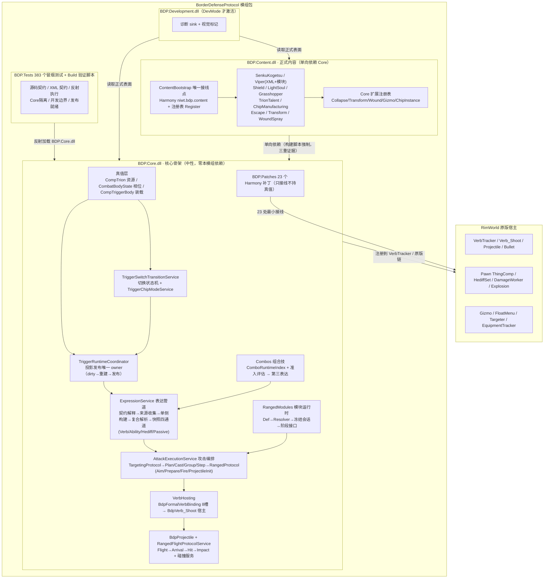

# BDP 全面架构评估报告（代码第一性）

> 分析方式：直接阅读当前工作区源码（772 个 .cs、383 个测试脚本、56 个 XML Def 文件），6 个并行子系统深挖 + 关键点人工复核。文档仅作背景，结论以代码实际实现为准。
> 分析日期：2026-08-15 | 分析对象：`模组工程/BorderDefenseProtocol`

---

## 一、项目全景

| 维度 | 事实 |
|---|---|
| 模组 | 《境界触发者》主题 RimWorld 1.6 模组，packageId `Niwt.BDP`，依赖 Biotech |
| 开发周期 | 2026-01-03 ~ 2026-08-14，1039 次提交，活跃开发中 |
| 程序集 | `BDP.Core.dll`（核心骨架，约 60K 行）、`BDP.Content.dll`（正式内容，约 22K 行）、`BDP.Development.dll`（开发辅助，可整体移除） |
| 测试 | `Source/BDP.Tests` 383 个 PowerShell 冒烟测试（源码契约 / XML 契约 / 可执行反射三种模式）+ 3 个构建门禁脚本 |
| 构建 | .NET Framework 4.8 / C# 7.3，旧式 MSBuild 工程，输出到 `1.6/Assemblies` |

**一句话定位**：这是旧 BDP 的"二次重构"——保留外在玩法表现（触发体、Trion 能量、芯片、战斗体），把内部重做成贴着 RimWorld 原版宿主、边界严格的三程序集架构。

---

## 二、架构总关系图



> 可编辑版本：`docs/04-架构评估/2026-08-15-BDP架构关系图.excalidraw`（Excalidraw 打开）。

---

## 三、程序集层与依赖边界（代码证据）

### 3.1 单向依赖被三重强制，不是口头声明

1. **源码级**：`BDP.Core` 中引用 `BDP.Content` 的 using = **0 次**；`BDP.Content` 引用 `BDP.Core` = 131 次。
2. **工程级**：BDP.csproj 无任何 ProjectReference；Content 仅引用 BDP；Development 引用 BDP+Content 且 `Private=False` 不复制产物。
3. **构建门禁**：`Verify-BdpCoreIsolation.ps1` 从工程引用、DLL AssemblyRef 字节表、明确名称提及三层检查，挂在 BDP.csproj 的 `AfterTargets=Build` 上——每次正式编译后自动执行，并配有 `CoreModAssemblyIsolationBuildHookSmokeTests.ps1` 锁定门禁本身的存在。

### 3.2 各层职责

| 层 | 职责 | 边界事实 |
|---|---|---|
| Core | 中性宿主、状态、协议、裁定、原版接入、扩展接口 | 不知道任何具体芯片/武器/能力名称 |
| Content | 具体芯片、武器、能力、数值、视觉、UI、对 Core 接口的正式实现 | 每个特性 = 接口实现 + Registry 注册 |
| Development | 诊断 sink、视觉标记 | 整体 try/catch + 仅 `Prefs.DevMode` 时 PatchAll，输出到独立 `1.6/Development/Assemblies`，构建后自动删除误复制的正式 DLL |
| Tests | 383 个冒烟测试 | 无总 runner，逐一 `powershell -File` 执行 |

---

## 四、真值架构（本模组最核心的设计纪律）

### 4.1 三类真值 owner 严格分离（代码验证）

| Owner | 真值 | 对外表面 |
|---|---|---|
| `CompTrion`（ThingComp） | cur/max/allocated/reserved/drainRegistry/冻结态 + 潜在容量/先天释放力 | `TrionSurfaceAccess` → ITrionReader/ITrionCommands/ITrionEvents |
| `CombatBodyState`（internal） | phase/allocatedTrion/activationTick/cooldownEndTick/manualTransformLockEndTick/collapseStartTick/collapseReason | `CombatBodySurfaceAccess` → ICombatBodyReader/Commands/Events |
| `CompTriggerBody`（CompEquippable） | mainSlots/subSlots/specialSlots/chipContainer/SwitchContext ×3 | `TriggerSurfaceAccess` → ITriggerLoadoutReader/Commands/ITriggerEvents/ITriggerInteractionReader |

要点（均有代码注释背书）：

- `CompTrion` 全库仅 7 处被直接引用，其余全部经 SurfaceAccess。
- `CombatBodyState` 查询入口惰性收冷却（`ResolveCooldownIfFinished`），"能否再激活"不依赖外部 tick 先跑——落实"暂停下立即成立"约束。
- `CompTriggerBody` 文件头注释明示"不直接充当对外正式表面"，9 个 partial 文件分读/写/生命周期/完整性/固定装载/拆除。
- 事件（AvailableDepleted、PhaseChanged、SlotLoadoutChanged 等）只广播通知，注册表逐 provider try/catch 隔离异常。

### 4.2 投影发布模型（协调者不持真值）

- `TriggerRuntimeCoordinator` 是**已发布投影的唯一 owner**：`RuntimeTick()` 顺序固定为 primary-owner 守卫 → post-load finalize → 切换懒结算 → 激活条件复查 → 组合条件复查 → `RebuildAndPublish` → VerbHostManager.Tick。
- 发布产物：`TriggerCombatProjectionState`（战斗投影：ExpressionSnapshot + ResultIndex + CompositeReferenceIndex）+ `TriggerPresentationState`（表现投影）。
- **投影版本号单调递增**，`AttackSessionToken`（AttackInstanceId + ResultId + ProjectionVersion + OwnerPawnThingId）绑定版本，过期会话可安全中断；读路径只消费已发布快照，绝不触发重建。

---

## 五、运行时主链（攻击执行全链路）

```
玩家/自动输入 → Targeter/Verb patch 拦截
  → AttackExecutionTargetingSource（交互确认，三快照冻结：ConfirmedInput/Interaction/Target）
  → AttackExecutionService（唯一正式入口：TryPrepareContext → BuildPlan → BuildGroups → BuildSteps → ExecutePrepared）
    → RangedProtocol（Aim → Prepare → Fire → ProjectileInit 四段，每段基线+会话+Addon 模块组合）
      → BdpVerb_Shoot（原版 Verb_Shoot 宿主：TryStartCastOn → 暖机 → 命中判定 → 逐发发射）
        → BdpProjectile : Bullet（桥宿主，不承载业务）
          → RangedFlightProtocol（Flight → Arrival → Hit → Impact 四段，模块可覆盖命中/爆炸）
            → 原版 DamageWorker / Explosion（携带 ISemanticContext 语义上下文）
```

### 5.1 可插拔协议机制

- 三套协议（TargetingProtocol 4 段 / RangedProtocol 4 段 / FlightProtocol 4 段）统一"阶段服务 + 贡献 + 维度仲裁"模式。
- 远程模块：XML `BdpRangedAttackModuleDef`（声明 runtimeClass）→ `RangedAttackModuleResolver`（反射实例化）→ `RangedAttackModuleSession`（冻结态，私有上下文经 `AttackContext` 键存取，**支持读档与 dual lane 重映射**）。
- 仲裁：`ModuleStageArbitrator` + ModuleDimensionKind（Override/Additive/Freeze）。
- **后半段不依赖前半段运行时对象**：`RangedFlightProtocolService.CreateModuleSession` 只凭 `ProjectileInitPlan.ResultId` 回读已发布投影重建会话——这是全链路可读档的关键设计。
- 弹道碰撞：`SegmentCollisionService.ScanSegment`（supercover 穿格 + IsObjectiveBlocker：非 Pawn/Plant、关着的门、Full Fillage；flyOverhead 豁免），阻挡收束为正式命中；视觉附件经 `ProjectileVisualAttachmentHost` 从 `plan.VisualAttachmentProviderDefs` 建附件（BeamTrail 在 Content 侧以 `BeamTrailMapComponent` 实现分段拖尾）。
- **题设修正**：文档中所谓 `InputModifierBridge` 在代码中无同名类——实际实现是 `TargetingInputRuntimeScope`（ThreadStatic 栈）+ `TargetingInputRuntimeFacts.FromEvent`（按钮+Shift/Ctrl/Alt）→ `TargetingInputFrame`，模块读 InputFrame/InputState(StepIndex/Anchors) 并写 AdvanceDecision。

### 5.2 双武器（Main/Sub）协调

`BuildDualRangedWeaponCasts` → `FilterDualRangedSidesByLegality`（逐侧用自家 host Verb 剪枝，必要直射侧才查 CanHitTargetFrom）→ 按 `DualExecutionSchedule`（Alternating/Simultaneous/MainThenSub/MixedRhythm）→ 每侧独立 `DualSourceLane` 跑完整单侧协议 → `MergeProjectilePlansByOuterEmitOrder` 合并回外层结果。`RangedVerbRoundState` 按轮管 Trion（暖机准入一次、首发提交一次，burst 不重复扣）。

### 5.3 内容模块（Content 实现，Core 只留骨架）

| 模块 | 实现位置 | 参与阶段 |
|---|---|---|
| Homing（追踪） | BDP.Content/RangedModules | ProjectileInit/Arrival/Hit，状态机 Pursuing→Released→FlyAway |
| RoutePath（毒蛇路线） | BDP.Content/RangedModules | Targeting/Preview/Confirm/Aim/ProjectileInit/Arrival，锚点折线逐段推进 |
| AreaExplosion | BDP.Content/RangedModules | Preview/Impact→GenExplosion |
| BeamTrail（拖尾） | BDP.Content/Projectiles/BeamTrail | 分段拖尾 + MapComponent 缓存 |

### 5.4 表达与组合技（比攻击更上位）

- 表达定义不在独立 Def 上，而在芯片的 `ChipExpressionConfig`（DefModExtension）与 `ComboDef.Expression` 上。
- 解析链：`ChipExpressionContractInterpreter`（作者写法→内部契约，按 mode/stance 选条目）→ `ExpressionSourceDeclarationProvider` → `ExpressionSourceCollector`（条件评估）→ `SingleSideExpressionBuilder` → `CompositeExpressionResolver`（组合技/双持）→ `ExpressionSnapshotBuilder.Assemble` 出总表 → 四通道（Verb/Ability/Hediff/Passive）并行索引。
- 组合技：`ComboRuntimeIndex` 按制造来源首个预设 DefName 建无序对索引，`ComboSourceAdmissionEvaluator` 正反向 A/B 准入；第三表达与单侧结果**同表同消费**；使用门槛不满足时仍存在但阻发布，`ComboUseRequirementMonitor` 每 60 tick 错峰复查。

---

## 六、Content 层组织（挂接点实证）

`ContentBootstrap`（[StaticConstructorOnStartup]）是唯一接线点，全部经 Core 注册表：

| 特性 | 关键实现 | Core 挂接点 |
|---|---|---|
| 弧月 SenkuKogetsu | 原生 Ability + 月牙波体（自行推进/扫掠） | 纯原版 Ability 系统 + XML |
| 毒蛇 Viper | **无独立 C#**：XML 预设 + RoutePath 模块 | RangedModules + PathInput |
| 护盾 Shield | HediffComp_EnergyShield + 薄 patch | 原生 Hediff + Patch_Pawn_PreApplyDamage |
| 光魂 LightSoul | HediffComp_VerbGiver + 4 个薄 patch | 原生 Hediff/Verb |
| 蝗虫 Grasshopper | CompAbilityEffect + 继承 Core BdpVerb_CastAbility | Core.Abilities + PathInput |
| Trion 天赋 | 检测流程 + 潜力分档 | Core.Trion.Capacity/Intensity 中性账本 |
| 芯片制造 | ChipPresetDef 菜单化 + 三套模板（物品/灵魂/外壳） | Core.Chips.External（IChipInstanceDefinitionProvider） |
| 紧急脱离/变换/伤口 | 崩解扩展 + 变换表现 + 喷溅表现 | Collapse/Transform/Wound 三个注册表 |

---

## 七、测试与质量门禁体系

| 模式 | 数量占比 | 示例 |
|---|---|---|
| 源码契约（读 .cs 断言命名/关键行） | 多数 | ContentBootstrapSmokeTests 锁 Register 次数、禁 Prefs.DevMode/DefDatabase |
| XML/Def 契约 | 部分 | defName、texPath、类归属、Core 禁词 |
| 可执行反射（LoadFrom BDP.Core.dll + Assembly-CSharp 实测） | ~25 | ComboSourceAdmissionExecutable 实测准入评估器；ChipSlotOccupancyResolution 实测私有决策口 |

另配 3 个构建门禁（Core 隔离 / 开发边界 / 发布就绪）+ 游戏内实测清单制度（用户逐项验收，如 2026-08-09 毒蛇 13 项清单）。

---

## 八、整体评估

### 8.1 优势（有代码证据）

1. **真值纪律是本模组最扎实的资产**：三 owner + 分面接口 + 事件只通知 + patch 只接线，全部可代码验证，且 2026-04 版评估中的承诺在代码里落地为 build-time 强制。
2. **单向依赖三重强制**：Core 零 Content 依赖是脚本 + 构建钩子 + 测试三层锁死的，不是自觉。
3. **读档/会话一致性设计完整**：投影版本号 + SessionToken + 全字段冻结的 IExposable 计划对象 + 旧档隔离容器（RecoveredItemContainer），攻击会话跨读档续接有专门设计（`RangedFlightProtocolService` 凭 ResultId 回读重建）。
4. **贴原版**：`BdpVerb_Shoot` 走原版 TryStartCastOn 链；`BdpProjectile` 继承 Bullet 仅做桥；伤害落地仍走原版 DamageWorker；23 个 patch 全为 Prefix/Postfix/Finalizer（无 Transpiler）。
5. **测试纪律强**：383 个冒烟测试锁定契约，构建门禁锁架构边界，"实施前回档点 + 逐任务提交"的工程方法可追溯。
6. **旧档防御**：`ReconcileAfterLoad`/只清 BDP 标记不猜改 Pawn 实物，体现了对存档兼容的克制。

### 8.2 风险与坏味道（按严重度）

| # | 风险 | 证据 | 建议 |
|---|---|---|---|
| 1 | **上帝类密集** | `BdpVerb_Shoot` 1772 行、`TriggerSwitchTransitionService` 1624 行、`AttackExecutionService.Stages.cs` 1584 行（其中 `BuildDualMelee/RangedWeaponCasts` 两套近 400 行镜像逻辑，双写易漂移）、`ChipExpressionContractInterpreter` 1293 行、`ExpressionFormalSurfaces.cs` 932 行、`CompTriggerBody` 9 partial ~2000+ 行 | 按已冻结的 Record 边界拆文件/拆类，先拆不改变行为的"纯函数区"（仲裁、校验、诊断）；镜像的双侧构建先合并为参数化单侧构建 |
| 2 | **隐性重复真值** | `TriggerSlotState` 的 loadedChip/loadedChipThingId/chipContainer 三处表达"装了谁"，靠 3 个不变式维护方法维持；攻击侧 RangedAttackExecutionContext/BdpVerb_Shoot.sessionTarget/HostAttackContextSnapshot 多份快照并存 | 给重复真值增加不变式断言（DEBUG 下验证），或收敛为单一引用 + 缓存 |
| 3 | **双路径契约漂移风险** | 静态 Def（Resolver+Validator+Cache）与制造芯片（`BuildManufacturedResult` 直接合成、**跳过 Validator**）两条路径；ChipActivationRequirementService 只走实例路径 | 制造路径也过 Validator 或增加等价校验冒烟测试 |
| 4 | **热路径性能** | `RangedFlightProtocolService.ExecuteFlight` 每 Tick 反射重建 ModuleSession；BdpProjectile.Tick 每次 new 上下文；弹道/宿主内大量 `Log*` 字符串拼接（`LogSuspiciousContinueFlight`/`LogFlightContinuation`/`LogProjectileLaunchDecision` 与业务同文件，热路径开销与可读性双输） | 会话缓存按 ResultId+版本复用；诊断日志移到可插拔 sink |
| 5 | **字符串契约脆** | Trion drain key 域串 "CombatBody"/"Wound"/"Expression" 硬编码两处；Def 名 `BDP_CombatBodyActive` 等 GetNamedSilentFail 硬编码 | 收敛为 DefOf 常量 + 启动校验 |
| 6 | **反射脆弱点** | `PawnCombatBodyBridge.RemoveQualityComp`（私有 comps 字段）、`IsUnpackedCaravanItem`（私有字段）、`TriggerCastJitter` Harmony Traverse 摸 Drawer 私有 jitterer | 加"原版版本升级即失败"的显式断言，或改为 modExtension 官方口 |
| 7 | 命名/结构瑕疵 | `Flow\CombatBodyCoordinator.cs` 声明的是 `CombatBodyService`；`BDP.Core.PathInput` 与 `BDP.Content.PathInput` 命名空间重名；`ExpressionVerbBridge` 已拆为恒 false 失败壳但残留 VerbHostResolver 死链 | 类名对齐文件名；Content 侧 PathInput 改名；清除死链与残留旧宿主字段 |
| 8 | 测试体系 | 383 脚本各自内联 `Assert-True`（DRY 缺失）、无总 runner、依赖路径推导约定 | 加 TestSupport 公共函数 + 总运行脚本（保留单文件可独立运行） |
| 9 | 启动期 Def 变异 | `PawnTrionTalentAssessmentInjector` 直接改 DefDatabase ThingDef.comps 注入 | 与 Core 的 PawnCompBootstrap 注入风格统一，评估多模组兼容 |
| 10 | 重复计算/复制粘贴 | `CombatBodySnapshotPolicy` 排除集每次全量重建；SenkuKogetsu 配置字段与运行时 1:1 拷贝；`CloneMeleeToolSurfaces/CloneRangedModules/CloneSustainCostBySourceCount` 在 Collector、CompositeResolver、ComboResultFactory、DeclarationProvider、PublishedSnapshotBuilder **五处重复** | 缓存排除集；配置只保留单一来源；Clone 辅助收敛为共享工具 |
| 11 | **静态可变状态** | `DefaultExpressionAbilityHostSynchronizer.AddedAbilityDefsByPawn/BoundAbilityResultsByPawn` 与 Hediff 同步器 `PublishedHediffDefsByPawn` 为按 pawn 静态字典，跨会话生命周期，读档/销毁清理有残留风险 | 改为挂 Pawn 实例的 comp/字段，或显式随 ExposeData 清理 |
| 12 | 组合歧义整技失效 | 多候选同时通过 `ComboSourceAdmissionEvaluator` 时 `ComboMatchAmbiguous` 直接拒绝整技；`ComboUseRequirementMonitor` 60 tick 错峰复查为硬编码 | 明确歧义优先级策略；复查间隔收敛为 Def 可配 |
| 13 | 小问题 | `PathInputHandler.BuildPreview` 硬编码 MaxAnchors=8 而非取 config；`SkillLevelRequirement.MinimumLevel` 用 float 再自校验整数；`BdpDiagnostics` 全局静态 Once/节流表靠 tick 倒退检测清理，无显式重置钩子 | 常量收敛为配置；类型用 int；诊断表加显式重置口 |

### 8.3 对照项目宪章核心约束的落实情况

| 硬约束 | 落实度 | 证据 |
|---|---|---|
| 三类真值 owner 不混 | ✅ 完全落实 | 三 owner + 分面接口，代码注释明示 |
| 事件不持真值 | ✅ 完全落实 | 事件仅广播，注册表 try/catch |
| patch 只接线 | ✅ 完全落实 | 23 个 patch 全薄，无业务承载 |
| 贴 RimWorld 原版宿主 | ✅ 完全落实 | Verb/Ability/Hediff/Projectile/ThingComp 全走原版 |
| 手动/自动入口分层 | ✅ 落实 | TargetingSource 与 TryGetAutoRangedVerb 分家 |
| 不新增第四 owner | ✅ 落实 | Coordinator 只持已发布投影 |
| 暂停下立即成立 | ✅ 落实 | 惰性收冷却、禁用判断不依赖 tick |
| 测试经正式扩展口接入 | ✅ 落实 | 测试只经 SurfaceAccess/反射正式口 |
| 避免上帝系统 | ⚠️ 部分 | 架构上拆了层，但类级别仍有多处 1000+ 行聚集 |

### 8.4 总体评分

| 维度 | 评分（5 分制） | 说明 |
|---|---|---|
| 架构边界与分层 | 4.5 | 程序集/子系统/接口三层边界清晰，构建期强制 |
| 真值模型 | 5.0 | 三类 owner 纪律本模组最突出，几乎无越权 |
| 原版贴合度 | 4.5 | 优先原版自然通道，patch 克制 |
| 可扩展性 | 4.5 | 模块化协议 + 注册表 + XML 驱动，新增芯片基本只写 XML |
| 可读性/可维护性 | 3.5 | 注释质量极高，但 1000+ 行类密集、重复真值/复制粘贴靠纪律维持、按 pawn 静态字典有读档残留风险 |
| 性能 | 3.5 | 主链设计合理，热路径有反射与分配风险 |
| 测试与门禁 | 4.5 | 冒烟测试覆盖面与构建门禁超出多数模组工程 |
| 工程过程 | 5.0 | 决策记录/实施计划/验收清单/回档点制度完整 |

**综合：4.4 / 5 —— 属于少数"架构纪律真正在代码里落地"的模组工程。**

### 8.5 总结

BDP 是一个以"真值 owner 分离 + 单向依赖 + 原版贴合"为三大支柱的严肃重构工程。它的架构不是停留在文档上的口号，而是通过构建门禁、反射测试、契约冒烟测试被强制执行的代码事实。主要债务集中在**类级别**（多处 1000+ 行上帝类）与**热路径性能**（每 tick 反射重建），以及少量"靠纪律而非编译期保证"的重复真值。若按优先级推进：先为制造芯片路径补 Validator 等价校验（防契约漂移），再拆上帝类、清除 `ExpressionVerbBridge` 死链与按 pawn 静态字典（防读档残留），最后做热路径会话缓存——即可显著降低长期维护风险。

---

*附：分析过程共派 6 个并行子代理深挖子系统（基础设施/CombatBody/Trigger+Chips/AttackExecution/Expressions+Combos/Content+测试），每个子代理均直接阅读源码并交叉核对；人工复核了入口、真值 owner、SurfaceAccess、Patch 层、ContentBootstrap、构建门禁等关键点。*
