---
标题：BorderDefenseProtocol UML类图
版本号: v1.0
更新日期: 2026-02-24
最后修改者: Claude Opus 4.6
标签: [文档][用户未确认][已完成][未锁定]
摘要: BorderDefenseProtocol模组全部C#类的UML类图，按子系统分包展示继承、实现、组合、依赖关系
---

## 总览

模组共 **5个子系统**、**36个类/接口/枚举**：

| 子系统 | 命名空间 | 职责 |
|--------|---------|------|
| Core | `BDP.Core` | Trion能量系统、基因、DefOf |
| Trigger | `BDP.Trigger` | 触发体状态机、芯片槽位管理 |
| Effects | `BDP.Trigger` | 三类芯片效果实现 |
| DualWeapon | `BDP.Trigger` | 双武器Verb合成、攻击JobDriver |
| UI | `BDP.Trigger` | Gizmo、窗口、自定义Command |

## 完整类图（Mermaid）

```mermaid
classDiagram
    direction TB

    %% ═══════════════════════════════════════
    %%  RimWorld/Verse 基类（灰色，仅显示名称）
    %% ═══════════════════════════════════════
    class ThingComp {
        <<Verse>>
    }
    class CompProperties {
        <<Verse>>
    }
    class Gene {
        <<RimWorld>>
    }
    class Gizmo_Slider {
        <<RimWorld>>
    }
    class DefModExtension {
        <<Verse>>
    }
    class Def {
        <<Verse>>
    }
    class CompEquippable {
        <<RimWorld>>
    }
    class CompAbilityEffect {
        <<RimWorld>>
    }
    class CompProperties_AbilityEffect {
        <<RimWorld>>
    }
    class Verb_Shoot {
        <<Verse>>
    }
    class Verb_MeleeAttackDamage {
        <<Verse>>
    }
    class JobDriver {
        <<Verse>>
    }
    class Gizmo {
        <<Verse>>
    }
    class Window {
        <<Verse>>
    }
    class Command_VerbTarget {
        <<Verse>>
    }

    %% ═══════════════════════════════════════
    %%  Core 子系统
    %% ═══════════════════════════════════════

    class BDPMod {
        <<static>>
        +BDPMod()$ 初始化Harmony
    }

    class CompTrion {
        -float cur
        -float max
        -float allocated
        -bool frozen
        -Dictionary~string, float~ drainRegistry
        -Gizmo_TrionBar gizmo
        +float Cur
        +float Max
        +float Allocated
        +float Available
        +float Percent
        +float TotalDrainPerDay
        +RegisterDrain(key, drainPerDay)
        +UnregisterDrain(key)
        +Consume(amount) bool
        +Recover(amount)
        +Allocate(amount) bool
        +Release(amount)
        +ForceDeplete()
        +SetFrozen(value)
        +RefreshMax()
        +CompTick()
        +CompGetGizmosExtra() IEnumerable~Gizmo~
    }

    class CompProperties_Trion {
        +float baseMax
        +float startPercent
        +float passiveDrainPerDay
        +float recoveryPerDay
        +bool showGizmo
        +Color barColor
        +Color allocatedBarColor
        +int statRefreshInterval
        +int drainSettleInterval
        +int recoveryInterval
    }

    class Gene_TrionGland {
        +PostAdd()
        +PostRemove()
    }

    class Gizmo_TrionBar {
        -CompTrion comp
        -Texture2D allocatedTex
        -Texture2D availableTex
        +GizmoOnGUI(topLeft, maxWidth, parms) GizmoResult
    }

    class BDPDefExtension {
        +List~float~ thresholdPercents
    }

    class BDP_DefOf {
        <<static>>
        +StatDef BDP_TrionCapacity$
        +StatDef BDP_TrionOutputPower$
        +StatDef BDP_TrionRecoveryRate$
        +GeneDef BDP_Gene_TrionGland$
        +JobDef BDP_ChipRangedAttack$
        +JobDef BDP_ChipMeleeAttack$
    }

    %% Core 继承关系
    ThingComp <|-- CompTrion
    CompProperties <|-- CompProperties_Trion
    Gene <|-- Gene_TrionGland
    Gizmo_Slider <|-- Gizmo_TrionBar
    DefModExtension <|-- BDPDefExtension

    %% Core 组合/依赖
    CompTrion --> CompProperties_Trion : Props
    CompTrion *-- Gizmo_TrionBar : 创建并缓存
    Gene_TrionGland ..> CompTrion : 刷新Max

    %% ═══════════════════════════════════════
    %%  Trigger 子系统
    %% ═══════════════════════════════════════

    class IChipEffect {
        <<interface>>
        +Activate(pawn, triggerBody)*
        +Deactivate(pawn, triggerBody)*
        +Tick(pawn, triggerBody)*
        +CanActivate(pawn, triggerBody)* bool
    }

    class CompTriggerBody {
        -List~ChipSlot~ leftHandSlots
        -List~ChipSlot~ rightHandSlots
        -List~ChipSlot~ specialSlots
        -SwitchState switchState
        -SwitchContext pending
        -ChipSlot dualHandLockSlot
        -Verb leftHandAttackVerb
        -Verb rightHandAttackVerb
        -Verb dualAttackVerb
        +bool IsCombatBodyActive
        +bool IsSwitching
        +float SwitchProgress
        +IReadOnlyList~ChipSlot~ LeftHandSlots
        +IReadOnlyList~ChipSlot~ RightHandSlots
        +IReadOnlyList~ChipSlot~ SpecialSlots
        +GetSlot(side, index) ChipSlot
        +AllSlots() IEnumerable~ChipSlot~
        +AllActiveSlots() IEnumerable~ChipSlot~
        +HasAnyActiveChip() bool
        +GetActiveSlot(side) ChipSlot
        +SetSideVerbs(side, verbs, tools)
        +ClearSideVerbs(side)
        +RebuildVerbs(pawn)
        +LoadChip(side, slotIndex, chip) bool
        +UnloadChip(side, slotIndex) bool
        +ActivateChip(side, slotIndex) bool
        +DeactivateChip(side)
        +DeactivateAll(pawn)
        +ActivateAllSpecial()
        +CompGetEquippedGizmosExtra() IEnumerable~Gizmo~
    }

    class CompProperties_TriggerBody {
        +int leftHandSlotCount
        +int rightHandSlotCount
        +bool hasRightHand
        +int switchCooldownTicks
        +bool allowChipManagement
        +bool autoActivateOnEquip
        +int specialSlotCount
        +List~PreloadedChipConfig~ preloadedChips
    }

    class PreloadedChipConfig {
        +SlotSide side
        +int slotIndex
        +ThingDef chipDef
    }

    class TriggerChipComp {
        -IChipEffect effectInstance
        +GetEffect() IChipEffect
    }

    class CompProperties_TriggerChip {
        +float activationCost
        +Type chipEffectClass
        +float allocationCost
        +float drainPerDay
        +int activationWarmup
        +bool isDualHand
        +float minOutputPower
        +List~string~ exclusionTags
        +int deactivationDelay
    }

    class ChipSlot {
        <<IExposable>>
        +int index
        +SlotSide side
        +Thing loadedChip
        +bool isActive
        +ExposeData()
    }

    class SwitchContext {
        <<IExposable>>
        +SlotSide side
        +int slotIndex
        +int cooldownTick
        +ExposeData()
    }

    class SlotSide {
        <<enumeration>>
        LeftHand
        RightHand
        Special
    }

    class SwitchState {
        <<enumeration>>
        Idle
        Switching
    }

    class ComboAbilityDef {
        +ThingDef chipA
        +ThingDef chipB
        +AbilityDef abilityDef
        +Matches(a, b) bool
    }

    %% Trigger 继承关系
    CompEquippable <|-- CompTriggerBody
    CompProperties <|-- CompProperties_TriggerBody
    ThingComp <|-- TriggerChipComp
    CompProperties <|-- CompProperties_TriggerChip
    Def <|-- ComboAbilityDef

    %% Trigger 组合/依赖
    CompTriggerBody --> CompProperties_TriggerBody : Props
    CompTriggerBody *-- ChipSlot : 管理多个槽位
    CompTriggerBody *-- SwitchContext : 切换上下文
    CompTriggerBody --> SlotSide : 使用
    CompTriggerBody --> SwitchState : 状态
    CompTriggerBody ..> CompTrion : 读取Trion
    CompTriggerBody ..> DualVerbCompositor : 调用合成
    CompTriggerBody ..> IChipEffect : 调用激活/关闭
    CompProperties_TriggerBody *-- PreloadedChipConfig : 预装配置
    TriggerChipComp --> CompProperties_TriggerChip : Props
    TriggerChipComp --> IChipEffect : 持有效果实例
    ChipSlot --> SlotSide : side

    %% ═══════════════════════════════════════
    %%  Effects 子系统
    %% ═══════════════════════════════════════

    class WeaponChipEffect {
        +Activate(pawn, triggerBody)
        +Deactivate(pawn, triggerBody)
        +Tick(pawn, triggerBody)
        +CanActivate(pawn, triggerBody) bool
    }

    class ShieldChipEffect {
        +Activate(pawn, triggerBody)
        +Deactivate(pawn, triggerBody)
        +Tick(pawn, triggerBody)
        +CanActivate(pawn, triggerBody) bool
    }

    class UtilityChipEffect {
        +Activate(pawn, triggerBody)
        +Deactivate(pawn, triggerBody)
        +Tick(pawn, triggerBody)
        +CanActivate(pawn, triggerBody) bool
    }

    class WeaponChipConfig {
        +int meleeBurstCount
        +int meleeBurstInterval
        +List~VerbProperties~ verbProperties
        +List~Tool~ tools
        +float trionCostPerShot
    }

    class ShieldChipConfig {
        +HediffDef shieldHediffDef
        +float trionCostPerDamageFactor
    }

    class UtilityChipConfig {
        +AbilityDef abilityDef
    }

    class CompAbilityEffect_TrionCost {
        +Apply(target, dest)
        +GizmoDisabled(out reason) bool
        +Valid(target, throwMessages) bool
    }

    class CompProperties_AbilityTrionCost {
        +float trionCostPerUse
    }

    %% Effects 继承/实现
    IChipEffect <|.. WeaponChipEffect
    IChipEffect <|.. ShieldChipEffect
    IChipEffect <|.. UtilityChipEffect
    DefModExtension <|-- WeaponChipConfig
    DefModExtension <|-- ShieldChipConfig
    DefModExtension <|-- UtilityChipConfig
    CompAbilityEffect <|-- CompAbilityEffect_TrionCost
    CompProperties_AbilityEffect <|-- CompProperties_AbilityTrionCost

    %% Effects 依赖
    WeaponChipEffect ..> CompTriggerBody : SetSideVerbs/RebuildVerbs
    WeaponChipEffect ..> WeaponChipConfig : 读取Verb/Tool配置
    ShieldChipEffect ..> ShieldChipConfig : 读取HediffDef
    UtilityChipEffect ..> UtilityChipConfig : 读取AbilityDef
    CompAbilityEffect_TrionCost --> CompProperties_AbilityTrionCost : Props
    CompAbilityEffect_TrionCost ..> CompTrion : Consume

    %% ═══════════════════════════════════════
    %%  DualWeapon 子系统
    %% ═══════════════════════════════════════

    class DualVerbCompositor {
        <<static>>
        +String SideLabel_LeftHand$
        +String SideLabel_RightHand$
        +ParseSideLabel(label)$ SlotSide?
        +ComposeVerbs(leftVerbs, rightVerbs, leftSlot, rightSlot)$ List~VerbProperties~
        +ComposeTools(leftTools, rightTools)$ List~Tool~
        +IsMeleeOnly(verbs)$ bool
    }

    class Verb_BDPRangedBase {
        <<abstract>>
        #TryCastShotCore(chipEquipment) bool
        +OrderForceTarget(target)
    }

    class Verb_BDPShoot {
        #TryCastShot() bool
    }

    class Verb_BDPDualRanged {
        -int dualBurstIndex
        -int leftRemaining
        -int rightRemaining
        -ThingDef leftProjectileDef
        -ThingDef rightProjectileDef
        #TryCastShot() bool
    }

    class Verb_BDPMelee {
        -ThingDef currentChipDef
        -int hitIndex
        -int pendingInterval
        -int cachedLeftBurst
        -int cachedRightBurst
        #ShotsPerBurst int
        +OrderForceTarget(target)
        #TryCastShot() bool
        +ApplyPendingInterval()
        +SafeAbortBurst()
        #ApplyMeleeDamageToTarget(target) DamageResult
    }

    class JobDriver_BDPChipRangedAttack {
        -bool startedIncapacitated
        -int numAttacksMade
        +TryMakePreToilReservations(errorOnFailed) bool
        #MakeNewToils() IEnumerable~Toil~
    }

    class JobDriver_BDPChipMeleeAttack {
        -int numMeleeAttacksMade
        +TryMakePreToilReservations(errorOnFailed) bool
        #MakeNewToils() IEnumerable~Toil~
    }

    %% DualWeapon 继承
    Verb_Shoot <|-- Verb_BDPRangedBase
    Verb_BDPRangedBase <|-- Verb_BDPShoot
    Verb_BDPRangedBase <|-- Verb_BDPDualRanged
    Verb_MeleeAttackDamage <|-- Verb_BDPMelee
    JobDriver <|-- JobDriver_BDPChipRangedAttack
    JobDriver <|-- JobDriver_BDPChipMeleeAttack

    %% DualWeapon 依赖
    Verb_BDPShoot ..> CompTriggerBody : 读取芯片
    Verb_BDPShoot ..> CompTrion : Consume
    Verb_BDPShoot ..> DualVerbCompositor : ParseSideLabel
    Verb_BDPDualRanged ..> CompTriggerBody : 读取两侧芯片
    Verb_BDPDualRanged ..> CompTrion : Consume
    Verb_BDPDualRanged ..> WeaponChipConfig : 读取burst/projectile
    Verb_BDPMelee ..> CompTriggerBody : 读取芯片配置
    Verb_BDPMelee ..> WeaponChipConfig : 读取burst参数
    Verb_BDPMelee ..> DualVerbCompositor : ParseSideLabel
    JobDriver_BDPChipMeleeAttack ..> Verb_BDPMelee : VerbTick/ApplyPendingInterval
    DualVerbCompositor ..> Verb_BDPMelee : verbClass引用
    DualVerbCompositor ..> Verb_BDPDualRanged : verbClass引用
    DualVerbCompositor ..> ChipSlot : 判断同芯片

    %% ═══════════════════════════════════════
    %%  UI 子系统
    %% ═══════════════════════════════════════

    class Gizmo_TriggerBodyStatus {
        -CompTriggerBody triggerBody
        +GetWidth(maxWidth) float
        +GizmoOnGUI(topLeft, maxWidth, parms) GizmoResult
    }

    class Window_TriggerBodySlots {
        -CompTriggerBody triggerBody
        +InitialSize Vector2
        +DoWindowContents(inRect)
    }

    class Command_BDPChipAttack {
        +string attackId
        +GroupsWith(other) bool
    }

    %% UI 继承
    Gizmo <|-- Gizmo_TriggerBodyStatus
    Window <|-- Window_TriggerBodySlots
    Command_VerbTarget <|-- Command_BDPChipAttack

    %% UI 依赖
    Gizmo_TriggerBodyStatus --> CompTriggerBody : 读取槽位状态
    Gizmo_TriggerBodyStatus ..> Window_TriggerBodySlots : 点击打开
    Window_TriggerBodySlots --> CompTriggerBody : 读取/操作槽位
    CompTriggerBody ..> Gizmo_TriggerBodyStatus : 创建Gizmo
    CompTriggerBody ..> Command_BDPChipAttack : 创建攻击Gizmo
```

## 关键关系说明

| 关系 | 说明 |
|------|------|
| `CompTriggerBody` ↔ `ChipSlot` | 触发体管理多个芯片槽位（组合） |
| `TriggerChipComp` → `IChipEffect` | 芯片物品持有效果实例（策略模式） |
| `CompTriggerBody` → `DualVerbCompositor` | 触发体调用静态工具类合成双武器Verb |
| `WeaponChipEffect` → `CompTriggerBody` | 武器芯片激活时向触发体注入Verb/Tool |
| `Verb_BDP*` → `CompTriggerBody` | 所有BDP Verb通过触发体读取芯片数据 |
| `JobDriver_BDP*` → `Verb_BDP*` | 自定义JobDriver手动驱动芯片Verb的burst计时 |
| `CompTrion` ← 多处依赖 | Trion能量被Verb射击、Ability使用、芯片激活等消耗 |

---

## 历史修改记录

| 版本 | 日期 | 修改摘要 | 签名 |
|------|------|---------|------|
| v1.0 | 2026-02-24 | 初始生成：全部36个类的UML类图 | Claude Opus 4.6 |
