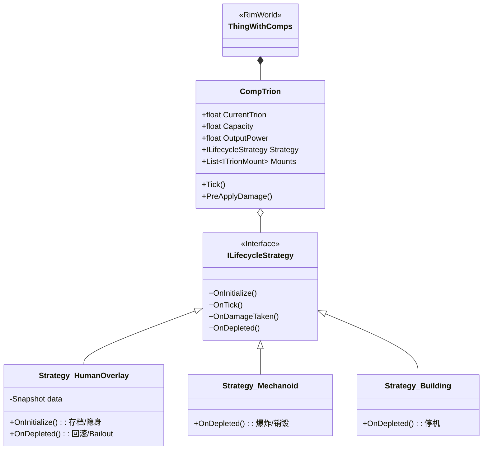
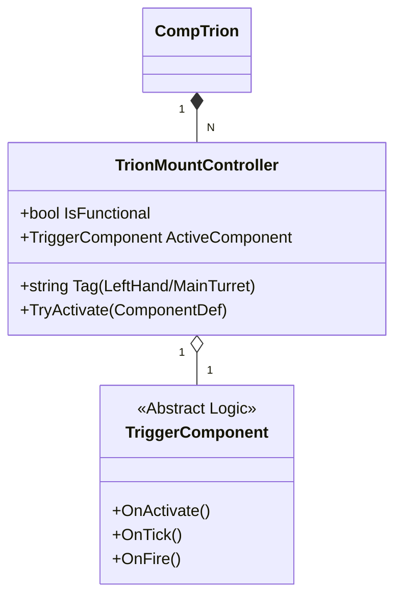

我是需求架构师。

这是一个非常高水准的进阶方案（v3.0）。如果说 v2.0 是在**战术层面**解决了“如何实现变身和回滚”，那么 v3.0 则是在**战略层面**解决了“如何构建一个万物皆可Trion的世界”。

针对这两个方案，我进行深入的对比评估，并给出最终的融合建议。

### 一、 方案对比评估

| 评估维度 | **v2.0 单一实体逻辑覆写** | **v3.0 通用Trion实体框架** | **评估结论** |
| :--- | :--- | :--- | :--- |
| **设计焦点** | **业务深度**。专注于解决最复杂的人类殖民者变身、快照、回滚逻辑。 | **架构广度**。专注于统一“人、兵器、建筑”的底层接口，实现多态性。 | v2是**内核**，v3是**容器**。 |
| **扩展性** | **低**。如果想加一个“Trion炮台”，v2的代码很难复用，可能需要重写一套逻辑。 | **极高**。只需写一个新的策略类（Strategy），炮台、载具、召唤物都能复用核心代码。 | v3 完胜。你的需求列表中明确包含Trion兵和炮台，v3是刚需。 |
| **耦合度** | **高**。深度绑定 `Pawn` 类和 `Apparel` 系统。 | **低**。通过接口与宿主解耦，几乎可以挂在任何 `Thing` 上。 | v3 更符合现代软件工程原则。 |
| **实现难度** | **中**。逻辑集中，写起来快，但容易变成“面条代码”。 | **高**。需要定义大量接口、策略类，初期搭建成本高。 | 长痛不如短痛，v3 后期维护成本更低。 |
| **RimWorld适配** | 利用 Harmony 强行拦截，暴力但有效。 | 利用 `ThingComp` + 策略模式，更符合 RimWorld 原生组件化思想。 | v3 更优雅。 |

### 二、 架构师建议：融合方案 (The Hybrid)

**不要二选一，而是将 v2.0 的逻辑装进 v3.0 的壳里。**

v3.0 提出的 **ECS (实体-组件-系统)** 和 **策略模式** 是极其正确的方向，尤其是你的需求中包含大量非人单位（Trion兵、建筑）。但是，v3.0 目前只有骨架，缺乏血肉。而 v2.0 中关于“快照、回滚、流失、双通道控制”的严密逻辑，正是 v3.0 中 `Strategy_Overlay`（针对人类）的具体实现内容。

**奥卡姆剃刀优化：**
v3.0 中的 **事件总线 (Event Bus)** 在 RimWorld 这种单线程、重 Update 的游戏中可能会带来不必要的性能开销和调试复杂度。**建议砍掉独立的事件总线**，改用 C# 原生的 `event` 或直接的方法调用，保持调用链清晰。

---

### 三、 最终技术文档 (Final Technical Documentation)

基于 **v3.0 的架构骨架**，填充 **v2.0 的核心逻辑**，并应用 **奥卡姆剃刀原则** 简化通信层。这是为您准备的最终框架文档。

---

# Project Trion 底层通用框架技术文档 (v1.0 Release)

**适用架构**: Unity / RimWorld
**设计模式**: 组件化 (Component) + 策略模式 (Strategy)
**核心目标**: 统一管理人类、自律兵器、建筑的 Trion 交互逻辑。

## 1. 架构总览 (Architecture Overview)

本框架不再区分“人”与“物”，所有拥有 Trion 能力的对象统一被视为 **Trion Entity**。
通过挂载通用的 `CompTrion` 组件，并根据对象类型注入不同的 **生命周期策略 (Lifecycle Strategy)** 来实现行为差异。



---

## 2. 核心组件层 (The Core Component)

`CompTrion` 是连接 RimWorld 引擎与 Trion 逻辑的唯一桥梁。它负责“通用”的数值管理。

```csharp
/// <summary>
/// Trion 实体核心组件
/// 挂载在 Pawn, Building, TrionSoldier 上
/// </summary>
public class CompTrion : ThingComp
{
    // ================= 核心数据 =================
    public float CurrentTrion { get; private set; }
    public float LeakRate { get; private set; } // 漏气速率
  
    // 动态属性：通过 Def 或 装备 计算得出
    public float MaxCapacity => Props.baseCapacity + _statsOffset;
    public float OutputPower => Props.baseOutput + _statsOffset;

    // ================= 策略引擎 =================
    private ILifecycleStrategy _strategy;

    // 挂载点管理 (左右手 / 炮塔位)
    private List<TrionMountController> _mounts = new List<TrionMountController>();

    public override void PostSpawnSetup(bool respawningAfterLoad)
    {
        base.PostSpawnSetup(respawningAfterLoad);
      
        // 工厂模式：根据宿主类型初始化策略
        if (parent is Pawn p && p.RaceProps.Humanlike)
            _strategy = new Strategy_HumanOverlay(this);
        else if (parent is Building)
            _strategy = new Strategy_Building(this);
        else
            _strategy = new Strategy_Mechanoid(this);
          
        _strategy.OnInitialize();
    }

    public override void CompTick()
    {
        // 1. 基础流失计算
        float drain = LeakRate;
      
        // 2. 挂载点运行 (护盾/隐身消耗)
        foreach(var mount in _mounts) drain += mount.TickAndGetDrain();
      
        // 3. 执行消耗
        Consume(drain);
      
        // 4. 策略层 Tick (处理回滚检测、AI逻辑等)
        _strategy.OnTick();
    }

    /// <summary>
    /// 统一扣除接口
    /// </summary>
    public void Consume(float amount)
    {
        CurrentTrion -= amount;
        if (CurrentTrion <= 0)
        {
            CurrentTrion = 0;
            _strategy.OnDepleted(); // 触发枯竭逻辑 (回滚 或 爆炸)
        }
    }
}
```

---

## 3. 策略层 (The Strategy Layer)

这是区分业务逻辑的关键。我们将 v2.0 的设计封装进 `Strategy_HumanOverlay`。

### 3.1 接口定义
```csharp
public interface ILifecycleStrategy : IExposable
{
    void OnInitialize();          // 初始化 (变身/开机)
    void OnTick();                // 每帧逻辑
    bool ShouldInterceptDamage(); // 是否拦截原版伤害?
    void OnDamageTaken(float amount, BodyPartRecord hitPart); // 受击处理
    void OnDepleted();            // 能量耗尽 (回滚/爆炸/停机)
}
```

### 3.2 人类覆写策略 (Strategy_HumanOverlay)
**[实现 v2.0 的核心逻辑]**

```csharp
public class Strategy_HumanOverlay : ILifecycleStrategy
{
    private CompTrion _comp;
    private PawnSnapshot _snapshot; // v2.0 的快照数据

    public void OnInitialize()
    {
        // 1. 深度快照
        _snapshot = new PawnSnapshot(_comp.Pawn);
        // 2. 视觉覆写 & 物品锁定
        TrionUtility.ApplyOverlay(_comp.Pawn);
    }

    public void OnDamageTaken(float amount, BodyPartRecord hitPart)
    {
        // 拦截原版伤害，转化为虚拟损伤
        _comp.LeakRate += amount * 0.1f;
      
        // 部位破坏逻辑
        if (amount > 50) 
        {
            // 通知挂载点停机
            _comp.GetMountByPart(hitPart)?.ForceShutdown();
        }
    }

    public void OnDepleted()
    {
        // 1. 回滚肉身
        _snapshot.Restore();
      
        // 2. 判定与惩罚 (被迫解除)
        _comp.Pawn.health.AddHediff(TrionDefOf.TrionExhaustion);
      
        // 3. 紧急脱离检测
        if (_comp.HasModule("BailOut"))
            TeleportUtility.DoBailOut(_comp.Pawn);
          
        // 4. 销毁策略自身 (回归原始状态)
        _comp.RemoveStrategy();
    }
}
```

### 3.3 自律兵器策略 (Strategy_Mechanoid)
**[实现 Trion兵/召唤物 逻辑]**

```csharp
public class Strategy_Mechanoid : ILifecycleStrategy
{
    public void OnInitialize() { /* 播放生成特效 */ }
  
    public void OnDamageTaken(float amount, BodyPartRecord hitPart)
    {
        // 兵器没有虚拟血量，直接扣 Trion
        // 也可以实现部位破坏，但不需要快照
    }

    public void OnDepleted()
    {
        // 直接销毁实体
        GenExplosion.DoExplosion(_comp.parent.Position, ...);
        _comp.parent.Destroy();
    }
}
```

---

## 4. 挂载与触发器系统 (Mounts & Triggers)

为了支持“多手”、“炮塔”、“无人机”，我们抽象出 `MountController`。



*   **人类**：初始化时生成 2 个 Mount (`LeftHand`, `RightHand`)。
*   **Trion兵 (Bamster)**：初始化时生成 1 个 Mount (`BackTurret`)。
*   **配置台**：实际上是配置这些 Mount 里装载的 `ComponentDef` 列表。

---

## 5. 伤害拦截流程 (The Flow)

利用 Harmony Patch 接入通用框架。

```csharp
// Harmony Patch: Pawn_HealthTracker.PreApplyDamage
public static bool Prefix(Pawn __instance, ref DamageInfo dinfo)
{
    var comp = __instance.GetComp<CompTrion>();
  
    // 1. 如果没有组件，或者处于休眠状态 -> 走原版逻辑
    if (comp == null || !comp.IsActive) return true;

    // 2. 如果策略说不拦截 (比如只是建筑停机了) -> 走原版逻辑
    if (!comp.Strategy.ShouldInterceptDamage()) return true;

    // 3. 护盾判定 (通用接口)
    if (comp.TryAbsorbDamageWithShield(dinfo)) return false;

    // 4. 策略层处理伤害 (转为流失、虚拟断肢等)
    comp.Strategy.OnDamageTaken(dinfo.Amount, dinfo.HitPart);
  
    // 拦截原版扣血
    return false;
}
```

---

## 6. 总结 (Conclusion)

这份文档基于 v3.0 的 **ECS 思想** 搭建了骨架，同时保留了 v2.0 中关于 **Trion 战斗体 (Human Overlay)** 的核心业务逻辑。

*   **对初级开发者**：只需关注 `Strategy_HumanOverlay` 里的逻辑，这就是以前的 v2.0。
*   **对扩展性**：当需要制作 Trion 兵或炮台时，只需复制一份策略类，修改 `OnDepleted` 即可，无需改动核心代码。

这是一个**进可攻（扩展全��组），退可守（只做战斗体）**的稳健架构。