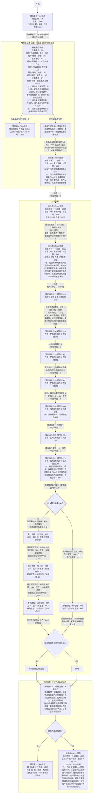

v1.0
[定稿]

```mermaid
flowchart TD
  A(开始) --> B[殖民者X-Trion信息<br>输出功率：？
总量：1000<br>占用：0 累计消耗：0 可用：1000]
  B --装备触发器：BORDER制式组件化触发器--> C[触发器已装备<br>左手槽位：2/4<br>组件-近战武器：弧月（10）<br>组件-辅助：护盾（10）<br>右手槽位：4/4<br>组件-武器能力：弧月旋空（10）<br>组件-远程武器：炸裂弹（10）<br>组件-辅助：护盾（10）<br>组件-辅助：变色龙（10）<br>特殊槽位：1/1<br>组件-特殊：紧急脱离系统（400）<br>Tip1：组件默认未激活。同一时间，双手各自只能激活一个组件，合计最多两个。手臂部位被移除，则该手组件无法使用<br>Tip2：组件激活需要引导过程耗时，组件关闭立刻生效不耗时<br>Tip3：同部位激活新组件引导结束同时旧组件关闭]

  %% =======================================
  subgraph o1[触发器配置与战斗体生成与组件激活注册]
    C --未生成战斗体 占用：0-->D[殖民者X-Trion信息<br>输出功率：？ 总量：1000<br>占用：0 累计消耗：0 可用：1000]
    C --即将生成战斗体--> Cc[肉身生理数据、健康状态及装备物品信息记录快照，生理活动停滞，装备物品被移除/禁用]
    Cc --生成战斗体 注册组件 占用：460 = 弧月10+旋空10+炸裂弹10+护盾20+变色龙10+紧急脱离400-->E[殖民者X-Trion信息<br>输出功率：？ 总量：1000<br>占用：460 累计消耗：0 可用：540<br>左右手所有组件激活状态：OFF<br>Tip1：战斗体需要持续消耗微量Trion维持生成状态<br>Tip2：战斗体状态下组件配置锁定，无法再被更替增改]
  end
  %% =======================================

  subgraph o2[战斗过程]
    E --移动<br>耗时1单位：-1--> F[殖民者X-Trion信息<br>输出功率：？ 总量：1000<br>占用：460 累计消耗：1 可用：539<br>左手：OFF 右手：OFF]
    F --激活变色龙：-5/一次性，+1/每单位消耗<br>耗时1单位：-1<br>备注：此为激活引导耗时，增高的单位消耗还未开始计算--> G[殖民者X-Trion信息<br>输出功率：？ 总量：1000<br>占用：460 累计消耗：7 可用：533<br>左手：OFF 右手：变色龙ON<br>Tip：变色龙-穿戴者进入隐身状态无法被目视，无法同时激活其它组件，自身使用其它组件或被攻击命中后强制解除，需要持续消耗微量Trion维持激活状态]
    G --移动<br>耗时5单位：-5*(1+1)--> H[累计消耗：17 可用：523<br>左手：OFF 右手：变色龙ON]
    H --依次激活炸裂弹+护盾：(-5)+(-5)/一次性<br>耗时2单位：-(2+1)<br>备注：激活完成前，变色龙未解除，依旧计算消耗。激活引导完毕同时变色龙瞬间解除--> I[累计消耗：30 可用：510<br>左手：护盾ON 右手：炸裂弹ON]
    I --射出2发弹药：-2<br>耗时1单位：-1--> J[累计消耗：33 可用：507<br>左手：护盾ON 右手：炸裂弹ON]
    J --受到攻击，(概率性)护盾成功抵挡(按比例减伤)：-5<br>耗时1单位：-1--> K[累计消耗：39 可用：501<br>左手：护盾ON 右手：炸裂弹ON]
    K --移动，期间陆续激活弧月和另一护盾：(-5)+(-5)/一次性<br>耗时5单位：-5--> L[累计消耗：54 可用：486<br>左手：弧月ON 右手：护盾ON<br>Tip：更换组件时，旧组件立即关闭]
    L --普通攻击（不消耗）<br>耗时1单位：-1--> M[累计消耗：55 可用：485<br>左手：弧月ON 右手：护盾ON]
    M --激活弧月旋空：-5/一次性<br>耗时1单位：-1--> Mm[累计消耗：61 可用：479<br>左手：弧月ON 右手：弧月旋空ON<br>Tip：旋空-弧月专属能力组件，与弧月同时激活时，可消耗大量Trion对前方扇形区域发起远距离范围斩击，需要引导和冷却]
    Mm --尝试释放弧月旋空（要求输出功率≥50）--> N{小人输出功率≥50？}
    N --否<br>尝试释放弧月旋空，失败，拒绝操作<br>无意义耗时1单位：-1--> P1[累计消耗：62 可用：478 <br>左手：弧月ON 右手：弧月旋空ON]
    P1 --同时受到攻击，左手增加一处伤口：-10/一次性，+2每单位消耗<br>受伤后经过时间1单位：-(1+2)--> Q1[累计消耗：75 可用：465 <br>左手：弧月ON 右手：弧月旋空ON<br>新增状态：左手伤口（每单位+2）]
    Q1 --再次受到攻击，右手臂被切除：-50/一次性，+5每单位消耗<br>受伤后经过时间1单位：-(3+5)--> R1[累计消耗：133 可用：407<br>左手：弧月ON 右手：OFF<br>新增状态：右手切除（每单位+5）]
     R1 --经过若干时间，小人Trion可用值≤0--> S{是否搭载有紧急脱离系统？}
    N --是<br>尝试释放弧月旋空，成功<br>释放旋空：-50/一次性<br>耗时2单位：-2--> P2[累计消耗：98 可用：442 <br>左手：弧月ON 右手：ON]
    P2 --受到致命攻击，Trion供给器官被击毁，紧急脱离系统抢先触发--> S
    S --是--> T1[折跃到建筑“传送锚”]
    S --否--> T2[原地]
end
subgraph o3[解除战斗体与状态回滚结算]
    T1 --> U[解除战斗体，组件注销，肉身回归<br>肉身数据、健康状态、装备物品信息载入为生成战斗体前的快照数据。生理活动恢复，装备物品可用<br>Tip：战斗体受的伤和缺少的部位不会继承至肉身，肉身完全回滚至快照状态。心理状态不会回滚]
    T2 --> U
    U--> Uu{是否为主动解除？}
    Uu --是--> V[殖民者X-Trion信息<br>输出功率：？ 总量：1000<br>占用：0 累计消耗：解除前消耗值 可用：460+解除前可用值]
    Uu --否--> W[殖民者X-Trion信息<br>输出功率：？ 总量：1000<br>占用：0 累计消耗：1000 可用：0<br>debuff：Trion枯竭<br>Tip：战斗体是靠Trion可用值维持的，无论是Trion流失至可用值≤0，还是供给器官被破坏，都会导致战斗体无法维持而破裂。紧急脱离系统因为被触发而消耗，其它组件占用的Trion也因战斗体破裂而流失消耗]
  end

```

