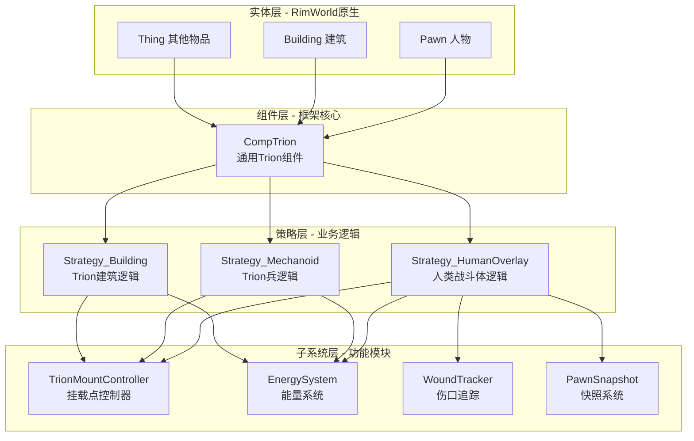
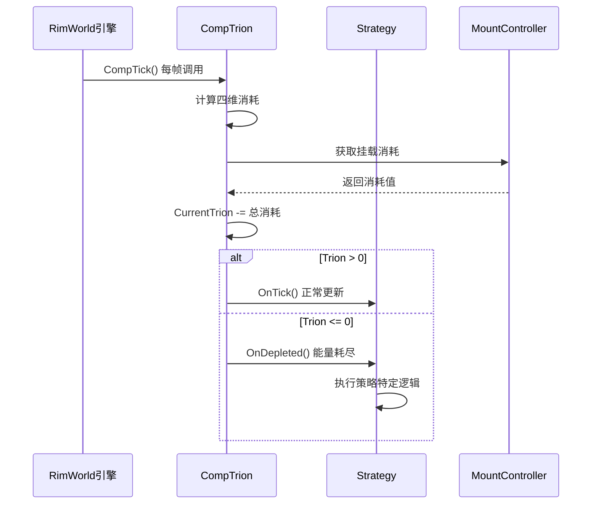

# ProjectTrion 融合框架 - 核心概念设计

## 文档目的

本文档面向**代码工程师**，阐述 ProjectTrion 融合框架的核心概念和设计哲学。读完本文档后，工程师应能理解：
- 框架为什么这样设计（设计哲学）
- 框架由哪些核心概念组成
- 各个概念之间的关系
- 与 RimWorld 原生系统的对接方式

---

## 第一部分：设计哲学与目标

### 1.1 融合的本质

ProjectTrion 融合框架源自两个设计方案的合并：

| 来源 | 核心优势 | 核心劣势 |
|------|---------|---------|
| **v2.0 方案** | 细致的 Trion 能量管理逻辑 | 只支持人类，扩展性差 |
| **v3.0 方案** | 通用 ECS 架构，支持所有实体类型 | 缺乏能量管理细节 |

**融合目标：** 取 v3.0 的架构骨架 + v2.0 的能量管理细节 = **万物皆可 Trion 的通用框架**

---

### 1.2 设计三原则

#### 原则 1：通用性优先
**理念：** 不区分"人"与"物"，所有拥有 Trion 能力的对象统一视为 **Trion 实体（Trion Entity）**。

**实践：**
- Pawn、Building、自定义兵器都可以挂载 CompTrion
- 通过策略模式（Strategy Pattern）实现不同实体的行为差异

---

#### 原则 2：组件化设计
**理念：** 遵循 RimWorld 的 ThingComp 组件化哲学，避免修改原版类。

**实践：**
- 核心逻辑封装在 `CompTrion` 组件中
- 通过 `GetComp<CompTrion>()` 获取 Trion 能力
- 与原版系统无缝集成

---

#### 原则 3：简洁胜过完美
**理念：** 应用奥卡姆剃刀原则，砍掉不必要的复杂度。

**实践：**
- 放弃事件总线，改用直接方法调用
- 避免过度抽象，保持调用链清晰

---

## 第二部分：核心概念模型

### 2.1 概念全景图



---

### 2.2 核心概念一：Trion 实体（Trion Entity）

**定义：** 任何挂载了 `CompTrion` 组件的 `ThingWithComps` 对象。

**特征：**
- 拥有 Trion 能量容量
- 可以消耗和恢复 Trion
- 受 Trion 系统的生命周期管理

**示例：**
```csharp
// 判断一个 Thing 是否为 Trion 实体
public static bool IsTrionEntity(Thing thing)
{
    return thing?.TryGetComp<CompTrion>() != null;
}
```

---

### 2.3 核心概念二：CompTrion 组件

**定义：** 融合框架的**唯一入口**，所有 Trion 相关数据和逻辑的顶层容器。

**职责边界：**

| ✅ 负责 | ❌ 不负责 |
|--------|---------|
| 存储 Trion 容量数据 | 具体业务逻辑（由 Strategy 负责） |
| 计算每 Tick 总消耗 | 肉身快照（由 Strategy_HumanOverlay 负责） |
| 管理生命周期策略 | UI 界面显示（由专门的 UI 组件负责） |
| 序列化/反序列化 | 特效和音效（由专门的效果系统负责） |

**核心属性：**
```csharp
public class CompTrion : ThingComp
{
    // === 核心数据 ===
    public float CurrentTrion;      // 当前 Trion 量
    public float MaxCapacity;       // 最大容量
    public float LeakRate;          // 泄漏速率（伤口导致）

    // === 策略引擎 ===
    private ILifecycleStrategy _strategy;  // 生命周期策略

    // === 挂载系统 ===
    private List<TrionMountController> _mounts;  // 挂载点列表
}
```

---

### 2.4 核心概念三：生命周期策略（Lifecycle Strategy）

**定义：** 决定 Trion 实体在不同生命周期阶段的**行为差异**。

**设计模式：** 策略模式（Strategy Pattern）

**为什么需要策略？**
- 人类：需要快照肉身、回滚、Bail Out
- Trion 兵：能量耗尽直接爆炸销毁
- Trion 建筑：能量耗尽停机，恢复后重启

**接口定义：**
```csharp
public interface ILifecycleStrategy : IExposable
{
    void OnInitialize();         // 初始化时（激活/开机）
    void OnTick();               // 每帧更新
    bool ShouldInterceptDamage(); // 是否拦截原版伤害？
    void OnDamageTaken(float amount, BodyPartRecord hitPart); // 受击处理
    void OnDepleted();           // 能量耗尽处理
}
```

**三大策略实现：**

| 策略类 | 适用对象 | 关键行为 |
|--------|---------|---------|
| `Strategy_HumanOverlay` | 类人 Pawn | 快照 → 战斗体 → 受伤泄漏 → 能量耗尽回滚 |
| `Strategy_Mechanoid` | Trion 兵器 | 直接战斗 → 能量耗尽爆炸销毁 |
| `Strategy_Building` | Trion 建筑 | 运行 → 能量耗尽停机 → 恢复后重启 |

---

### 2.5 核心概念四：四维能量消耗模型

**定义：** Trion 能量的消耗来自四个维度，每个维度独立计算。

**模型公式：**
```
总消耗 = 维持消耗 + 动作消耗 + 伤口泄漏 + 挂载消耗
```

**详细说明：**

#### 维度 1：维持消耗（Maintenance）
- **来源：** 基础存在消耗
- **参考值：** 0.5 Trion/Tick
- **特点：** 持续、稳定、无法避免

#### 维度 2：动作消耗（Action）
- **来源：** 移动、攻击、使用技能
- **参考值：** 1-5 Trion/Tick（根据动作强度）
- **特点：** 动态、可控制

#### 维度 3：伤口泄漏（Wound Leakage）
- **来源：** 战斗体受伤导致 Trion 泄漏
- **计算公式：** `伤口严重程度 × 0.5 Trion/Tick`
- **特点：** 累加、可通过治疗降低

#### 维度 4：挂载消耗（Mount Consumption）
- **来源：** 激活的 Trion 组件（护盾、隐身、武器等）
- **参考值：** 5-50 Trion/Tick（根据组件类型）
- **特点：** 可开关、高消耗

**代码示例：**
```csharp
// @ CompTrion.cs
public float CalculateTotalDrain()
{
    float drain = 0f;

    // 1. 维持消耗
    drain += Props.maintenanceCost;  // 0.5/Tick

    // 2. 动作消耗
    if (_pawn.pather.Moving)
        drain += Props.movementCost;  // 1/Tick

    // 3. 伤口泄漏
    drain += LeakRate;  // 动态值，受伤增加

    // 4. 挂载消耗
    foreach (var mount in _mounts)
        drain += mount.GetCurrentDrain();  // 5-50/Tick

    return drain;
}
```

---

### 2.6 核心概念五：挂载点系统（Mount System）

**定义：** Trion 实体上的**装备位**，用于安装 Trion 组件（武器、护盾、能力等）。

**核心类：** `TrionMountController`

**职责：**
- 管理单个挂载位的状态
- 跟踪组件激活状态
- 计算该挂载位的能量消耗

**挂载点示例：**

| 实体类型 | 挂载点配置 | 用途 |
|---------|----------|------|
| 人类 Pawn | `LeftHand`, `RightHand` | 装备 Trigger（触发器类武器） |
| Trion 兵 Bamster | `BackTurret` | 固定武器系统 |
| Trion 炮台 | `MainTurret`, `Turret2`, `Turret3` | 多炮塔系统 |

**激活状态机：**
```
Inactive（未激活）
    ↓ 激活指令
Activating（激活中，1-5 Tick 引导）
    ↓ 引导完成
Active（已激活，正常工作）
    ↓ 关闭或能量耗尽
Cooling（冷却中，无法切换）
    ↓ 冷却完成
Inactive（可重新激活）
```

**代码示例：**
```csharp
public class TrionMountController : IExposable
{
    public string Tag;  // 挂载点标识：LeftHand, BackTurret 等
    public MountState State;  // 当前状态
    private int _activationCounter;  // 激活引导计数
    private int _cooldownCounter;    // 冷却计数

    public List<ComponentDef> EquippedComponents;  // 装备的组件列表

    // 每 Tick 计算并返回能量消耗
    public float TickAndGetDrain()
    {
        if (State == MountState.Active)
            return EquippedComponents.Sum(c => c.drainPerTick);
        return 0f;
    }
}
```

---

### 2.7 核心概念六：人类战斗体（Human Overlay）

**定义：** 人类殖民者通过 Trion 能量转换为**战斗体**的临时状态。

**核心机制：快照与回滚**

```
肉身状态
    ↓ 激活战斗体
  【快照】保存：健康、装备、技能
    ↓
战斗体状态（虚拟健康）
    ↓ Trion 耗尽
  【回滚】恢复：健康、装备
    ↓
肉身状态（原状态 + 惩罚）
```

**关键概念：虚拟伤害与 Trion 泄漏**

在战斗体状态下：
- **不扣除肉身血量**
- **伤害转化为 Trion 泄漏**
- **虚拟断肢**：部位"功能丧失"但不真实损坏

**PawnSnapshot 快照内容：**
```csharp
public class PawnSnapshot : IExposable
{
    // 健康数据
    public List<Hediff> savedHediffs;  // 所有 Hediff 状态
    public Dictionary<BodyPartRecord, float> partHealths;  // 部位健康

    // 装备数据
    public List<Apparel> savedApparel;  // 服装
    public ThingWithComps savedWeapon;  // 武器

    // 技能数据（如需要）
    public Dictionary<SkillDef, int> savedSkills;

    // 恢复方法
    public void Restore(Pawn pawn)
    {
        // 1. 清除战斗体 Hediff
        // 2. 恢复肉身 Hediff
        // 3. 恢复装备
        // 4. 应用惩罚（如 Trion 耗尽状态）
    }
}
```

---

### 2.8 核心概念七：Bail Out（紧急脱离）

**定义：** 当人类战斗体受到致命伤害或 Trion 即将耗尽时，自动触发的**紧急传送**机制。

**触发条件（二选一）：**
1. 受到单次伤害超过阈值（如 50 Trion）
2. 当前 Trion < 预留量（如 400 Trion）

**效果：**
- 立即回滚肉身
- 传送到指定安全区域（基地、传送点）
- 施加"Trion 耗尽"debuff（减速、虚弱）

**代码示例：**
```csharp
// @ Strategy_HumanOverlay.cs
public void OnDamageTaken(float amount, BodyPartRecord hitPart)
{
    // 检查 Bail Out 条件
    if (amount > 50f || _comp.CurrentTrion < 400f)
    {
        if (_comp.HasModule("BailOut"))
        {
            DoBailOut();  // 触发紧急脱离
            return;
        }
    }

    // 正常伤害处理：转化为泄漏
    _comp.LeakRate += amount * 0.1f;
}

private void DoBailOut()
{
    // 1. 特效和音效
    FleckMaker.ThrowSmoke(_comp.Pawn.Position.ToVector3(), ...);

    // 2. 传送
    IntVec3 safePos = FindBailOutPosition();
    _comp.Pawn.Position = safePos;

    // 3. 回滚肉身
    _snapshot.Restore(_comp.Pawn);

    // 4. 施加 debuff
    _comp.Pawn.health.AddHediff(TrionDefOf.TrionExhaustion);
}
```

---

## 第三部分：概念之间的关系

### 3.1 组织结构关系

```
Trion 实体（Thing）
  │
  ├─ CompTrion（唯一组件）
  │    │
  │    ├─ ILifecycleStrategy（策略，1个）
  │    │    ├─ Strategy_HumanOverlay（人类专用）
  │    │    │    └─ PawnSnapshot（快照，1个）
  │    │    ├─ Strategy_Mechanoid（兵器专用）
  │    │    └─ Strategy_Building（建筑专用）
  │    │
  │    └─ TrionMountController（挂载点，N个）
  │         └─ ComponentDef（组件定义，每个挂载可装备多个）
```

---

### 3.2 数据流关系



---

### 3.3 职责分层关系

| 层级 | 职责 | 示例类 |
|------|------|-------|
| **实体层** | 提供基础属性和能力 | Pawn, Building |
| **组件层** | 封装 Trion 核心数据和逻辑 | CompTrion |
| **策略层** | 实现业务逻辑差异化 | Strategy_HumanOverlay |
| **子系统层** | 提供独立功能模块 | TrionMountController, PawnSnapshot |

---

## 第四部分：与 RimWorld 原生系统的对接

### 4.1 ThingComp 系统对接

**关键点：** CompTrion 继承自 `Verse.ThingComp`

**生命周期回调映射：**

| RimWorld 回调 | Trion 框架行为 |
|--------------|---------------|
| `PostSpawnSetup()` | 初始化 Strategy，创建 Mounts |
| `CompTick()` | 计算消耗，更新 Trion，调用 Strategy.OnTick() |
| `PostExposeData()` | 序列化 Trion 数据和 Strategy |
| `PostPreApplyDamage()` | 拦截伤害，调用 Strategy.OnDamageTaken() |

**API 引用：**
```csharp
// @ CompTrion.cs
public class CompTrion : ThingComp  // ✅ 已验证 @ Verse\ThingComp.cs
{
    public override void PostSpawnSetup(bool respawningAfterLoad)  // ✅ 已验证
    {
        base.PostSpawnSetup(respawningAfterLoad);

        // 根据宿主类型创建 Strategy
        if (parent is Pawn p && p.RaceProps.Humanlike)  // ✅ 已验证 @ Verse\Pawn.cs.cs
            _strategy = new Strategy_HumanOverlay(this);
    }
}
```

---

### 4.2 伤害系统对接

**方式一：ThingComp.PostPreApplyDamage（推荐）**

```csharp
public override void PostPreApplyDamage(ref DamageInfo dinfo, out bool absorbed)
{
    base.PostPreApplyDamage(ref dinfo, out absorbed);

    if (!_strategy.ShouldInterceptDamage())
        return;  // 不拦截，走原版流程

    // 拦截伤害
    _strategy.OnDamageTaken(dinfo.Amount, dinfo.HitPart);
    absorbed = true;  // 告诉 RimWorld 伤害已被吸收
}
```

**方式二：Harmony Patch（备用）**

当需要更复杂的控制时使用：
```csharp
[HarmonyPatch(typeof(Pawn_HealthTracker), "PreApplyDamage")]  // ✅ 已验证 @ Verse\Pawn_HealthTracker.cs
public static class Patch_PreApplyDamage
{
    public static bool Prefix(Pawn ___pawn, ref DamageInfo dinfo, out bool absorbed)
    {
        var comp = ___pawn.TryGetComp<CompTrion>();
        if (comp != null && comp.IsActive)
        {
            // 自定义拦截逻辑
            absorbed = comp.TryAbsorbDamage(ref dinfo);
            return !absorbed;  // false = 跳过原版逻辑
        }

        absorbed = false;
        return true;  // true = 执行原版逻辑
    }
}
```

---

### 4.3 序列化系统对接

**关键点：** 使用 RimWorld 的 Scribe 系统

```csharp
public override void PostExposeData()
{
    base.PostExposeData();

    // 1. 简单值序列化
    Scribe_Values.Look(ref CurrentTrion, "currentTrion", 0f);  // ✅ 已验证 @ Verse\Scribe_Values.cs
    Scribe_Values.Look(ref LeakRate, "leakRate", 0f);

    // 2. 深度序列化（IExposable 对象）
    Scribe_Deep.Look(ref _strategy, "strategy");  // ✅ 已验证 @ Verse\Scribe_Deep.cs

    // 3. 集合序列化
    Scribe_Collections.Look(ref _mounts, "mounts", LookMode.Deep);  // ✅ 已验证 @ Verse\Scribe_Collections.cs
}
```

---

### 4.4 Tick 系统对接

**关键点：** 每帧调用 `CompTick()`

```csharp
public override void CompTick()  // ✅ 已验证：每 Tick 自动调用
{
    base.CompTick();

    // 1. 计算消耗
    float drain = CalculateTotalDrain();

    // 2. 扣除 Trion
    CurrentTrion -= drain;

    // 3. 检查耗尽
    if (CurrentTrion <= 0)
    {
        CurrentTrion = 0;
        _strategy.OnDepleted();  // 触发策略的耗尽逻辑
    }

    // 4. 策略自定义逻辑
    _strategy.OnTick();
}
```

---

## 第五部分：设计约束与限制

### 5.1 性能约束

**问题：** CompTick 每帧调用，大量 Trion 实体会影响性能。

**应对：**
1. **只在必要时计算**：Trion 为 0 或 Max 时跳过计算
2. **缓存计算结果**：挂载消耗缓存 10 Tick
3. **分帧更新**：使用 `TickRare` 或 `TickLong` 处理非关键逻辑

```csharp
public override void CompTick()
{
    // 跳过无意义计算
    if (CurrentTrion <= 0 && _strategy.IsInactive)
        return;

    // 正常计算...
}

public override void CompTickRare()  // 每 250 Tick 调用一次
{
    // 处理非紧急逻辑（如 UI 更新）
}
```

---

### 5.2 保存/加载约束

**问题：** 复杂对象序列化可能失败。

**应对：**
1. **所有数据类实现 IExposable**
2. **使用版本标记**，方便未来迁移
3. **测试保存/加载兼容性**

```csharp
public override void PostExposeData()
{
    base.PostExposeData();

    // 版本标记（用于未来数据迁移）
    int version = 1;
    Scribe_Values.Look(ref version, "version", 1);

    if (Scribe.mode == LoadSaveMode.LoadingVars)
    {
        // 根据版本号处理数据迁移
        if (version < 1)
            MigrateFromOldVersion();
    }

    // 正常序列化...
}
```

---

### 5.3 扩展性约束

**问题：** 新增实体类型需要修改核心代码。

**应对：**
- 策略工厂模式，通过配置文件映射实体类型和策略

```csharp
// @ CompTrion.cs
public override void PostSpawnSetup(bool respawningAfterLoad)
{
    base.PostSpawnSetup(respawningAfterLoad);

    // 从配置文件读取策略映射
    _strategy = StrategyFactory.Create(parent, this);
}

// @ StrategyFactory.cs
public static ILifecycleStrategy Create(Thing parent, CompTrion comp)
{
    // 可通过 XML 配置扩展
    if (parent is Pawn p && p.RaceProps.Humanlike)
        return new Strategy_HumanOverlay(comp);
    else if (parent.def.defName.Contains("TrionSoldier"))
        return new Strategy_Mechanoid(comp);
    else if (parent is Building)
        return new Strategy_Building(comp);

    return new Strategy_Default(comp);  // 默认策略
}
```

---

## 第六部分：核心概念总结

### 6.1 概念清单

| 概念 | 核心思想 | 关键实现 |
|------|---------|---------|
| **Trion 实体** | 万物皆可 Trion | 挂载 CompTrion 组件 |
| **CompTrion** | 唯一入口，数据容器 | 继承 ThingComp |
| **生命周期策略** | 行为差异化 | ILifecycleStrategy 接口 |
| **四维消耗模型** | 能量资源博弈 | 维持+动作+伤口+挂载 |
| **挂载点系统** | 装备管理 | TrionMountController 状态机 |
| **人类战斗体** | 快照与回滚 | PawnSnapshot 深拷贝 |
| **Bail Out** | 紧急脱离 | 条件触发传送 |

---

### 6.2 概念之间的依赖链

```
RimWorld 原生系统
    ↓ 继承/使用
CompTrion（组件层）
    ↓ 持有
ILifecycleStrategy（策略层）
    ↓ 调用
子系统（MountController, PawnSnapshot 等）
```

---

### 6.3 理解检验清单

工程师应能回答以下问题：

1. ✅ 为什么使用 CompTrion 而不是直接修改 Pawn？
   - **答：** 遵循 RimWorld 组件化哲学，避免与原版冲突。

2. ✅ 为什么需要 ILifecycleStrategy？
   - **答：** 不同实体在能量耗尽时行为不同（人类回滚 vs 兵器爆炸）。

3. ✅ 四维消耗模型中，哪一维最重要？
   - **答：** 挂载消耗，因为它是玩家可控的高消耗部分。

4. ✅ PawnSnapshot 为什么不能用浅拷贝？
   - **答：** 浅拷贝会导致引用共享，恢复时会污染原版数据。

5. ✅ Bail Out 的设计目的是什么？
   - **答：** 防止玩家因操作失误导致角色永久死亡，提供容错机制。

---

## 第七部分：下一步阅读

完成本文档后，请按顺序阅读：

1. **02_功能详细设计说明书.md** - 每个功能的详细实现
2. **03_数据结构设计规范.md** - 类的字段和方法定义
3. **04_系统交互流程设计.md** - 关键流程的时序图
4. **05_配置参数定义.md** - 所有可调参数
5. **06_技术方案选择与考量.md** - 为什么这样实现

---

## 版本历史

| 版本号 | 日期 | 改动说明 | 修改者 |
|--------|------|---------|--------|
| 1.0 | 2026-01-09 | 初版：核心概念设计完成 | 需求架构师（AI） |

---

## 相关文档

- **RiMCP API 验证清单**：`RiMCP_API验证清单.md`
- **融合方案快速指南**：`临时\ProjectTrion框架设计\08_融合方案快速指南.md`

---

**需求架构师（AI）**
*2026-01-09*
