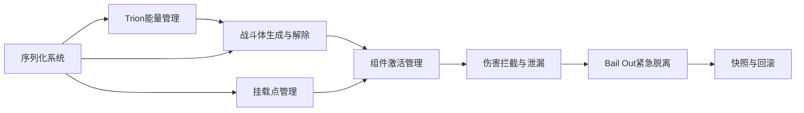
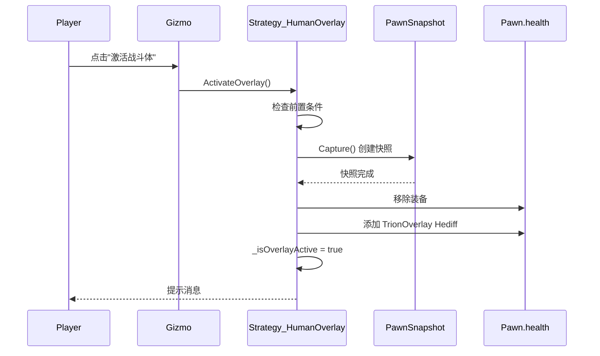
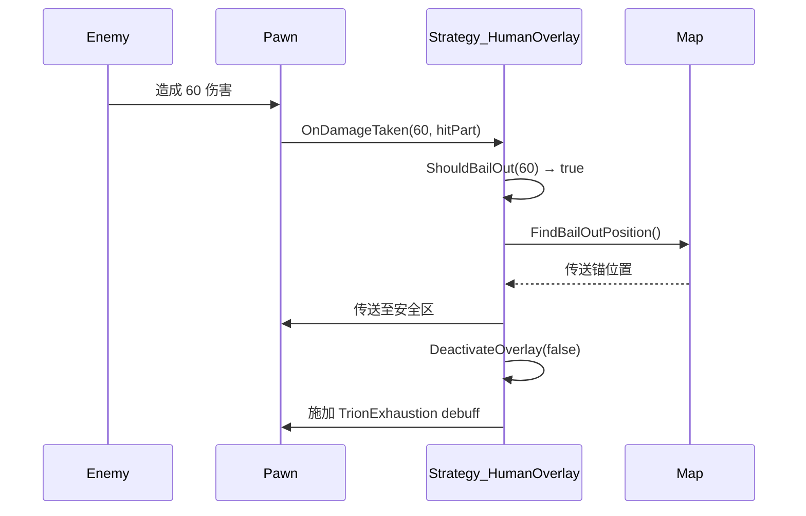

# ProjectTrion 融合框架 - 功能详细设计说明书

## 文档目的

本文档面向**代码工程师**，详细说明融合框架每个功能模块的实现规格。每个功能都包含：
- 功能描述与职责边界
- 输入/输出定义
- 处理逻辑流程
- 边界条件与异常处理
- 性能要求
- 测试验收标准

---

## 功能模块总览



---

## 第一部分：Trion 能量管理功能

### 功能 1.1：Trion 容量初始化

**功能ID：** FUNC-001
**优先级：** P0（核心功能）
**负责类：** `CompTrion`

#### 1.1.1 功能描述

根据实体类型和配置，初始化 Trion 能量容量和初始值。

#### 1.1.2 输入

| 输入项 | 类型 | 来源 | 说明 |
|-------|------|------|------|
| `parent` | `ThingWithComps` | RimWorld | 宿主实体（Pawn/Building） |
| `props` | `CompProperties_Trion` | XML 配置 | Trion 组件属性 |

#### 1.1.3 输出

| 输出项 | 类型 | 说明 |
|-------|------|------|
| `MaxCapacity` | `float` | 最大容量 |
| `CurrentTrion` | `float` | 当前 Trion 量（初始值 = MaxCapacity） |

#### 1.1.4 处理逻辑

```csharp
public override void PostSpawnSetup(bool respawningAfterLoad)
{
    base.PostSpawnSetup(respawningAfterLoad);

    // 1. 从 Props 读取基础容量
    MaxCapacity = Props.baseCapacity;  // 例如：1000

    // 2. 根据宿主类型调整容量
    if (parent is Pawn pawn)
    {
        // 人类：根据体型调整
        float bodySize = pawn.RaceProps.baseBodySize;
        MaxCapacity *= bodySize;  // 大型生物容量更高
    }
    else if (parent is Building building)
    {
        // 建筑：根据建筑规模调整
        int cells = building.OccupiedRect().Area;
        MaxCapacity *= Mathf.Sqrt(cells);  // 占地面积越大容量越高
    }

    // 3. 初始化当前值
    if (!respawningAfterLoad)  // 新生成
        CurrentTrion = MaxCapacity;
    // 加载存档时，CurrentTrion 由 PostExposeData 恢复
}
```

#### 1.1.5 边界条件

| 条件 | 处理 |
|------|------|
| `props.baseCapacity <= 0` | 使用默认值 1000，记录警告 |
| `parent == null` | 抛出异常（不应发生） |

#### 1.1.6 性能要求

- 调用频率：初始化时仅一次
- 执行时间：< 0.1ms

---

### 功能 1.2：四维消耗计算

**功能ID：** FUNC-002
**优先级：** P0
**负责类：** `CompTrion`

#### 1.2.1 功能描述

每 Tick 计算总消耗量，包含四个维度的累加。

#### 1.2.2 输入

| 输入项 | 类型 | 说明 |
|-------|------|------|
| `Props.maintenanceCost` | `float` | 维持消耗（配置） |
| `_pawn.pather.Moving` | `bool` | 是否移动 |
| `LeakRate` | `float` | 伤口泄漏速率 |
| `_mounts` | `List<TrionMountController>` | 挂载点列表 |

#### 1.2.3 输出

| 输出项 | 类型 | 说明 |
|-------|------|------|
| `totalDrain` | `float` | 本 Tick 总消耗量 |

#### 1.2.4 处理逻辑

```csharp
private float CalculateTotalDrain()
{
    float drain = 0f;

    // === 维度 1：维持消耗 ===
    drain += Props.maintenanceCost;  // 0.5/Tick

    // === 维度 2：动作消耗 ===
    if (_pawn != null)
    {
        // 移动消耗
        if (_pawn.pather?.Moving ?? false)
            drain += Props.movementCost;  // 1.0/Tick

        // 攻击消耗（如需要）
        if (_pawn.stances?.curStance is Stance_Busy busy && busy.verb?.IsMeleeAttack == true)
            drain += Props.meleeCost;  // 2.0/Tick
    }

    // === 维度 3：伤口泄漏 ===
    drain += LeakRate;  // 动态值

    // === 维度 4：挂载消耗 ===
    if (_mounts != null)
    {
        foreach (var mount in _mounts)
        {
            if (mount.State == MountState.Active)
                drain += mount.GetActiveDrain();  // 5-50/Tick
        }
    }

    return drain;
}
```

#### 1.2.5 公式验证

**测试用例 1：静止人类，无伤口，无激活组件**
```
总消耗 = 0.5 + 0 + 0 + 0 = 0.5 Trion/Tick
```

**测试用例 2：移动中，受伤（严重程度 5），激活护盾（10）**
```
LeakRate = 5 × 0.5 = 2.5 Trion/Tick
总消耗 = 0.5 + 1.0 + 2.5 + 10 = 14 Trion/Tick
```

#### 1.2.6 边界条件

| 条件 | 处理 |
|------|------|
| `LeakRate < 0` | 强制设为 0 |
| `drain < 0` | 强制设为 0（不允许负消耗） |
| `_pawn == null && parent is Building` | 跳过动作消耗计算 |

#### 1.2.7 性能要求

- 调用频率：每 Tick（60 次/秒）
- 执行时间：< 0.05ms
- 优化：缓存挂载消耗，每 10 Tick 更新一次

---

### 功能 1.3：Trion 扣除与枯竭检测

**功能ID：** FUNC-003
**优先级：** P0
**负责类：** `CompTrion`

#### 1.3.1 功能描述

每 Tick 扣除计算出的消耗量，检测是否枯竭并触发相应逻辑。

#### 1.3.2 输入

| 输入项 | 类型 | 说明 |
|-------|------|------|
| `totalDrain` | `float` | 本 Tick 总消耗 |
| `CurrentTrion` | `float` | 当前 Trion 量 |

#### 1.3.3 输出

| 输出项 | 类型 | 说明 |
|-------|------|------|
| `CurrentTrion` | `float` | 扣除后的 Trion 量 |
| `OnDepletedEvent` | `Action` | 枯竭事件（如触发） |

#### 1.3.4 处理逻辑

```csharp
public override void CompTick()
{
    base.CompTick();

    // 如果已经枯竭且策略已处理，跳过
    if (CurrentTrion <= 0 && _strategyHandledDepletion)
        return;

    // 1. 计算消耗
    float drain = CalculateTotalDrain();

    // 2. 扣除 Trion
    CurrentTrion -= drain;

    // 3. 检测枯竭
    if (CurrentTrion <= 0)
    {
        CurrentTrion = 0;  // 钳制为 0
        OnDepleted();  // 触发枯竭逻辑
        _strategyHandledDepletion = true;
        return;
    }

    // 4. 策略层 Tick（仅在未枯竭时）
    _strategy?.OnTick();
}

private void OnDepleted()
{
    // 委托给策略处理
    _strategy?.OnDepleted();

    // 通知其他系统
    Find.LetterStack.ReceiveLetter(
        "Trion 枯竭",
        $"{parent.LabelCap} 的 Trion 已耗尽！",
        LetterDefOf.NegativeEvent,
        parent
    );
}
```

#### 1.3.5 枯竭行为（根据策略）

| 策略 | 枯竭行为 |
|------|---------|
| `Strategy_HumanOverlay` | 回滚肉身，判定 Bail Out，施加 debuff |
| `Strategy_Mechanoid` | 爆炸并销毁实体 |
| `Strategy_Building` | 停机，等待能量恢复 |

#### 1.3.6 边界条件

| 条件 | 处理 |
|------|------|
| `CurrentTrion < 0` | 钳制为 0 |
| `_strategy == null` | 仅记录警告，不执行枯竭逻辑 |
| 连续多帧枯竭 | 使用 `_strategyHandledDepletion` 标志位，避免重复触发 |

---

### 功能 1.4：Trion 恢复

**功能ID：** FUNC-004
**优先级：** P1
**负责类：** `CompTrion`

#### 1.4.1 功能描述

通过充能设施或物品恢复 Trion。

#### 1.4.2 输入

| 输入项 | 类型 | 说明 |
|-------|------|------|
| `amount` | `float` | 恢复量 |
| `source` | `Thing` | 恢复来源（可选，用于日志） |

#### 1.4.3 输出

| 输出项 | 类型 | 说明 |
|-------|------|------|
| `actualRestored` | `float` | 实际恢复量（受容量上限限制） |

#### 1.4.4 处理逻辑

```csharp
public float RestoreTrion(float amount, Thing source = null)
{
    if (amount <= 0)
        return 0f;

    float before = CurrentTrion;
    CurrentTrion = Mathf.Min(CurrentTrion + amount, MaxCapacity);
    float actualRestored = CurrentTrion - before;

    // 日志记录（调试用）
    if (Prefs.DevMode)
        Log.Message($"[Trion] {parent.LabelCap} 恢复 {actualRestored:F1} Trion（来源：{source?.LabelCap ?? "未知"}）");

    return actualRestored;
}
```

#### 1.4.5 边界条件

| 条件 | 处理 |
|------|------|
| `amount > (MaxCapacity - CurrentTrion)` | 恢复至满值，不溢出 |
| `amount <= 0` | 返回 0，不处理 |

---

## 第二部分：战斗体生成与解除功能

### 功能 2.1：战斗体生成（人类专用）

**功能ID：** FUNC-101
**优先级：** P0
**负责类：** `Strategy_HumanOverlay`

#### 2.1.1 功能描述

人类殖民者激活 Trion 战斗体，肉身数据被快照保存，切换到虚拟健康状态。

#### 2.1.2 前置条件

| 条件 | 检查方式 |
|------|---------|
| 当前未处于战斗体状态 | `_isOverlayActive == false` |
| Trion 容量足够 | `CurrentTrion >= Props.activationCost` |
| 宿主为类人 Pawn | `parent is Pawn p && p.RaceProps.Humanlike` |

#### 2.1.3 输入

| 输入项 | 类型 | 说明 |
|-------|------|------|
| 无（由玩家触发） | - | 通过 Gizmo 按钮触发 |

#### 2.1.4 输出

| 输出项 | 类型 | 说明 |
|-------|------|------|
| `_snapshot` | `PawnSnapshot` | 肉身快照数据 |
| `_isOverlayActive` | `bool` | 战斗体激活标志 |

#### 2.1.5 处理逻辑

```csharp
public void ActivateOverlay()
{
    // 1. 前置检查
    if (_isOverlayActive)
    {
        Messages.Message("战斗体已激活", MessageTypeDefOf.RejectInput);
        return;
    }

    if (_comp.CurrentTrion < _comp.Props.activationCost)
    {
        Messages.Message($"Trion 不足（需要 {_comp.Props.activationCost:F0}）", MessageTypeDefOf.RejectInput);
        return;
    }

    Pawn pawn = _comp.Pawn;

    // 2. 创建快照
    _snapshot = new PawnSnapshot(pawn);
    _snapshot.Capture();  // 保存健康、装备、技能

    // 3. 隐藏/移除肉身装备
    if (pawn.apparel != null)
    {
        List<Apparel> wornApparel = new List<Apparel>(pawn.apparel.WornApparel);
        foreach (var apparel in wornApparel)
        {
            pawn.apparel.TryDrop(apparel, out Apparel _);  // 卸下
        }
    }

    if (pawn.equipment?.Primary != null)
    {
        pawn.equipment.TryDropEquipment(pawn.equipment.Primary, out ThingWithComps _, pawn.Position);
    }

    // 4. 应用战斗体 Hediff（视觉标记）
    Hediff overlayMarker = HediffMaker.MakeHediff(TrionDefOf.TrionOverlay, pawn);
    pawn.health.AddHediff(overlayMarker);

    // 5. 设置状态
    _isOverlayActive = true;
    _wounds.Clear();  // 清空伤口记录
    _comp.LeakRate = 0f;  // 重置泄漏率

    // 6. 特效
    FleckMaker.ThrowLightningGlow(pawn.Position.ToVector3(), pawn.Map, 1.5f);

    // 7. 消息提示
    Messages.Message($"{pawn.LabelCap} 激活了战斗体", MessageTypeDefOf.PositiveEvent);
}
```

#### 2.1.6 时序图



#### 2.1.7 边界条件

| 条件 | 处理 |
|------|------|
| Pawn 已死亡 | 拒绝激活，提示"无法激活已死亡单位" |
| Pawn 处于精神崩溃 | 允许激活（战斗体不影响精神状态） |
| 快照失败 | 记录错误，不激活战斗体 |

#### 2.1.8 测试验收

- [ ] 激活后肉身装备被移除
- [ ] 快照数据正确保存
- [ ] 战斗体 Hediff 正确添加
- [ ] Trion 消耗正确计算
- [ ] 特效正常播放

---

### 功能 2.2：战斗体解除（人类专用）

**功能ID：** FUNC-102
**优先级：** P0
**负责类：** `Strategy_HumanOverlay`

#### 2.2.1 功能描述

解除战斗体，恢复肉身状态。分为**主动解除**和**被动解除**（Trion 耗尽）。

#### 2.2.2 输入

| 输入项 | 类型 | 说明 |
|-------|------|------|
| `isVoluntary` | `bool` | 是否主动解除 |

#### 2.2.3 输出

| 输出项 | 类型 | 说明 |
|-------|------|------|
| `_isOverlayActive` | `bool` | 战斗体激活标志（设为 false） |
| 恢复的肉身状态 | - | 根据快照恢复 |

#### 2.2.4 处理逻辑

```csharp
public void DeactivateOverlay(bool isVoluntary)
{
    if (!_isOverlayActive)
        return;

    Pawn pawn = _comp.Pawn;

    // 1. 移除战斗体 Hediff
    Hediff overlayMarker = pawn.health.hediffSet.GetFirstHediffOfDef(TrionDefOf.TrionOverlay);
    if (overlayMarker != null)
        pawn.health.RemoveHediff(overlayMarker);

    // 2. 恢复快照
    if (_snapshot != null)
    {
        _snapshot.Restore(pawn);
    }

    // 3. 清除虚拟伤口
    _wounds.Clear();
    _comp.LeakRate = 0f;

    // 4. 根据解除方式施加效果
    if (!isVoluntary)  // 被动解除（Trion 耗尽）
    {
        // 施加"Trion 耗尽"debuff
        Hediff exhaustion = HediffMaker.MakeHediff(TrionDefOf.TrionExhaustion, pawn);
        pawn.health.AddHediff(exhaustion);

        // 惩罚：所有 Trion 被消耗
        _comp.CurrentTrion = 0f;

        Messages.Message($"{pawn.LabelCap} 的 Trion 耗尽，战斗体破裂！", MessageTypeDefOf.NegativeEvent);
    }
    else  // 主动解除
    {
        Messages.Message($"{pawn.LabelCap} 解除了战斗体", MessageTypeDefOf.NeutralEvent);
    }

    // 5. 重置状态
    _isOverlayActive = false;

    // 6. 特效
    FleckMaker.ThrowSmoke(pawn.Position.ToVector3(), pawn.Map, 1.0f);
}
```

#### 2.2.5 主动 vs 被动解除对比

| 项目 | 主动解除 | 被动解除（耗尽） |
|------|---------|----------------|
| **Trion 消耗** | 无额外消耗 | 全部消耗至 0 |
| **肉身恢复** | 完全恢复快照 | 完全恢复快照 |
| **debuff** | 无 | "Trion 耗尽"（减速、虚弱） |
| **装备恢复** | 是 | 是 |
| **触发条件** | 玩家手动 | `CurrentTrion <= 0` |

#### 2.2.6 边界条件

| 条件 | 处理 |
|------|------|
| 快照为 null | 记录错误，仅移除 Hediff，不恢复肉身 |
| Pawn 已死亡 | 跳过恢复，仅清理状态 |

---

## 第三部分：组件激活管理功能

### 功能 3.1：组件激活状态机

**功能ID：** FUNC-201
**优先级：** P0
**负责类：** `TrionMountController`

#### 3.1.1 功能描述

管理单个挂载点上组件的激活状态，实现状态机转换。

#### 3.1.2 状态定义

```csharp
public enum MountState
{
    Inactive,      // 未激活（可激活）
    Activating,    // 激活中（引导阶段，1-5 Tick）
    Active,        // 已激活（正常工作）
    Cooling,       // 冷却中（无法切换）
    Destroyed      // 已销毁（部位丢失）
}
```

#### 3.1.3 状态转换表

| 当前状态 | 触发事件 | 下一状态 | 附加操作 |
|---------|---------|---------|---------|
| `Inactive` | `TryActivate()` | `Activating` | 开始引导计数 |
| `Activating` | 引导完成（N Tick后） | `Active` | 开始消耗 Trion |
| `Active` | `Deactivate()` | `Cooling` | 停止消耗，开始冷却计数 |
| `Active` | 激活新组件 | `Cooling`（旧）→ `Activating`（新） | 瞬间切换 |
| `Cooling` | 冷却完成（M Tick后） | `Inactive` | 可重新激活 |
| 任意 | 部位丢失 | `Destroyed` | 永久禁用 |

#### 3.1.4 处理逻辑

```csharp
public class TrionMountController : IExposable
{
    public string Tag;  // 挂载点标识
    public MountState State;
    public ComponentDef ActiveComponent;  // 当前激活的组件

    private int _activationCounter;  // 激活引导计数（Tick）
    private int _cooldownCounter;    // 冷却计数（Tick）

    public void Tick()
    {
        switch (State)
        {
            case MountState.Activating:
                _activationCounter++;
                if (_activationCounter >= ActiveComponent.activationTicks)
                {
                    State = MountState.Active;
                    _activationCounter = 0;
                    Messages.Message($"{ActiveComponent.label} 激活完成", MessageTypeDefOf.SilentInput);
                }
                break;

            case MountState.Cooling:
                _cooldownCounter++;
                if (_cooldownCounter >= ActiveComponent.cooldownTicks)
                {
                    State = MountState.Inactive;
                    _cooldownCounter = 0;
                }
                break;
        }
    }

    public bool TryActivate(ComponentDef component)
    {
        // 检查状态
        if (State == MountState.Destroyed)
        {
            Messages.Message("该挂载点已损坏", MessageTypeDefOf.RejectInput);
            return false;
        }

        if (State == MountState.Activating || State == MountState.Cooling)
        {
            Messages.Message("正在激活或冷却中，无法切换", MessageTypeDefOf.RejectInput);
            return false;
        }

        // 检查 Trion 是否足够
        float activationCost = component.activationCost;
        if (_comp.CurrentTrion < activationCost)
        {
            Messages.Message($"Trion 不足（需要 {activationCost:F0}）", MessageTypeDefOf.RejectInput);
            return false;
        }

        // 如果当前有激活组件，先关闭
        if (State == MountState.Active && ActiveComponent != null)
        {
            Deactivate();
        }

        // 开始激活
        ActiveComponent = component;
        State = MountState.Activating;
        _activationCounter = 0;

        // 扣除一次性激活消耗
        _comp.CurrentTrion -= activationCost;

        Messages.Message($"正在激活 {component.label}...", MessageTypeDefOf.SilentInput);
        return true;
    }

    public void Deactivate()
    {
        if (State != MountState.Active)
            return;

        State = MountState.Cooling;
        _cooldownCounter = 0;

        Messages.Message($"{ActiveComponent.label} 已关闭", MessageTypeDefOf.SilentInput);
    }

    public float GetActiveDrain()
    {
        if (State == MountState.Active && ActiveComponent != null)
            return ActiveComponent.drainPerTick;
        return 0f;
    }
}
```

#### 3.1.5 时序示例

```
Tick 0:  Inactive（玩家点击激活护盾）
Tick 1:  Activating（引导中，计数 1/5）
Tick 2:  Activating（引导中，计数 2/5）
Tick 3:  Activating（引导中，计数 3/5）
Tick 4:  Activating（引导中，计数 4/5）
Tick 5:  Activating（引导中，计数 5/5） → Active（激活完成）
Tick 6-100: Active（持续消耗 Trion）
Tick 101: Active（玩家点击关闭） → Cooling（冷却中，计数 1/10）
Tick 102-110: Cooling（冷却中）
Tick 111: Cooling（计数 10/10） → Inactive（可重新激活）
```

#### 3.1.6 边界条件

| 条件 | 处理 |
|------|------|
| 引导过程中 Trion 耗尽 | 激活失败，状态回到 `Inactive` |
| 冷却过程中再次激活 | 拒绝，提示"冷却中" |
| 部位被移除 | 状态设为 `Destroyed`，无法再激活 |

---

### 功能 3.2：同部位组件切换

**功能ID：** FUNC-202
**优先级：** P1
**负责类：** `TrionMountController`

#### 3.2.1 功能描述

在同一挂载点上快速切换组件（旧组件瞬间关闭，新组件开始引导）。

#### 3.2.2 处理逻辑

```csharp
public bool TrySwitchComponent(ComponentDef newComponent)
{
    // 如果当前正在激活或冷却，拒绝切换
    if (State == MountState.Activating || State == MountState.Cooling)
    {
        Messages.Message("无法在激活或冷却时切换组件", MessageTypeDefOf.RejectInput);
        return false;
    }

    // 如果当前有激活组件，立即关闭（不进入冷却）
    if (State == MountState.Active)
    {
        ActiveComponent = null;  // 清空旧组件
        State = MountState.Inactive;  // 瞬间回到未激活
    }

    // 激活新组件
    return TryActivate(newComponent);
}
```

#### 3.2.3 时序示例

```
Tick 100: Active（护盾）
Tick 101: 玩家点击切换到"炸裂弹"
          → Active（护盾）瞬间关闭
          → Activating（炸裂弹，计数 1/5）
Tick 102-106: Activating（炸裂弹）
Tick 107: Active（炸裂弹）
```

---

## 第四部分：伤害拦截与泄漏功能

### 功能 4.1：伤害拦截

**功能ID：** FUNC-301
**优先级：** P0
**负责类：** `CompTrion`, `Strategy_HumanOverlay`

#### 4.1.1 功能描述

战斗体状态下，拦截原版伤害，转化为 Trion 泄漏。

#### 4.1.2 输入

| 输入项 | 类型 | 说明 |
|-------|------|------|
| `dinfo` | `DamageInfo` | 伤害信息 |

#### 4.1.3 输出

| 输出项 | 类型 | 说明 |
|-------|------|------|
| `absorbed` | `bool` | 是否吸收伤害（true = 不扣血） |
| 更新的 `LeakRate` | `float` | 伤口泄漏速率 |

#### 4.1.4 处理逻辑

```csharp
// @ CompTrion.cs
public override void PostPreApplyDamage(ref DamageInfo dinfo, out bool absorbed)
{
    base.PostPreApplyDamage(ref dinfo, out absorbed);

    // 1. 检查是否应该拦截
    if (!_strategy.ShouldInterceptDamage())
    {
        absorbed = false;  // 不拦截，走原版逻辑
        return;
    }

    // 2. 委托给策略处理
    _strategy.OnDamageTaken(dinfo.Amount, dinfo.HitPart);

    // 3. 标记为已吸收
    absorbed = true;  // 告诉 RimWorld 不要扣血
}

// @ Strategy_HumanOverlay.cs
public void OnDamageTaken(float amount, BodyPartRecord hitPart)
{
    // 1. 检查 Bail Out 条件
    if (ShouldBailOut(amount))
    {
        DoBailOut();
        return;
    }

    // 2. 记录伤口
    var wound = new WoundData
    {
        part = hitPart,
        severity = amount,
        leakRate = amount * 0.5f  // 伤害 × 0.5 = 泄漏速率
    };
    _wounds.Add(wound);

    // 3. 更新总泄漏率
    _comp.LeakRate = _wounds.Sum(w => w.leakRate);

    // 4. 检查部位破坏
    if (amount > hitPart.def.hitPoints * 0.8f)  // 伤害超过部位 80% 血量
    {
        OnPartDestroyed(hitPart);
    }

    // 5. 提示
    Messages.Message($"{_comp.Pawn.LabelCap} 的 {hitPart.Label} 受伤，Trion 泄漏增加！", MessageTypeDefOf.SilentInput);
}
```

#### 4.1.5 伤害转泄漏公式

| 伤害类型 | 泄漏速率计算 | 示例 |
|---------|-------------|------|
| 轻伤（< 10） | `amount × 0.5` | 5 伤害 → +2.5/Tick 泄漏 |
| 中伤（10-30） | `amount × 0.5` | 20 伤害 → +10/Tick 泄漏 |
| 重伤（> 30） | `amount × 0.5` | 50 伤害 → +25/Tick 泄漏 |
| 部位切除（> 80% 血量） | `amount × 0.5 + 5` | 60 伤害 → +35/Tick 泄漏 |

#### 4.1.6 边界条件

| 条件 | 处理 |
|------|------|
| `hitPart == null` | 使用躯干作为受击部位 |
| `amount <= 0` | 忽略，不处理 |
| 战斗体未激活 | 不拦截，走原版伤害逻辑 |

---

### 功能 4.2：部位虚拟破坏

**功能ID：** FUNC-302
**优先级：** P1
**负责类：** `Strategy_HumanOverlay`

#### 4.2.1 功能描述

当战斗体部位受到致命伤害时，标记为"虚拟破坏"，禁用相关功能但不真实切除。

#### 4.2.2 处理逻辑

```csharp
private void OnPartDestroyed(BodyPartRecord part)
{
    // 1. 查找该部位对应的挂载点
    var mount = _comp.GetMountByBodyPart(part);
    if (mount != null)
    {
        mount.State = MountState.Destroyed;  // 禁用挂载点
        mount.ActiveComponent = null;
    }

    // 2. 添加虚拟断肢标记（Hediff）
    Hediff virtualLoss = HediffMaker.MakeHediff(TrionDefOf.VirtualPartLoss, _comp.Pawn, part);
    _comp.Pawn.health.AddHediff(virtualLoss, part);

    // 3. 增加额外泄漏
    var wound = _wounds.FirstOrDefault(w => w.part == part);
    if (wound != null)
        wound.leakRate += 5f;  // 断肢额外泄漏

    // 4. 提示
    Messages.Message($"{_comp.Pawn.LabelCap} 的 {part.Label} 已无法使用！", MessageTypeDefOf.NegativeEvent);
}
```

#### 4.2.3 虚拟 vs 真实断肢对比

| 项目 | 虚拟断肢（战斗体） | 真实断肢（肉身） |
|------|------------------|----------------|
| **部位状态** | 标记为"功能丧失" | 真实移除 |
| **挂载点** | 禁用 | 无影响（肉身无挂载点） |
| **回滚后** | 完全恢复 | 永久丢失 |
| **视觉表现** | 透明/红色高亮 | 缺失 |

---

## 第五部分：Bail Out 紧急脱离功能

### 功能 5.1：Bail Out 条件判定

**功能ID：** FUNC-401
**优先级：** P0
**负责类：** `Strategy_HumanOverlay`

#### 5.1.1 功能描述

根据条件自动触发紧急脱离，传送至安全区域。

#### 5.1.2 触发条件（二选一）

| 条件 | 阈值 | 说明 |
|------|------|------|
| **单次伤害过高** | `amount > 50` | 致命伤害 |
| **Trion 即将耗尽** | `CurrentTrion < 400` | 预留量不足 |

#### 5.1.3 处理逻辑

```csharp
private bool ShouldBailOut(float incomingDamage)
{
    // 1. 检查是否装备 Bail Out 系统
    if (!_comp.HasComponent("BailOut"))
        return false;

    // 2. 条件 1：单次伤害过高
    if (incomingDamage > 50f)
        return true;

    // 3. 条件 2：Trion 即将耗尽
    if (_comp.CurrentTrion < 400f)
        return true;

    return false;
}
```

---

### 功能 5.2：Bail Out 执行

**功能ID：** FUNC-402
**优先级：** P0
**负责类：** `Strategy_HumanOverlay`

#### 5.2.1 处理逻辑

```csharp
private void DoBailOut()
{
    Pawn pawn = _comp.Pawn;

    // 1. 特效和音效
    FleckMaker.ThrowSmoke(pawn.Position.ToVector3(), pawn.Map, 2.0f);
    SoundDefOf.PsychicPulseGlobal.PlayOneShot(new TargetInfo(pawn.Position, pawn.Map));

    // 2. 查找传送目标位置
    IntVec3 safePos = FindBailOutPosition(pawn);
    if (safePos == IntVec3.Invalid)
    {
        Messages.Message($"{pawn.LabelCap} 无法找到安全传送点！", MessageTypeDefOf.NegativeEvent);
        // 继续在原地解除战斗体
    }
    else
    {
        // 传送
        pawn.Position = safePos;
        pawn.Notify_Teleported(false, false);

        Messages.Message($"{pawn.LabelCap} 紧急脱离至安全区域！", MessageTypeDefOf.NeutralEvent);
    }

    // 3. 解除战斗体
    DeactivateOverlay(isVoluntary: false);

    // 4. 消耗 Bail Out 系统的预留 Trion
    _comp.CurrentTrion -= 400f;  // Bail Out 预留量被消耗
}

private IntVec3 FindBailOutPosition(Pawn pawn)
{
    // 查找地图上的"传送锚"建筑
    Building anchor = pawn.Map.listerBuildings.AllBuildingsColonistOfDef(TrionDefOf.TeleportAnchor).FirstOrDefault();
    if (anchor != null)
        return anchor.Position;

    // 如果没有传送锚，尝试返回基地
    Pawn anyColonist = pawn.Map.mapPawns.FreeColonists.FirstOrDefault();
    if (anyColonist != null)
        return anyColonist.Position;

    return IntVec3.Invalid;  // 无安全位置
}
```

#### 5.2.2 时序图



#### 5.2.3 边界条件

| 条件 | 处理 |
|------|------|
| 地图上无传送锚 | 尝试传送到殖民者位置 |
| 完全无安全位置 | 原地解除战斗体 |
| Trion 不足 400 | 仍触发 Bail Out，但 Trion 归零 |

---

## 第六部分：快照与回滚功能

### 功能 6.1：快照捕获

**功能ID：** FUNC-501
**优先级：** P0
**负责类：** `PawnSnapshot`

#### 6.1.1 功能描述

深度复制 Pawn 的健康、装备、技能数据。

#### 6.1.2 捕获内容

| 数据类型 | 捕获方法 | 说明 |
|---------|---------|------|
| **Hediff（健康状态）** | 深拷贝列表 | 所有疾病、伤口、义肢 |
| **装备（Apparel）** | 引用列表 | 穿戴的服装 |
| **武器（Equipment）** | 引用 | 持有的武器 |
| **技能（Skills）** | 数值拷贝 | 技能等级和经验 |

#### 6.1.3 处理逻辑

```csharp
public class PawnSnapshot : IExposable
{
    public List<Hediff> savedHediffs;
    public List<Apparel> savedApparel;
    public ThingWithComps savedWeapon;
    public Dictionary<SkillDef, (int level, float xp)> savedSkills;

    public void Capture(Pawn pawn)
    {
        // 1. 复制 Hediff
        savedHediffs = new List<Hediff>();
        foreach (var hediff in pawn.health.hediffSet.hediffs)
        {
            // 深拷贝（避免引用共享）
            Hediff copy = (Hediff)Activator.CreateInstance(hediff.GetType());
            copy.def = hediff.def;
            copy.pawn = pawn;
            copy.Part = hediff.Part;
            copy.Severity = hediff.Severity;
            // ... 复制其他字段
            savedHediffs.Add(copy);
        }

        // 2. 保存装备引用
        savedApparel = new List<Apparel>(pawn.apparel.WornApparel);
        savedWeapon = pawn.equipment?.Primary;

        // 3. 保存技能
        savedSkills = new Dictionary<SkillDef, (int, float)>();
        if (pawn.skills != null)
        {
            foreach (var skill in pawn.skills.skills)
            {
                savedSkills[skill.def] = (skill.Level, skill.xpSinceLastLevel);
            }
        }
    }
}
```

#### 6.1.4 边界条件

| 条件 | 处理 |
|------|------|
| Pawn 已死亡 | 抛出异常（不应捕获死亡 Pawn） |
| Hediff 为 null | 跳过该项 |
| 技能系统不存在 | 保存空字典 |

---

### 功能 6.2：快照恢复

**功能ID：** FUNC-502
**优先级：** P0
**负责类：** `PawnSnapshot`

#### 6.2.1 功能描述

根据快照数据恢复 Pawn 状态。

#### 6.2.2 处理逻辑

```csharp
public void Restore(Pawn pawn)
{
    // 1. 清除所有 Hediff
    List<Hediff> currentHediffs = new List<Hediff>(pawn.health.hediffSet.hediffs);
    foreach (var hediff in currentHediffs)
    {
        pawn.health.RemoveHediff(hediff);
    }

    // 2. 恢复快照 Hediff
    foreach (var hediff in savedHediffs)
    {
        Hediff restored = (Hediff)Activator.CreateInstance(hediff.GetType());
        restored.def = hediff.def;
        restored.pawn = pawn;
        restored.Part = hediff.Part;
        restored.Severity = hediff.Severity;
        // ... 恢复其他字段
        pawn.health.AddHediff(restored, hediff.Part);
    }

    // 3. 恢复装备
    foreach (var apparel in savedApparel)
    {
        pawn.apparel.Wear(apparel, false);
    }

    if (savedWeapon != null)
    {
        pawn.equipment.AddEquipment(savedWeapon);
    }

    // 4. 恢复技能
    if (pawn.skills != null)
    {
        foreach (var kvp in savedSkills)
        {
            var skill = pawn.skills.GetSkill(kvp.Key);
            if (skill != null)
            {
                skill.Level = kvp.Value.level;
                skill.xpSinceLastLevel = kvp.Value.xp;
            }
        }
    }

    // 5. 刷新UI和缓存
    pawn.health.capacities.Notify_CapacityLevelsDirty();
    pawn.Drawer.renderer.graphics.ResolveAllGraphics();
}
```

#### 6.2.3 边界条件

| 条件 | 处理 |
|------|------|
| 装备已被销毁 | 跳过该装备，记录警告 |
| Hediff 类型不存在 | 跳过，记录错误 |
| Pawn 已死亡 | 尝试复活（高级功能） |

---

## 第七部分：性能优化要求

### 7.1 关键性能指标

| 功能 | 调用频率 | 目标耗时 | 优化方案 |
|------|---------|---------|---------|
| `CompTick()` | 每帧（60/秒） | < 0.1ms | 缓存计算结果 |
| `CalculateTotalDrain()` | 每帧 | < 0.05ms | 缓存挂载消耗 |
| `OnDamageTaken()` | 受击时 | < 0.2ms | 无需优化 |
| `Capture()` | 激活战斗体时 | < 5ms | 异步捕获（可选） |
| `Restore()` | 解除战斗体时 | < 10ms | 批量操作 |

### 7.2 缓存策略

```csharp
// 挂载消耗缓存（每 10 Tick 更新一次）
private float _cachedMountDrain = 0f;
private int _lastMountDrainTick = 0;

private float GetMountDrain()
{
    int currentTick = Find.TickManager.TicksGame;
    if (currentTick - _lastMountDrainTick > 10)
    {
        _cachedMountDrain = _mounts.Sum(m => m.GetActiveDrain());
        _lastMountDrainTick = currentTick;
    }
    return _cachedMountDrain;
}
```

---

## 版本历史

| 版本号 | 日期 | 改动说明 | 修改者 |
|--------|------|---------|--------|
| 1.0 | 2026-01-09 | 初版：7 大功能模块详细设计完成 | 需求架构师（AI） |

---

**需求架构师（AI）**
*2026-01-09*
