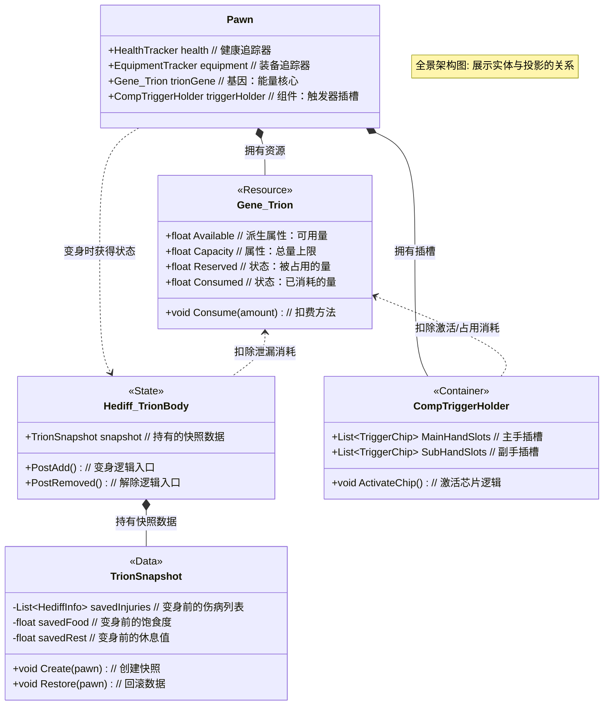
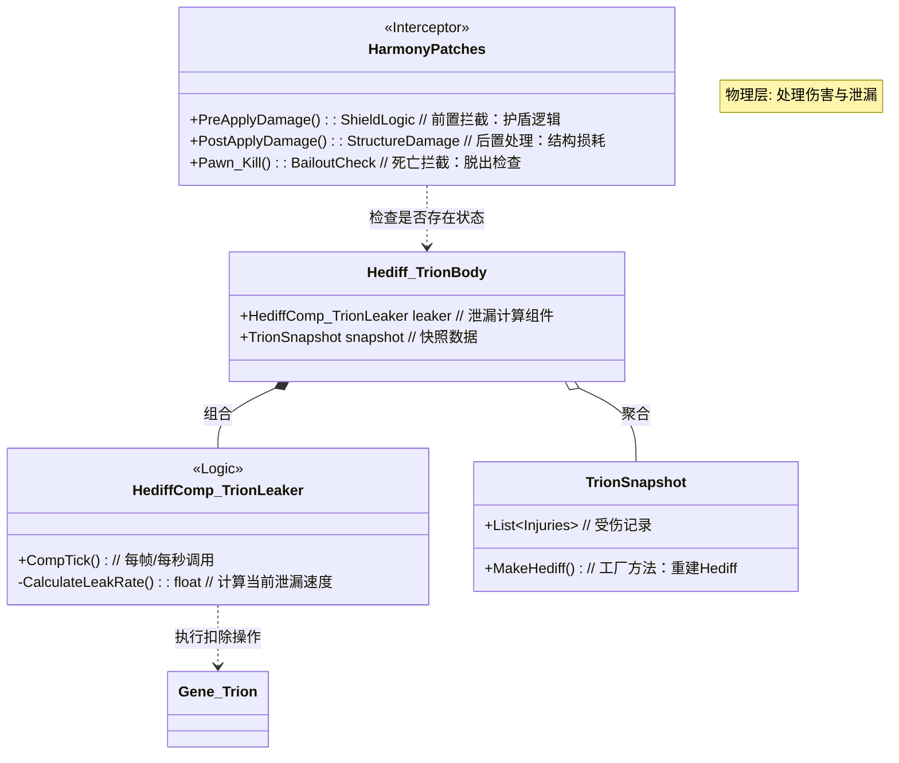
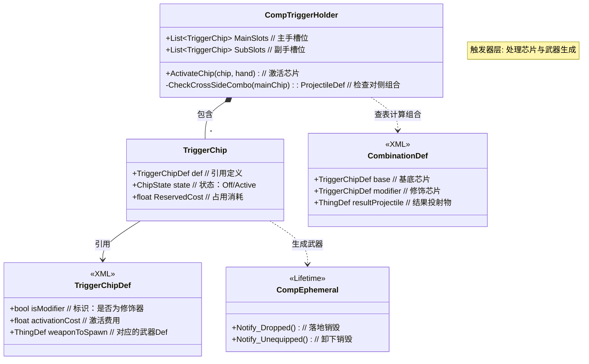
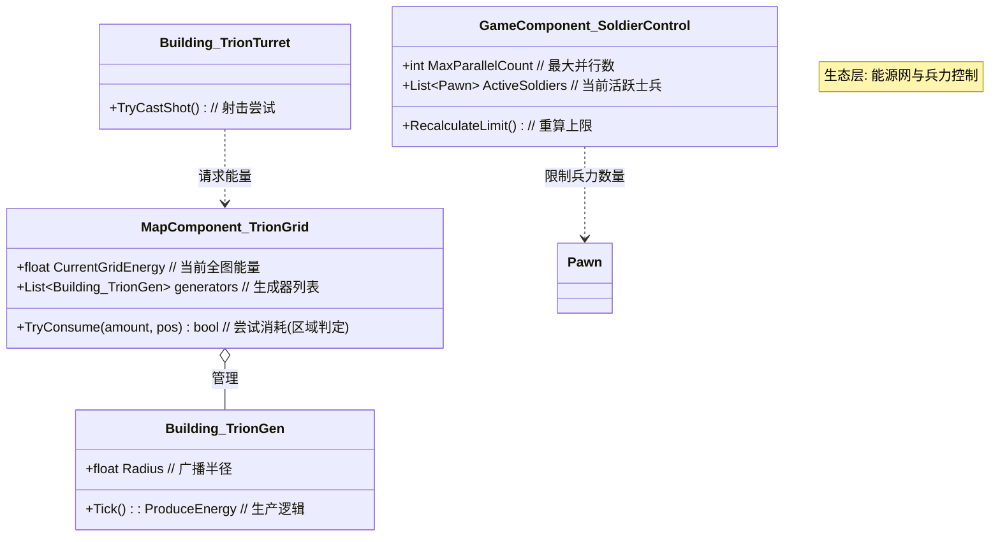

这份文档是 **RimTrion Framework** 的核心技术指导方针（v2.2）。

本文档在 v2.1 的基础上，严格遵循 **“只增不减”** 的原则，补充了详细的项目背景、设计意图说明（Why & What for）、参考案例分析，并增加了带有中文注释的 UML 架构图。此文档将指导整个项目的代码编写、系统设计与逻辑实现。

---

# RimTrion Framework 技术指导文档 (v2.2)

## 0. 项目背景与全景目标

### 0.1 背景介绍 (Context)
*   **RimWorld (环世界)**: 一款硬核科幻殖民模拟游戏。其核心体验建立在 **“不可逆的残酷性”** 上——肢体永久缺失、伤疤伴随终身、死亡即是终结。玩家通过管理资源和应对危机来维持殖民地生存。
*   **World Trigger (境界触发者)**: 一部科幻战斗题材动漫/漫画。其核心设定是 **“肉身置换”**。战斗员并非使用肉体战斗，而是利用“触发器 (Trigger)”将肉身置换为由 Trion (一种生物能量) 构成的 **“战斗体 (Trion Body)”**。战斗体拥有超常的体能，且受损不会影响肉身；当 Trion 耗尽或关键部位被毁时，战斗体解体，肉身无损归来（Bailout）。

### 0.2 项目目标 (Project Goal)
**RimTrion Framework** 旨在 RimWorld 中构建一套完整的“境界触发者”规则层。
我们不是要在游戏中塞入几把强力武器，而是要 **欺骗并劫持** RimWorld 的底层逻辑：
1.  **生存层面**: 将“血量 (HP) 经济”转化为“能量 (Trion) 经济”。
2.  **战斗层面**: 实现“敢于牺牲”的战术体验。玩家不再因为怕小人断腿而缩手缩脚，只要能量足够，断肢只是暂时的战术成本。
3.  **扩展层面**: 提供一个标准化的 C# 框架 (Framework)，让未来的开发者可以轻松添加新的触发器、新的 Trion 兵种或新的黑触发器，而无需重新编写底层的“变身”和“能量”逻辑。

### 0.3 现有模组参考 (References)
为了确保技术可行性，我们分析了社区现有的类似实现，并确立了本项目独特的技术路线：
*   **Altered Carbon (副本/义体)**: 实现了将 Pawn 的意识（技能/关系/记忆）保存为“堆栈 (Stack)”物品并在新躯体上复活。
    *   *参考点*: 它的数据快照逻辑验证了 `Snapshot` 系统的可行性。我们不需要做物品，但需要做类似的内存级数据备份。
*   **Vanilla Psycasts Expanded (灵能扩展)**: 其中的 "Blade Focus" 能够召唤持续一段时间的灵能武器。
    *   *参考点*: 验证了 `CompEphemeral` (瞬态物品) 的稳定性，即生成的武器可以安全地被系统回收而不破坏存档。
*   **Android Tiers (机械族扩展)**: 实现了远程控制机械体 (Surrogates)。
    *   *参考点*: 为我们的“操作员提供算力”系统提供了逻辑参考。

---

## 1. 核心架构与资源定义

### 1.1 核心机制：虚拟体 (The Virtual Body)
我们要实现的不再是简单的“护盾”，而是一种**“可被破坏、可泄漏、但保护本体”的虚拟肉身**。
*   **肉身 (Flesh Body)**: 数据实体。存放在快照中，绝对安全，冻结状态。
*   **战斗体 (Trion Body)**: 投影实例。完全模拟肉身的功能，**会受伤、会断肢、会有痛觉**，但这一切都是对 Trion 的消耗表现。

### 1.2 统一能源公式 (The Grand Formula)
所有系统基于浮点数 `Trion`。为了确保资源的每一分流动都有据可依，我们严格定义公式：

`Available (可用量) = Capacity (总量) - Reserved (占用量) - Consumed (已消耗量)`

*   **Capacity (总量)**:
    *   **定义**: 能量池的物理上限。
    *   **设计目的**: 决定了战斗的续航天花板。由先天 `StatDef` 决定。
    *   *Why?* 区分“天才”与“凡人”的核心数值，符合原作设定。
*   **Reserved (占用量)**:
    *   **定义**: 被装备的触发器芯片“锁定”的那部分能量。
    *   **设计目的**: 模拟负载。越强的装备占用越多。这部分能量**并没有消失**，只是暂时无法用于“抵挡伤害”或“发射子弹”。当战斗体主动解除时，这部分能量会返还。
    *   *Why?* 迫使玩家做 Build 构建抉择：是带满神装但只有薄皮（低可用量），还是轻装上阵拥有厚血条（高可用量）。
*   **Consumed (已消耗量)**:
    *   **定义**: 无论是开枪、开护盾、还是受伤泄漏，都计入此项。
    *   **设计目的**: 不可逆的损耗。这是战斗中真正的“成本”。
*   **Available (可用量)**:
    *   **定义**: 战斗体的“生命值”。
    *   **设计目的**: 当此数值 <= 0 时，战斗体因无法维持形态而物理崩溃。

### 1.3 全景架构 UML (Global Architecture)

---

## 2. 核心物理层 (The Physics Layer)

这是框架的底层地基，负责处理“人”的属性转换。

### 2.1 资源与属性系统 (Resource & Stats)
摒弃“仅作为资源”的简单设计，引入双属性系统。

#### A. Trion 核心 (`Gene_Trion`)
继承自 `RimWorld.Gene_Resource`。
*   **Why Gene?**: 复用 Biotech DLC 成熟的 UI 和数据结构，避免重写底层存读档逻辑。官方代码已处理了 Gizmo 显示和基础数值同步。
*   **接口**: 实现 `ITrionSource` (Consume, Reserve, CanConsume)。这允许未来的建筑或电池也能接入同一套扣费系统。

#### B. 属性定义 (`StatDef`)
为了代码的灵活性和模组兼容性，数值计算全部挂钩原版属性系统。
1.  **`TrionMaxCap` (总量)**:
    *   **来源**: 主要由 `TrionTalent` (天赋 Hediff/Trait) 提供 (如 A级=1000)。
    *   **扩展性**: 允许通过科技或药物给予临时的 buff/debuff。
2.  **`TrionOutput` (输出功率)**: **[新增]**
    *   **定义**: 决定能够驱动多大功率的触发器。
    *   **逻辑**: 在使用能力（如旋空）时，检查 `Pawn.GetStatValue(TrionOutput) >= RequiredOutput`。

### 2.2 战斗体构造：快照与回滚 (Snapshot & Rollback)
采用 **“基于数据的完全重构方案”**。

#### A. 启动流程 (Activation)
1.  **实例化快照 (`TrionSnapshot`)**:
    *   序列化保存：当前 `Hediff` 列表（只存数据不存引用）、`Needs` (饥饿/娱乐)、`Apparel` (如果需要替换衣服)。
    *   **Why no references?**: C# 的垃圾回收机制 (GC) 可能会销毁被移除的 Hediff 对象。如果只存引用，回滚时会遇到空指针或野指针。必须只存 Def 和 数值 (Severity, Immunity)。
2.  **冻结肉身**:
    *   移除所有外伤 (`Injury`)。
    *   锁定 Needs（通过 Patch 禁止下降）。
    *   **重要**: 保留永久性缺失 (`MissingPart`)。瞎子变身后依然是瞎子。
3.  **生成战斗体**:
    *   添加 `Hediff_TrionBody`。
    *   根据 V3.0 设定，计算组件的 `Reserved` 占用量，扣除可用上限。

#### B. 解除与回滚 (Deactivation)
1.  **清理战场**:
    *   调用 `pawn.health.RemoveAllHediffs()`。战斗体期间的一切断肢、枪伤全部抹除。
    *   **Why?**: 确保没有任何“投影”的损伤污染到“实体”。
2.  **数据回写**:
    *   读取快照，使用 `HediffMaker.MakeHediff` 重建变身前的所有状态。
    *   恢复 Needs 数值。
3.  **结算**:
    *   如果是主动解除：返还 `Reserved` 值。
    *   如果是被迫解除（Bailout/破碎）：扣除所有 `Reserved`（视为流失），并施加 `TrionExhaustion` (枯竭) Debuff。

### 2.3 伤害模型：泄漏与损耗 (The Leakage Model)
**这是与旧白皮书最大的区别。** 我们不再拦截伤害，而是管理伤害的后果。

#### A. 伤害处理流程
1.  **Harmony Patch**: `Verse.Pawn_HealthTracker.PreApplyDamage`
    *   **源码确认**: 此方法包含 `out bool absorbed` 参数。
    *   **逻辑**: 检查是否有“护盾组件”激活 (如 Raygust Shield)。如果有且判定格挡成功，则设 `absorbed = true` 拦截伤害并扣除 Trion。否则，**放行伤害**。
2.  **Harmony Patch**: `Verse.Pawn_HealthTracker.PostApplyDamage`
    *   **源码确认**: 此方法在伤害实际应用后调用，此时 `pawn.health.hediffSet` 中已包含新的伤口。
    *   **逻辑**:
        *   **结构损耗**: 根据伤害量 (`totalDamageDealt`)，扣除微量 Trion（例如 1 Damage = 1 Trion）。
        *   **痛觉抑制**: 战斗体不应因痛觉倒地。需 Patch `PainShockThreshold` 或强制战斗体痛觉系数为 0.1。

#### B. 持续泄漏机制 (`Leaking`)
这是 V3.0 的核心设定。
*   **组件**: `HediffComp_TrionLeaker` (挂载在 `Hediff_TrionBody` 上)。
*   **周期**: 每 60 Ticks (1秒) 执行一次。
*   **逻辑**:
    1.  遍历 `pawn.health.hediffSet` 中的所有伤口。
    2.  根据伤口类型计算流失速度：
        *   轻伤 (Scratch/Bruise): +2/sec。
        *   重伤 (Cut/Stab): +5/sec。
        *   **断肢 (MissingPart)**: +20/sec (手臂断裂导致严重泄漏)。
    3.  从 `Gene_Trion` 中扣除总泄漏量。
*   **What for?**: 迫使玩家进行战术决策——“我的左臂断了，Trion 正在狂掉，我是现在就撤退，还是在这个状态下拼死一搏？”

#### C. 物理层 UML (Physics Diagram)

### 2.4 死亡与紧急脱出 (Death & Bailout)
分层级的防死系统。

#### A. 触发条件
1.  `Gene_Trion.Value <= 0` (能量耗尽)。
2.  `Pawn.Kill` 被调用 (关键部位被毁，如头/心脏)。

#### B. 判定逻辑
当上述条件满足时，**拦截死亡** (Harmony Patch `Pawn.Kill`)，进入以下分支：

*   **分支 1: 拥有“紧急脱出系统” (Safe Bailout)**
    *   **条件**: `CompTriggerHolder` 中装备并激活了 Bailout 芯片 (占用400)。
    *   **效果**:
        *   播放传送特效。
        *   将 Pawn 传送到“传送锚”建筑或安全区。
        *   执行 **[回滚]**。
        *   **代价**: 400 占用量 + 当前剩余 Trion 全部清零。

*   **分支 2: 无脱出系统 (Unsafe Breakdown)**
    *   **条件**: 未装备 Bailout 芯片。
    *   **效果**:
        *   原地倒地 (Downed)。
        *   执行 **[回滚]**。
        *   **惩罚**: 施加长时间的昏迷，且根据设定，肉身可能受到一定程度的震荡伤害（可选硬核选项）。

---

## 3. 触发器架构 (The Trigger Layer)

### 3.1 插槽与容器 (`CompTriggerHolder`)
不再是简单的列表，而是带有状态的容器。

*   **数据结构**:
    *   `List<TriggerChip> MainHandSlots` (主手槽: 容量4)
    *   `List<TriggerChip> SubHandSlots` (副手槽: 容量4)
    *   `List<TriggerChip> SpecialSlots` (特殊槽: 容量2, 用于 Bailout/Bagworm)
*   **互斥逻辑**:
    *   **硬性限制**: 主手槽位中，同一时间只能有一个状态为 `Active`。副手同理。
    *   **特殊槽位**: 可与其他槽位共存（一直占用）。

### 3.2 激活状态机 (Activation State Machine)
模拟流程图中的“引导”过程。
*   **状态**: `Off` -> `Warmup` (引导中) -> `Active` (激活) -> `Cooldown` (冷却)。
*   **操作手感**:
    1.  玩家点击 Gizmo "激活弧月"。
    2.  Pawn 停止移动（或减速），头顶出现进度条 (Stance_Warmup)。
    3.  引导完成 (如 60 ticks)：
        *   扣除激活费用 (Activation Cost)。
        *   关闭**同手**其他组件。
        *   生成武器实体。

### 3.3 实体化与瞬态物品 (Materialization)
*   **瞬态组件 (`CompEphemeral`)**:
    *   所有生成的武器（弧月、蝎子）必须包含此组件。
    *   **销毁监听**: 
        *   `Notify_Dropped`: 落地即焚。
        *   `Notify_Unequipped`: 卸下即焚。
    *   **Why?**: 防止 RimWorld 的财富系统崩溃。如果玩家可以无限生成武器去卖，经济系统就完了。这也符合设定：Trion 武器离开使用者就会消散。

### 3.4 组合技系统 (Cross-Side Combo System) - **[修正重点]**
*   **修正说明**: 之前的文档错误地描述为同侧组合。根据设定，组合技（如“战斧”）通常是**主手**的弹药与**副手**的弹药（或辅助功能）同时作用的结果。
*   **逻辑**: 
    *   当 Pawn 尝试发射武器（如主手：美特拉/Meteor）时。
    *   检查**对侧槽位 (Opposite Hand)** 是否有处于 `Active` 状态且带有 `Modifier` 标签的芯片（如副手：蝮蛇/Viper）。
    *   **合成判定**: 
        *   查找 `CombinationDef` 数据库。
        *   Key: `[WeaponDef: Meteor] + [Modifier: Viper]`
        *   Result: `Projectile: Tomahawk` (拥有 Viper 追踪逻辑的高爆弹)。
    *   **结果**: 修改发射出的 `Projectile`，或者给 Projectile 添加额外的 `Comp`。
    *   **What for?**: 鼓励 Build 多样性。不再是无脑堆数值，而是通过“基底+修饰”创造出适合当前战况的独特攻击方式（如：针对高机动敌人用追踪弹，针对密集敌人用散射弹）。

#### C. 触发器层 UML (Trigger Diagram)

---

## 4. Trion 兵器与生态 (Soldiers & Ecosystem)

### 4.1 消耗品兵种 (Expendable Soldiers)
Trion 兵（Bamster, Marmod）与人类殖民者有着本质区别。
*   **无快照**: 它们不需要回滚。
*   **无泄漏**: 它们不需要复杂的伤口泄漏逻辑，或者简化处理（HP=Trion）。
*   **死亡**: `Pawn.Kill` 不被拦截。死亡即产生 `Explosion` (自爆) 并销毁尸体，不留垃圾。
*   **What for?**: 提供真正的“炮灰”。玩家应该习惯于在一场战斗中消耗掉 10 个 Bamster 而不感到心疼。

### 4.2 虚拟算力 (Parallel Processing)
*   **限制**: 玩家不能无限造兵。
*   **公式**: `TotalCapacity = Base + Sum(Colonist.Intellect * 0.5)`。
*   **实现**: `GameComponent` 全局维护当前已激活的 Soldier 数量和算力占用。超限则 Soldier 停机。
*   **Why?**: 平衡性控制。防止玩家暴兵推平全图，同时也赋予了“高智力非战斗人员”在战争中的价值（作为操作员提供算力）。

### 4.3 无线能源网 (Wireless Grid)
*   **MapComponent**: 维护全图 Trion 池。
*   **建筑**:
    *   **Trion Generator**: 吃生食，加数值。
    *   **Trion Turret**: 开火时调用 `MapComponent.TryConsume(amount)`。无需电线，但需要处于 Generator 的广播半径内（类似 WiFi）。

#### C. 生态层 UML (Eco Diagram)

---

## 5. 开发路线与优先级

### Phase 1: 物理法则验证 (The Physics Prototype)
1.  **StatDef**: 定义 `TrionMaxCap`, `TrionOutput`。
2.  **Gene**: 实现 `Gene_Trion`。
3.  **Snapshot**: 实现 `TrionSnapshot` 的序列化与 `MakeHediff` 重构逻辑。
4.  **Damage Patch**:
    *   实现 `PostApplyDamage` 的结构扣除。
    *   实现 `HediffComp_TrionLeaker` 的伤口检测与流失。
5.  **Bailout**: 实现 `Pawn.Kill` 的拦截与回滚测试。
    *   *验收标准*: 小人变身 -> 被砍断手 (Trion加速流失) -> 主动解除 -> 手长回来了。

### Phase 2: 触发器系统 (The Trigger System)
1.  **UI**: 制作左右手槽位的配置界面。
2.  **Holder**: 实现 `CompTriggerHolder` 的状态机与互斥锁。
3.  **Weapon**: 制作一把测试武器（如弧月），实现 `CompEphemeral`。
4.  **Power Check**: 在武器激活逻辑中加入 `TrionOutput` 的属性检查。
5.  **Combo**: 实现“主手+副手”的 Modifier 检查逻辑。

### Phase 3: 兵器与建筑 (Expansion)
1.  **Soldier**: 制作 Bamster 的 PawnKind，设置死后自爆。
2.  **Grid**: 编写 `MapComponent_TrionGrid`。

---

## 附录：关键技术风险预警

1.  **Mod 兼容性 (Combat Extended)**:
    *   CE 彻底改变了伤害计算和 Inventory 系统。
    *   **策略**: Phase 1 阶段 **不** 兼容 CE。在 Phase 2 完成后，需为 CE 编写专门的 `Armor` 类 Patch 来处理虚拟体逻辑。
2.  **复杂 Hediff 的回滚**:
    *   某些 Mod (如怀孕、寄生虫) 的 Hediff 数据结构极其复杂。
    *   **策略**: 在 Snapshot 中建立黑名单。对于无法识别的复杂 Hediff，变身时不移除，仅隐藏 (Visible=false)，回滚时重新显示。确保数据安全。
3.  **性能 (Performance)**:
    *   `HediffComp_TrionLeaker` 每一帧运行会卡死游戏。
    *   **策略**: 强制使用 `HashOffsetTicks`，确保只在每 60 ticks (1秒) 运行一次计算。

这份文档是当前 RimTrion 项目的最高技术准则。如有逻辑冲突，以此文档 V2.2 为准。
