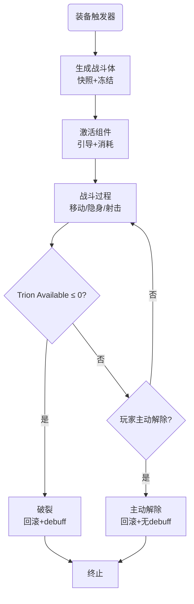

# Trion框架实现指南：战斗系统流程

---

## 文档元信息

**摘要**：基于Trion框架v0.5，详细说明如何实现完整的战斗系统流程。包括生成战斗体、装备组件、激活、消耗、受伤、恢复、解除等所有环节的实现方案。

**版本号**：v1.0
**修改时间**：2026-01-10
**关键词**：实现指南、战斗流程、CompTrion、Strategy、应用层
**标签**：[待审]

---

## 一、战斗系统流程总览



---

## 二、核心流程实现

### 2.1 流程节点1：装备触发器

**设定要求**：殖民者装备触发器，自动识别为Trion实体。

**框架支持**：
- 框架在PostSpawnSetup中自动检查是否有CompTrion
- 如果有CompTrion，自动选择Strategy_HumanCombatBody
- 初始化挂载点

**应用层需要实现**：

```csharp
// 1. 在Pawn的ThingDef中添加CompTrion
<thingDef>
    <defName>Human</defName>
    <comps>
        <li Class="CompTrion" />  // 添加核心组件
    </comps>
</thingDef>

// 2. 定义CompTrion配置
<CompProperties_CompTrion>
    <capacity>1000</capacity>  // 由天赋系统覆盖
    <mounts>
        <li Class="MountConfig">
            <slotTag>LeftHand</slotTag>
            <maxEquipped>4</maxEquipped>
        </li>
        <li Class="MountConfig">
            <slotTag>RightHand</slotTag>
            <maxEquipped>4</maxEquipped>
        </li>
        <li Class="MountConfig">
            <slotTag>Sub</slotTag>
            <maxEquipped>4</maxEquipped>
        </li>
    </mounts>
</CompProperties_CompTrion>

// 3. 实现天赋系统（应用层）
public class TrionTalentComp : ThingComp
{
    public float BaseOutputPower { get; set; }  // 天赋决定的输出功率
    public float TalentCapacity { get; set; }   // 天赋决定的总容量
}

// 在殖民者生成时应用天赋
public static void ApplyTrionTalent(Pawn pawn)
{
    var trionComp = pawn.TryGetComp<CompTrion>();
    var talentComp = pawn.GetComponent<TrionTalentComp>();

    if (trionComp != null && talentComp != null)
    {
        trionComp.Capacity = talentComp.TalentCapacity;  // 例如1000
        trionComp.RecalculateOutputPower();
    }
}
```

---

### 2.2 流程节点2：生成战斗体

**设定要求**（来自设定文档3.2）：
1. 快照肉身状态（健康、装备、物品）
2. 冻结生理活动
3. 禁用肉身装备
4. 生成战斗体形态
5. 组件注册（Disconnected → Dormant）
6. 计算占用量
7. 锁定配置

**框架支持**：
- Strategy_HumanCombatBody.OnInitialize() 负责快照和组件注册
- CompTrion.PostSpawnSetup() 负责初始化

**应用层需要实现**：

```csharp
// 1. 定义PawnSnapshot数据结构
public class PawnSnapshot
{
    public List<Hediff> health;           // 健康数据（排除心理）
    public List<Apparel> apparel;         // 穿戴装备
    public ThingWithComps equipment;      // 持有武器
    public List<Thing> inventory;         // 背包物品
    public Dictionary<NeedDef, float> needs;  // 生理需求值

    public void SaveHealth(Pawn pawn, bool excludeMental = true)
    {
        health = new List<Hediff>();
        foreach (var hediff in pawn.health.hediffSet.hediffs)
        {
            // 排除心理状态相关Hediff
            if (excludeMental && IsMentalHediff(hediff))
                continue;

            health.Add(hediff);
        }
    }

    public void SaveApparel(Pawn pawn)
    {
        apparel = new List<Apparel>(pawn.apparel.WornApparel);
    }

    public void SaveEquipment(Pawn pawn)
    {
        equipment = pawn.equipment?.Primary;
    }

    public void SaveInventory(Pawn pawn)
    {
        inventory = new List<Thing>(pawn.inventory.innerContainer);
    }

    public void SaveNeeds(Pawn pawn)
    {
        needs = new Dictionary<NeedDef, float>();
        foreach (var need in pawn.needs.AllNeeds)
        {
            needs[need.def] = need.CurLevel;
        }
    }

    public void Restore(Pawn pawn, bool excludeMental = true)
    {
        RestoreHealth(pawn, excludeMental);
        RestoreApparel(pawn);
        RestoreEquipment(pawn);
        RestoreInventory(pawn);
        RestoreNeeds(pawn);
    }

    // ... 具体恢复实现省略
}

// 2. Harmony补丁：冻结生理需求
[HarmonyPatch(typeof(Need), nameof(Need.NeedInterval), MethodType.PropertyGetter)]
static class Patch_FreezeNeeds
{
    static bool Prefix(Need __instance, ref float __result)
    {
        var pawn = __instance.pawn;
        var comp = pawn.TryGetComp<CompTrion>();

        if (comp?.GetStrategy() is Strategy_HumanCombatBody strategy && strategy.IsActive)
        {
            __result = 0f;  // 冻结生理需求变化
            return false;
        }

        return true;  // 走原版
    }
}

// 3. 禁用肉身装备（表现形式待定）
// 应用层可选择：隐藏穿戴、视觉替换等

// 4. 生成战斗体形态（表现形式待定）
// 应用层可选择：替换角色渲染、添加特效等
```

---

### 2.3 流程节点3：组件激活与引导

**设定要求**（来自设定文档2.3-2.4）：
1. 激活引导时间 1-5 Tick
2. 支付激活费用
3. 引导期间旧组件仍产生消耗
4. 引导完成后瞬间切换

**框架支持**：
- TriggerMount.TryActivate() 处理激活请求
- TriggerMount.TickActivation() 处理引导过程
- Activating状态管理引导期间的状态

**应用层需要实现**：

```csharp
// 1. 定义TriggerComponentDef（XML）
<TriggerComponentDef>
    <defName>Trigger_ArcBlade</defName>
    <label>弧月</label>
    <description>近战切割武器，轻便锋利</description>

    <!-- 占用和消耗 -->
    <reserveCost>10</reserveCost>        <!-- 装备时占用 -->
    <activationCost>5</activationCost>   <!-- 激活时一次性消耗 -->
    <sustainCost>0</sustainCost>          <!-- 激活后每单位持续消耗 -->
    <usageCost>0</usageCost>             <!-- 使用时消耗（近战无） -->

    <!-- 激活引导 -->
    <activationDelay>1</activationDelay>  <!-- 引导时间 -->

    <!-- 输出功率要求 -->
    <requiredOutputPower>0</requiredOutputPower>

    <!-- Worker -->
    <workerClass>ProjectWT.TriggerWorker_ArcBlade</workerWorker>
</TriggerComponentDef>

// 2. 实现Trigger组件状态转换
public class TriggerComponent
{
    public TriggerComponentDef def { get; set; }
    public TriggerState state { get; set; }

    public void OnEquipped() { /* 装备时调用 */ }
    public void OnActivated() { /* 激活时调用 */ }
    public void OnDeactivated() { /* 关闭时调用 */ }
    public void OnUnequipped() { /* 卸载时调用 */ }
}

// 3. UI/Gizmo实现：激活按钮
public class Gizmo_ActivateTrigger : Gizmo
{
    private TriggerMount mount;
    private TriggerComponent trigger;

    public override void GizmoOnGUI(Rect inRect)
    {
        if (Widgets.ButtonText(inRect, $"Activate {trigger.def.label}"))
        {
            if (mount.TryActivate(trigger.def))
            {
                // 成功，UI反馈
            }
            else
            {
                // 失败，显示原因（输出功率不足、费用不足等）
            }
        }
    }
}
```

---

### 2.4 流程节点4：战斗过程（消耗）

**设定要求**（来自设定文档4）：
- 基础消耗：战斗体维持 1/单位时间
- 组件消耗：激活后持续消耗
- 伤口泄漏：severity相关，轻伤+2，重伤+5，断肢+10
- 一次性消耗：射击、激活、护盾抵挡等

**框架支持**：
- CompTrion.CompTick() 每60 Tick执行一次消耗计算
- 所有消耗项累加
- Strategy提供GetBaseMaintenance()和GetLeakageRate()

**应用层需要实现**：

```csharp
// 1. 基础消耗：框架已定义，Strategy_HumanCombatBody返回1.0f

// 2. 组件持续消耗：TriggerMount.TickAndGetConsumption()
public float TickAndGetConsumption()
{
    float consumption = 0;

    // Activating状态的组件不消耗
    if (activeTrigger != null && activeTrigger.state == TriggerState.Active)
    {
        consumption += activeTrigger.def.sustainCost;
    }

    return consumption;
}

// 3. 伤口泄漏：Strategy_HumanCombatBody.GetLeakageRate()
public float GetLeakageRate(VirtualWound wound)
{
    if (wound.severity < 10) return 2.0f;      // 轻伤
    if (wound.severity < 30) return 5.0f;      // 重伤
    return 10.0f;                              // 断肢
}

// 4. 一次性消耗：由Worker实现
public class TriggerWorker_ShotgunBlast : TriggerWorker
{
    public override void Fire(Pawn user, LocalTargetInfo target)
    {
        var comp = user.TryGetComp<CompTrion>();

        // 支付使用费用
        comp.Consume(def.usageCost);

        // 执行具体效果（射击、爆炸等）
        // ...
    }
}
```

---

### 2.5 流程节点5：受伤处理

**设定要求**（来自设定文档3.3-3.4）：
1. 伤害转Trion消耗（1:1）
2. 护盾判定（概率+减伤）
3. 注册虚拟伤口
4. 部位损毁检测
5. 核心部位检测 → Bail Out

**框架支持**：
- Harmony补丁拦截PreApplyDamage
- Strategy_HumanCombatBody.OnDamageTaken()处理流程
- TriggerMount.OnPartDestroyed()处理部位毁坏

**应用层需要实现**：

```csharp
// 1. Harmony补丁：拦截伤害
[HarmonyPatch(typeof(Pawn_HealthTracker), "PreApplyDamage")]
static class Patch_InterceptDamage
{
    static bool Prefix(Pawn ___pawn, DamageInfo dinfo, bool absorbed)
    {
        var comp = ___pawn.TryGetComp<CompTrion>();
        if (comp == null) return true;

        var strategy = comp.GetStrategy();
        if (!strategy.ShouldInterceptDamage()) return true;

        // 调用框架伤害处理
        strategy.OnDamageTaken(dinfo.Amount, dinfo.HitPart);

        return false;  // 拦截原版伤害
    }
}

// 2. 护盾判定：框架Strategy_HumanCombatBody.TryBlockDamage()已实现
// 应用层只需在XML中配置护盾参数
<TriggerComponentDef>
    <defName>Trigger_Shield</defName>
    <isShield>true</isShield>
    <blockChance>0.5</blockChance>           <!-- 50%概率 -->
    <damageReduction>0.5</damageReduction>   <!-- 减伤50% -->
    <blockCost>5</blockCost>                 <!-- 消耗5 Trion -->
</TriggerComponentDef>

// 3. 虚拟伤口数据结构
public class VirtualWound
{
    public BodyPartRecord part;
    public float severity;
}

// 4. 部位损毁检测：Harmony拦截截肢Hediff
[HarmonyPatch(typeof(Pawn_HealthTracker), "AddHediff")]
static class Patch_DetectAmputations
{
    static void Postfix(Pawn ___pawn, Hediff hediff)
    {
        if (hediff is Hediff_MissingBodyPart)
        {
            var comp = ___pawn.TryGetComp<CompTrion>();
            comp?.OnBodyPartLost(hediff.Part);
        }
    }
}

// 5. CompTrion中实现部位丧失处理
public void OnBodyPartLost(BodyPartRecord part)
{
    // 查找绑定该部位的TriggerMount
    foreach (var mount in Mounts)
    {
        if (mount.boundPart == part)
        {
            mount.OnPartDestroyed();
        }
    }
}
```

---

### 2.6 流程节点6：Trion恢复

**设定要求**（来自设定文档7）：
- 人类：自然恢复，受饱食度影响
- 受伤时泄漏，不自愈
- 建筑：不自然恢复，献祭恢复

**框架支持**：
- CompTrion.CompTick()中调用ShouldRecover()和GetRecoveryModifier()
- Strategy决定恢复规则
- RecoveryRate参数控制恢复速度

**应用层需要实现**：

```csharp
// 1. 基础恢复速率设置
public override void PostSpawnSetup(bool respawningAfterLoad)
{
    var comp = parent.TryGetComp<CompTrion>();
    comp.RecoveryRate = 2.0f;  // 每60 Tick恢复2 Trion
}

// 2. 恢复条件检查：框架Strategy_HumanCombatBody.ShouldRecover()已实现
// 应用层可扩展修正系数

public override float GetRecoveryModifier()
{
    float modifier = 1.0f;

    // 特性加成（应用层定义）
    foreach (var trait in pawn.story.traits.allTraits)
    {
        if (trait.def.defName == "Trait_TrionFastRecovery")
            modifier += 0.5f;  // +50%
    }

    // 建筑加成（应用层实现）
    // 检查附近是否有"恢复增幅舱"
    if (HasNearbyRecoveryBooster())
        modifier += 0.3f;  // +30%

    return modifier;
}

private bool HasNearbyRecoveryBooster()
{
    var pawn = (Pawn)comp.parent;
    var boosters = pawn.Map.listerBuildingsRepairable
        .Where(b => b.def.defName == "Building_TrionRecoveryBooster")
        .Where(b => pawn.Position.DistanceTo(b.Position) <= 5);

    return boosters.Any();
}

// 3. 献祭恢复（建筑）：应用层实现
public class Building_TrionCharger : Building_WorkTable
{
    public void ConsumeSacrifice(Thing item)
    {
        var comp = TryGetComp<CompTrion>();
        if (comp == null) return;

        // 计算恢复量：物品价值 * 转化率
        float recoveryAmount = item.MarketValue * 0.1f;
        comp.Recover(recoveryAmount);

        // 消耗物品
        item.Destroy();
    }
}
```

---

### 2.7 流程节点7：Bail Out与战斗体破裂

**设定要求**（来自设定文档5和3.4）：
- 可用量 ≤ 0 时自动触发
- 核心部位被毁时最高优先级触发
- 玩家主动触发（UI按钮）
- 瞬移到传送锚，施加debuff

**框架支持**：
- CompTrion.CompTick()中检查Available ≤ 0
- Strategy_HumanCombatBody检查核心部位
- Strategy.OnDepleted()处理被动破裂

**应用层需要实现**：

```csharp
// 1. 传送锚建筑
<thingDef>
    <defName>Building_TransferAnchor</defName>
    <label>传送锚点</label>
    <thingClass>Building</thingClass>
    <placingDraggableDimensions>1</placingDraggableDimensions>
    <!-- 必须标记为传送锚，供Bail Out识别 -->
</thingDef>

// 2. Bail Out按钮/Gizmo
public class Gizmo_BailOut : Gizmo
{
    private Pawn pawn;

    public override void GizmoOnGUI(Rect inRect)
    {
        if (!IsBailOutAvailable()) return;

        if (Widgets.ButtonText(inRect, "Bail Out!"))
        {
            ExecuteBailOut();
        }
    }

    private bool IsBailOutAvailable()
    {
        var comp = pawn.TryGetComp<CompTrion>();
        var strategy = comp?.GetStrategy() as Strategy_HumanCombatBody;

        return strategy != null && strategy.HasBailOutComponent();
    }

    private void ExecuteBailOut()
    {
        var comp = pawn.TryGetComp<CompTrion>();
        var strategy = (Strategy_HumanCombatBody)comp.GetStrategy();

        strategy.TriggerBailOut();
    }
}

// 3. debuff "Trion枯竭"定义
<HediffDef>
    <defName>Hediff_TrionDepleted</defName>
    <label>Trion枯竭</label>
    <description>Trion能量完全耗尽，身体处于极度虚弱状态。</description>

    <stages>
        <li>
            <label>Trion枯竭</label>
            <capMods>
                <li>
                    <capacity>Moving</capacity>
                    <offset>-0.5</offset>  <!-- 移速 -50% -->
                </li>
                <li>
                    <capacity>Consciousness</capacity>
                    <offset>-0.2</offset>  <!-- 意识 -20% -->
                </li>
            </capMods>
        </li>
    </stages>

    <comps>
        <li Class="HediffCompProperties_ThoughtSetter">
            <thought>Thought_TrionDepleted</thought>
        </li>
        <li Class="HediffCompProperties_Disappears">
            <disappearsAfterTicks>30000</disappearsAfterTicks>  <!-- 12小时 -->
        </li>
    </comps>
</HediffDef>

<ThoughtDef>
    <defName>Thought_TrionDepleted</defName>
    <stages>
        <li>
            <label>Trion枯竭</label>
            <description>我的Trion完全耗尽了...</description>
            <baseMoodEffect>-10</baseMoodEffect>
        </li>
    </stages>
</ThoughtDef>
```

---

### 2.8 流程节点8：主动解除与被动破裂

**设定要求**：
- 主动解除：占用量返还，无debuff
- 被动破裂：占用量流失，施加debuff，快照回滚

**框架支持**：
- Strategy.OnDepleted()处理被动破裂逻辑
- 应用层需实现主动解除UI

**应用层实现**：

```csharp
// 1. 主动解除按钮
public class Gizmo_DisableCombatBody : Gizmo
{
    public override void GizmoOnGUI(Rect inRect)
    {
        if (Widgets.ButtonText(inRect, "Disable Combat Body"))
        {
            DisableCombatBody(isActive: true);  // 主动解除
        }
    }

    private void DisableCombatBody(bool isActive)
    {
        var comp = pawn.TryGetComp<CompTrion>();
        var strategy = (Strategy_HumanCombatBody)comp.GetStrategy();

        // 调用主动解除逻辑
        // Reserved返还，无debuff
        comp.Reserved = 0;
        strategy.SetInactive();

        // 恢复快照（不施加debuff）
        // ...
    }
}

// 2. 被动破裂：由框架自动处理
// CompTrion.CompTick() → if (Available <= 0) → OnDepleted()
// Strategy.OnDepleted() → 回滚快照 + 施加debuff + Reserved流失
```

---

## 三、完整战斗流程示例

基于《Trion战斗系统流程.md》的具体数值：

```
初始状态：
  Capacity: 1000
  Reserved: 0
  Consumed: 0
  Available: 1000

步骤1：生成战斗体（占用460）
  Reserved: 460 (= 弧月10 + 旋空10 + 炸裂弹10 + 护盾×2 20 + 变色龙10 + 紧急脱离400)
  Available: 540

步骤2：移动消耗（1单位 = 基础消耗1）
  Consumed: 1
  Available: 539

步骤3：激活变色龙（激活费用5 + 引导消耗1）
  Consumed: 7 (1 + 5激活费用 + 1引导期间的基础消耗)
  Available: 533
  状态：变色龙 Activating → Active (持续消耗+1/单位)

步骤4：移动5单位（1基础 + 1变色龙 = 2/单位）
  Consumed: 17 (7 + 5×2)
  Available: 523

步骤5：激活护盾和炸裂弹（激活费用各5，引导消耗3）
  Consumed: 30 (17 + 5 + 5 + 3)
  变色龙自动断开
  Available: 510

步骤6：射出2发弹药（使用费用1/发）
  Consumed: 33 (30 + 1基础消耗 + 2使用费用)
  Available: 507

步骤7：护盾抵挡攻击（概率50%成功，减伤50%，消耗5）
  原始伤害: 10 → 实际消耗: 5 (10 × 50%) + 5 (护盾费用) = 10
  Consumed: 39 (33 + 1基础 + 5护盾)
  Available: 501

步骤8：激活弧月和护盾（激活费用各5）
  Consumed: 49
  Available: 491

步骤9：尝试释放弧月旋空（输出功率检查）
  if (OutputPower < 50) 禁用按钮
  else：消耗50
  Available: 441

步骤10：受伤（伤口导致泄漏增加）
  伤害10 → 消耗10，注册伤口(severity=10) → 泄漏+2/单位
  Consumed: 61
  Available: 431

步骤11：失去右手（泄漏+5/单位）
  伤害50 → 消耗50，注册伤口(severity=50) → 泄漏+10/单位
  右手组件断开
  Consumed: 133
  Available: 367

步骤12：Trion≤0或Bail Out触发
  → Strategy.OnDepleted()
  → 回滚快照（健康、装备、物品）
  → Reserved流失：Consumed += Reserved; Reserved = 0
  → 施加debuff："Trion枯竭"
  → 心理状态保留
```

---

## 四、检查清单

### 实现前必读
- [ ] 阅读Trion框架v0.5设计文档
- [ ] 了解Strategy模式的实现方式
- [ ] 熟悉RimWorld的Harmony补丁机制
- [ ] 理解Trion四要素的含义和数据关系

### 框架层实现
- [ ] CompTrion核心组件（CompTick、Consume、Recover等）
- [ ] ILifecycleStrategy接口及三个实现类
- [ ] TriggerMount和TriggerComponent状态机
- [ ] Harmony补丁（伤害拦截、需求冻结、截肢检测）
- [ ] RiMCP验证清单中的所有API可用性确认

### 应用层实现（按优先级）
1. **天赋系统**
   - [ ] TrionTalentComp定义
   - [ ] BaseOutputPower和TalentCapacity计算
   - [ ] GetBaseOutputPower()实现

2. **快照机制**
   - [ ] PawnSnapshot数据结构
   - [ ] Save/Restore各项内容
   - [ ] 冻结生理需求的Harmony补丁

3. **组件系统**
   - [ ] TriggerComponentDef配置
   - [ ] TriggerWorker实现（射击、能力等）
   - [ ] 激活/关闭UI

4. **伤害系统**
   - [ ] 伤害拦截Harmony补丁
   - [ ] 护盾配置和逻辑
   - [ ] 虚拟伤口和泄漏

5. **部位损毁**
   - [ ] 截肢检测Harmony补丁
   - [ ] 部位绑定映射
   - [ ] 断连逻辑

6. **Bail Out和恢复**
   - [ ] 传送锚建筑
   - [ ] debuff定义
   - [ ] 恢复修正系数

---

**需求架构师**
*2026-01-10*
