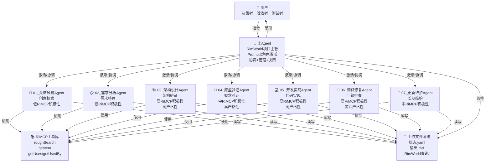
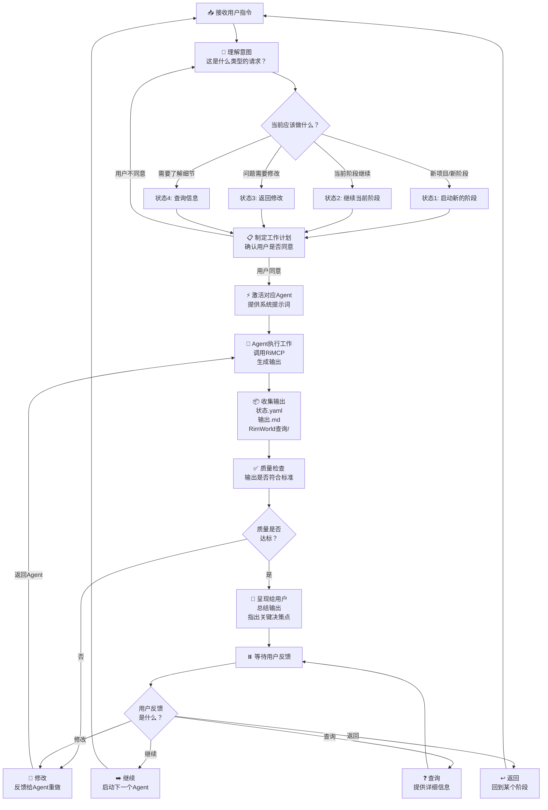
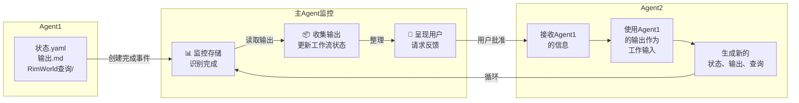
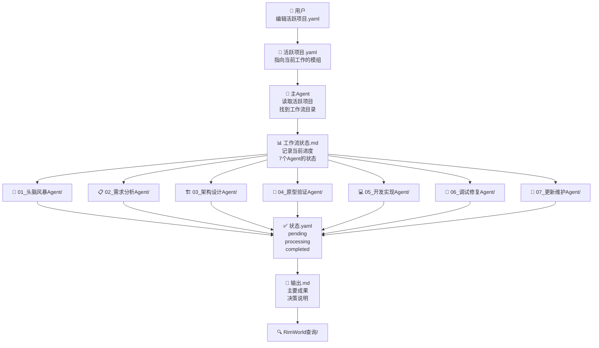
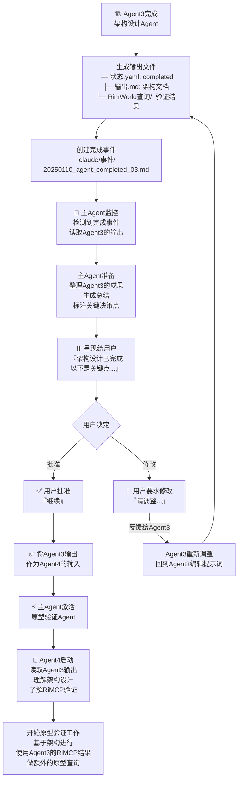
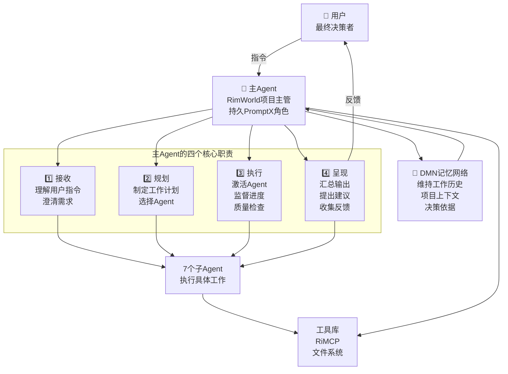
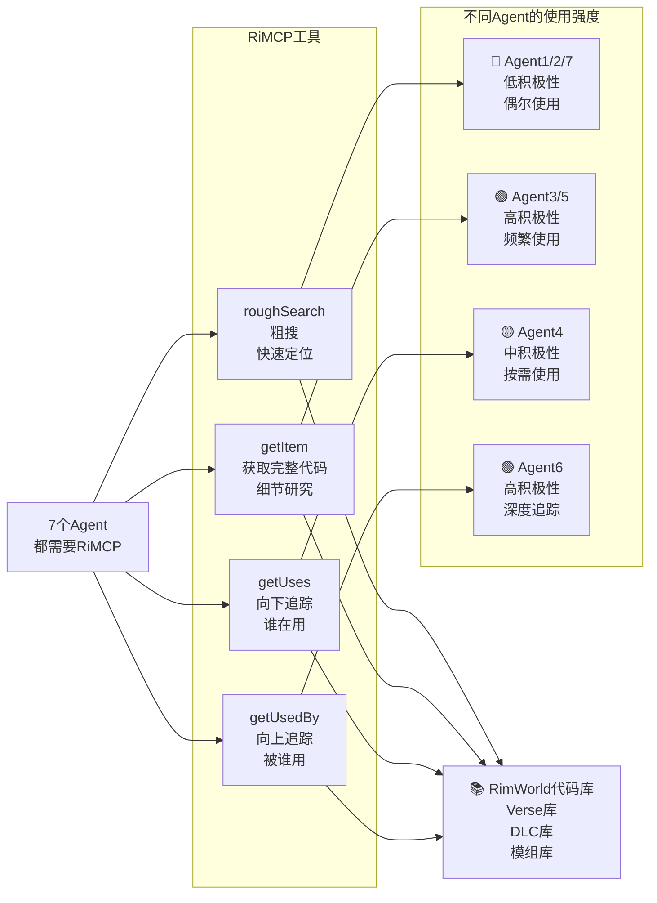
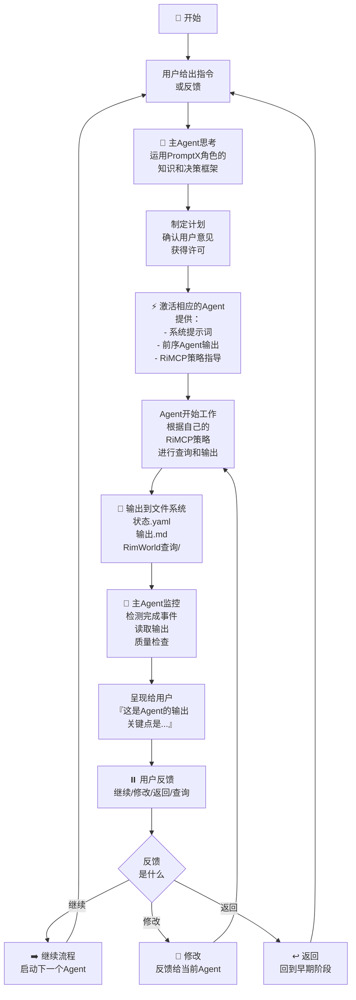

# 🏗️ **团队结构和工作流全景图**

让我用多个Mermaid图来为您描绘整个团队和工作流：

---

## **1️⃣ 团队组织结构**



---

## **2️⃣ 标准工作流程 - 7个阶段的顺序流转**

```mermaid
graph TD
    Start["🚀 开始<br/>用户说出想法"]
    
    Agent1["<b>01_头脑风暴Agent</b><br/>输入: 用户的想法<br/>工作: 进行创意探索<br/>输出: 概念框架<br/>RiMCP: 低积极性"]
    
    Agent2["<b>02_需求分析Agent</b><br/>输入: 概念框架<br/>工作: 整理需求<br/>输出: 需求清单<br/>RiMCP: 低积极性"]
    
    Agent3["<b>03_架构设计Agent</b><br/>输入: 需求清单<br/>工作: 设计架构<br/>输出: 架构文档+RiMCP验证<br/>RiMCP: 高积极性 高严格性"]
    
    Agent4["<b>04_原型验证Agent</b><br/>输入: 架构文档<br/>工作: 构建原型<br/>输出: 原型代码+测试结果<br/>RiMCP: 中积极性 高严格性"]
    
    Agent5["<b>05_开发实现Agent</b><br/>输入: 原型验证结果<br/>工作: 实现生产代码<br/>输出: 完整代码+注记<br/>RiMCP: 高积极性 高严格性"]
    
    Agent6["<b>06_调试修复Agent</b><br/>输入: 生产代码+测试反馈<br/>工作: 排查问题<br/>输出: 问题分析+修复方案<br/>RiMCP: 高积极性 灵活严格"]
    
    Agent7["<b>07_更新维护Agent</b><br/>输入: 稳定代码<br/>工作: 版本维护<br/>输出: 维护日志<br/>RiMCP: 中积极性"]
    
    End["✅ 完成<br/>模组发布"]
    
    UserCheck1["⏸️ 用户审查<br/>头脑风暴输出"]
    UserCheck2["⏸️ 用户审查<br/>需求分析输出"]
    UserCheck3["⏸️ 用户审查<br/>架构设计输出"]
    UserCheck4["⏸️ 用户审查<br/>原型验证结果"]
    UserCheck5["⏸️ 用户审查<br/>开发实现代码"]
    UserCheck6["⏸️ 用户审查<br/>调试修复结果"]
    UserCheck7["⏸️ 用户审查<br/>维护计划"]
    
    Start -->|主Agent激活| Agent1
    Agent1 -->|输出| UserCheck1
    UserCheck1 -->|批准| Agent2
    UserCheck1 -->|修改| Agent1
    
    Agent2 -->|输出| UserCheck2
    UserCheck2 -->|批准| Agent3
    UserCheck2 -->|修改| Agent2
    
    Agent3 -->|输出| UserCheck3
    UserCheck3 -->|批准| Agent4
    UserCheck3 -->|修改| Agent3
    
    Agent4 -->|输出| UserCheck4
    UserCheck4 -->|批准| Agent5
    UserCheck4 -->|修改| Agent4
    
    Agent5 -->|输出| UserCheck5
    UserCheck5 -->|批准| Agent6
    UserCheck5 -->|修改| Agent5
    
    Agent6 -->|输出| UserCheck6
    UserCheck6 -->|批准| Agent7
    UserCheck6 -->|修改| Agent6
    
    Agent7 -->|输出| UserCheck7
    UserCheck7 -->|批准| End
    UserCheck7 -->|修改| Agent7
```



---

## **3️⃣ 主Agent的核心决策树**



---

## **4️⃣ 信息流和交接过程**



---

## **5️⃣ 文件系统的交接点**



---

## **6️⃣ 一个完整的交接示例：从Agent3到Agent4**



---

## **7️⃣ 主Agent在项目中的核心位置**



---

## **8️⃣ RiMCP的角色和使用模式**



---

## **总结：工作流的核心逻辑**



---

# 📝 **文字总结：团队结构和工作流**

## **团队组成**

```text
1个主Agent（RimWorld项目主管）
  + 7个子Agent（各司其职）
  + RiMCP工具库（知识来源）
  + 文件系统（信息交接）
  + PromptX角色（主Agent增强）
  
= 完整的模组开发系统
```

## **工作流的3个关键特点**

### **特点1：串联而非并行**

```text
Agent1 → [用户审查] → Agent2 → [用户审查] → Agent3 → ...
        ↑ 可返回修改              ↑ 可返回修改
```

-   每个Agent完成后，用户审查
    
-   用户可以继续、修改或返回
    
-   不是并行，而是线性串联
    

### **特点2：主Agent是"指挥官"**

```text
用户指令 → 主Agent理解 → 主Agent规划 → 主Agent激活Agent
                              ↓
                        主Agent监督 → 主Agent呈现 → 用户反馈
```

-   所有的激活、协调、呈现都由主Agent负责
    
-   用户和Agent之间通过主Agent桥接
    
-   主Agent保持全局视图
    

### **特点3：RiMCP是"真理来源"**

```text
所有Agent的工作都基于RiMCP验证

Agent1（低使用）→ Agent2（低使用）→ Agent3（高使用 ⭐）
                                  ↓
                            基础已奠定

Agent3（高使用）→ Agent4（中使用）→ Agent5（高使用 ⭐）
                                  ↓
                            代码已验证

Agent5（高使用）→ Agent6（高使用 ⭐ 深度追踪）
```

## **交接的5个关键时刻**

### **交接点1：User → MainAgent**

```text
用户说："我想做一个贸易系统"
主Agent理解并规划
```

### **交接点2：MainAgent → Agent1**

```text
主Agent激活头脑风暴Agent
提供用户的需求
```

### **交接点3：Agent1 → MainAgent → User**

```text
Agent1完成输出
主Agent收集、整理
呈现给用户审查
```

### **交接点4：User批准 → Agent2**

```text
用户说"继续"
主Agent激活需求分析Agent
提供Agent1的输出作为输入
```

### **交接点5：Agent → Agent（通过文件系统）**

```text
Agent3输出架构设计
Agent4读取Agent3的输出
特别是RimWorld查询的结果
基于这些进行原型验证
```

---

现在您能看到完整的团队结构和工作流了吗？

有什么需要调整或澄清的吗？