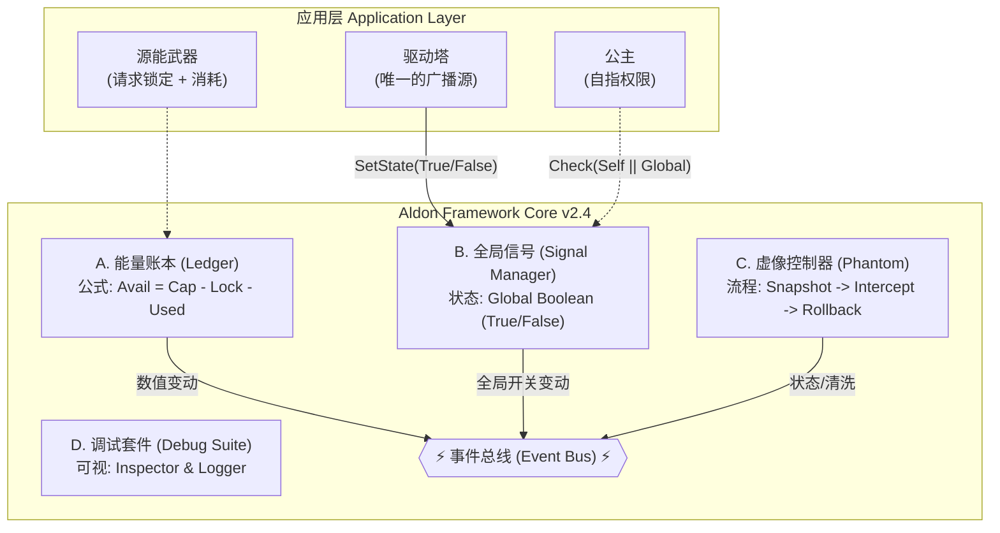

# Aldon Framework 技术白皮书 v2.4
**[框架层核心引擎规范]**

**版本：** v2.4 (Stable Core)  
**适用环境：** RimWorld v1.6+  
**设计哲学：** 奥卡姆剃刀原则——剔除一切非必要的业务逻辑  
**最后更新：** 2025-12-30  
**文档目的：** 本文档定义了Aldon Framework的核心逻辑引擎。框架只管数学计算与流程控制，一切数值设定与具体玩法均下放至应用层。所有三大定律的基本框架已锁定，但在实装验证过程中可能因为RimWorld API的实际限制而做微调。

## 标签说明
-  **[锁定]**  - 已确认、不轻易改变的核心设定
-  **[核心创意]**  - 故事/美术/音乐的创意方向
-  **[试验]**  - 临时添加或思考尚未完全的机制，有可能撤销
-  **[参数待调]**  - 逻辑框架确定，具体数值公式需测试调整
-  **[待验证]**  - 需通过代码验证有效性可行性
-  **[实现待定]**  - 逻辑框架确定，具体实现方式未决定
-  **[方案待定]**  - 宏观方向确定，但具体方案设计未决定
-  **[实现需权衡]**  - 目标已明确，但实现方式可能因技术/性能问题而调整
-  **[未来计划]**  - 明确排除在当前版本外的功能
-  **[参考设计]**  - 用于演示的范例
-  **[表述可优化]**  - 思路方向已定，但具体表达可以考虑或者应当需要润色
-  **[概念待定]**  - 概念方向已定，但命名或描述需推敲
-  **[完全待定]**  - 确认将会设计，但完全未开始具体实行，全都是临时记录
-  **[无法判断]**  - 用户的知识不足以自行判断内容的状况
-  **[____]**  - 需要你根据实际情况补充标签的位置

---

# 1. 摘要 (Abstract) **[锁定]**

Aldon Framework是一套独立于RimWorld原版机制的高维物理规则引擎。它不包含任何具体的游戏内容(如剧情、物品、建筑)，而是提供了一张"白纸"般的底层逻辑网。它通过 **"通用容器"、<u>"全局二值场域" [概念待定] </u>、"虚像协议"三大核心定律，以及一套高频响应的"事件总线"** ，为模组开发者提供了一个处理能量流动、权限鉴权与实体生命周期管理的通用解决方案。

**核心变革 [锁定] [概念待定]**  
框架层只负责"数学计算"与"流程控制"，一切"数值设定"与"具体玩法"均下放至应用层。

---

# 2. 背景与设计理念 (Background & Philosophy)

## 2.1 核心理念：去语义化 (De-semanticization) **[表述可优化]**
依照奥卡姆剃刀原则，框架层剔除了一切具体的业务语义。在框架的视角中：
- 不是"公主"而是拥有自指权限的特殊实体(Self-Authorized Entity)。
- 不是"驱动塔"而是全局信号状态的唯一维护者(Global Signal Provider)。
- 不是"武器扣费"而是数值消耗请求(Consume Request)。

## 2.2 架构目标 **[锁定]**
- **Pure Logic：** 框架只维护公式`Available = Capacity - Used - Locked`，不关心能量来源。
- **Global State：** 信号不再计算距离，简化为全图范围的True/False开关。
- **Robustness：** 强化存档安全机制，防止因模组变动导致的坏档。

---

# 3. 三大核心定律 (The Three Laws) **[锁定]**

## 3.1 定律一：通用容器 (Universal Container) **[锁定]**

**模块：** 能量账本(The Ledger)

**定义 [锁定]** - 任何接入系统的物体(Pawn/Building/Item)都必须持有的数据结构。

**唯一公式 [锁定]** - `Available = Capacity (上限) - Used (已用) - Locked (锁定)`

**逻辑 [锁定]**
- **锁定(Lock)：** **[表述可优化]** 由装备、芯片或Buff发起的"预占用"。
- **溢出(Overload)：** 当`Used > (Capacity - Locked)`时，触发过载状态。

**剃刀优化 [锁定]** - 框架不包含"回充速度"计算，仅提供`AddEnergy()`接口，回充逻辑由应用层自行调用。

## 3.2 定律二：全局二值场域 (Global Binary Field) **[表述可优化]**

**模块：** 信号管理器(The Signal Manager)

**修订定义 [锁定] [表述可优化]** - 摒弃复杂的距离扫描与强度计算，信号场域被重定义为全图唯一的布尔状态(Boolean State)。

**逻辑 [锁定]**
- **唯一广播源：** 仅由主控端（如驱动塔）修改GlobalField.IsActive状态。
- **二值性：** 只有Active(有信号)和Inactive(无信号)两种状态。
- **判定逻辑：**
  - 普通单位：CanRecharge = GlobalField.IsActive
  - 特殊单位(如皇室)：CanRecharge = Self.HasAuthority（由应用层逻辑决定，框架仅提供查询接口）。 **[表述可优化，皇室因子拥有者不依赖全局场域]**

## 3.3 定律三：虚像协议 (Phantom Protocol) **[锁定]**

**模块：** 虚像控制器(The Phantom Controller)

**定义 [锁定]** - 管理对象生命周期的状态机。

**流程 [锁定]**
- **Activate：** 执行Snapshot()（由应用层定义快照内容，如健康/装备）。
- **Intercept：** 拦截伤害→调用账本扣费。
- **Deactivate：** 执行Rollback()（恢复快照状态）。

**新增：存档安全机制 [试验]**  
脏数据清洗：在ExposeData阶段，如果检测到虚像数据结构损坏（如依赖的Mod丢失导致快照无法读取），框架将强制执行"紧急重置"，将Pawn恢复为肉身状态并清空所有虚像标记，防止坏档。  
**注：** 此机制为新增，经历了多轮设计调整，逻辑框架已确定但具体实现细节还需验证。

**剃刀优化 [锁定]** - 框架不负责"传送"或"爆炸"，只负责在能量耗尽瞬间广播事件，具体后果由应用层实现。

---

# 4. 框架架构图谱 (Architecture Graph) **[参考设计]**



---

# 5. 事件总线说明 (The Event Bus) **[核心-需优先实现]**

为了让应用层能灵活响应框架状态，框架开放以下核心钩子(Hooks)。注意区分数值变动与结构变动。

| 事件名称 | 标签 | 触发时机 | 携带参数 | 应用层典型用途 |
|----------|------|----------|----------|----------------|
| OnEnergyChanged | **[锁定]** | 能量数值(Used)变动时 | float current, float percent | 仅更新UI进度条的长度/数字，不重绘背景。 |
| OnLedgerStructureChanged | **[新增]** | Capacity或Locked值变动时 | float newCapacity, float newLocked | UI重绘信号：重新计算进度条的背景长度、灰色锁定区域范围。 |
| OnOverload | **[锁定]** | 试图消耗量 > Available时 | float amount_needed | 武器卡壳、播放"咔哒"声、提示"能量不足"。 |
| OnPhantomActivated | **[新增]** | 虚像构建成功，控制权移交后 | Pawn phantom | 播放变身音效、生成启动气浪特效。 |
| OnPhantomDeactivated | **[新增]** | 虚像正常关闭（非崩溃） | Pawn original | 播放解除变身音效、清除视觉残留。 |
| OnPhantomBreak | **[锁定]** | 虚像能量耗尽导致崩溃 | BreakCause cause | 触发紧急脱离逻辑、播放碎裂特效、施加惩罚Buff。 |
| OnSignalStatusChanged | **[锁定]** | 全局信号状态翻转时 | bool isActive | 激活/停用全图的源能设施指示灯。 |

---

# 6. API接口概览 (API & Interfaces)

## 6.1 通用容器组件CompAldonContainer **[无法判断]**

```csharp
public class CompAldonContainer : ThingComp
{
    // 纯数学接口
    public float Capacity; // 由应用层注入
    public float Available => Capacity - Used - Locked;

    // 核心操作
    public bool TryConsume(float amount);
    public void AddEnergy(float amount);

    // 锁定机制
    public int RegisterLock(float amount, object source);
    public void ReleaseLock(int lockID);
}
```

**实现状态 [实现中] [概念待定]** - 接口签名已确定，具体实现需要考虑：
- Dirty标记的处理
- 事件总线的触发时机
- 边界情况的异常处理

### 6.1.1 动态负载检查逻辑 **[新增] [必须明确]**

在实现 RegisterLock 时，必须遵循以下优先级防止逻辑死锁：
1. **预检查：** 如果 Current_Used + New_Lock_Amount > Capacity，则视为 **过载 (Overload)** 。
2. **处理策略：** 硬限制：直接返回 false，禁止装备该组件（UI提示"容量不足"）。

## 6.2 全局信号管理器AldonFieldManager(单例) **[无法判断]**

```csharp
public static class AldonFieldManager
{
    // 全局唯一状态
    public static bool IsActive { get; private set; }

    // 仅允许拥有特殊权限的组件(如驱动塔)调用
    public static void SetState(bool state, Thing source)
    {
        if (state != IsActive)
        {
            IsActive = state;
            AldonEvents.TriggerSignalStatusChanged(state);
        }
    }
}
```

## 6.3 虚像快照策略 ISnapshotStrategy **[核心-需优先实现]**

应用层必须实现此接口以处理"身心分离"时的复杂数据搬运（如记忆、社交关系）。

```csharp
public interface ISnapshotStrategy
{
    /// <summary>
    /// 阶段1: 在原身Despawn之前调用。
    /// 职责: 记录原身的健康、装备、Buff状态，返回一个数据对象。
    /// </summary>
    object TakeSnapshot(Pawn original);

    /// <summary>
    /// 阶段2: 虚像生成后立即调用。
    /// 职责: 将原身的"精神数据"（记忆、社交、技能）复制给虚像。
    /// </summary>
    void OnPhantomRealized(Pawn original, Pawn phantom, object snapshotData);

    /// <summary>
    /// 阶段3: 虚像销毁前/原身复活后调用。
    /// 职责: 将虚像在战斗中获得的"精神增量"（新记忆、新经验）合并回原身，并利用快照恢复原身肉体状态。
    /// </summary>
    void RestoreSnapshot(Pawn original, Pawn phantom, object snapshotData);
}
```

---

# 7. 调试与开发工具 (Visual Debugging Suite) **[核心-需优先实现]**

为了应对"去语义化"带来的数值黑盒问题，框架必须提供直观的视觉反馈。

## 7.1 实体调试器 (Inspector Overlay)

当玩家开启 **开发者模式 (God Mode)** 并选中含有 CompAldonContainer 的物体时，自动绘制覆盖层。

- **挂载点 (Hook):** ThingComp.PostDrawExtraSelectionOverlays()
- **绘制逻辑:** 获取当前 Available, Locked, Used 数值。使用 GenDraw.DrawFillableCircle 或 Material 在物体上方绘制一个微型饼图。
  - 红色 (Used): 表示已消耗/等待回充的缺口。
  - 灰色/锁链 (Locked): 表示被装备/组件硬性占用的上限。
  - 绿色/青色 (Available): 表示当前可用的能量。
- **文本浮窗:** 鼠标悬停在饼图上时，使用 TooltipHandler.TipRegion 显示具体的数值（如 "500/1000 (Locked: 200)"）。

## 7.2 全局场域监视器 (Global Field Monitor)

在屏幕右上角常驻显示当前源能场域的状态，用于快速判断逻辑死锁是否由信号中断引起。

- **挂载点 (Hook):** MapComponent.MapComponentOnGUI()
- **绘制逻辑:**
  - **位置:** UI.screenWidth - 200, 10
  - **内容:** 状态灯: (绿⚪) ON (Active) / (黑⚪) OFF (Inactive)
  - **激活源:** 显示 AldonFieldManager.ActiveSource 的 Label (如 "DriveTower_1")。
- **性能优化:** 仅在 Prefs.DevMode 为 true 时绘制。

## 7.3 锁定追踪器 (Lock Tracer) **[可选]**

在 Inspector 面板中增加一个自定义 Tab 或 Gizmo，用于追踪是谁锁住了能量。

- **挂载点 (Hook):** ThingComp.CompGetGizmosExtra()
- **实现:** 返回一个自定义 Command_Action，图标显示当前 Locked 总值。
- **点击效果:** 弹出一个 FloatMenu，列出所有注册了锁定的源对象：
  - "Weapon: Corona_Rifle (Cost: 50)"
  - "Trait: HighVolume (Cost: -200)"

---

# 8. 开发使用范例 (Extended Implementation Guide) **[参考设计] [无法判断]**

以下示例展示了这套"白纸框架"如何支持从基础设施到复杂逻辑的多种形态，验证其高度的扩展性。

## MVP 工程测试用例 (Technical Verification Scenario)

建议在开始写具体玩法Mod之前，先创建一个名为 Aldon_Debug_Module 的空Mod，只包含以下这一个测试用例。这能在一小时内验证你框架的 Container、Field 和 Phantom 三大逻辑是否打通。

**场景 T: "零号机" 验证协议 (Project Zero: The Logic Validator)**

**目标：** 验证不含任何美术资源的纯代码逻辑。  
**资源需求：** 使用 RimWorld 原版纹理（如红/绿方块）。

1. **测试对象 A：源能黑盒 (The Black Box)**
   - **Def:** 一个 ThingWithComps (外形借用原版蓄电池)。
   - **组件:** 挂载 CompAldonContainer (Capacity = 1000)。
   - **Gizmos (调试按钮):**
     - **[DEBUG] Add 100:** 调用 AddEnergy(100)。
     - **[DEBUG] Lock 200:** 模拟装备一件重型武器，调用 RegisterLock(200)。
     - **[DEBUG] Fire (Cost 50):** 调用 TryConsume(50)。
   - **验证点:**
     - 点击 Add 100 -> 检查 Inspector 饼图是否增加。
     - 点击 Lock 200 -> 检查 Available 上限是否立即减少。
     - 连续点击 Add 直到满 -> 再点击 Lock 200 -> 期望结果： 应该提示失败或无法锁定（根据你选的策略A/B），验证边界条件。

2. **测试对象 B：场域开关 (The Switch)**
   - **Def:** 一个无贴图的 MapComponent 或隐藏建筑。
   - **Gizmos:**
     - **[DEBUG] Toggle Field:** 切换 AldonFieldManager.IsActive。
   - **验证点:**
     - 关闭 Field。
     - 点击对象 A 的 Fire (Cost 50)。
     - 期望结果： TryConsume 返回 false，即便能量是满的。（验证全局锁是否生效）。

3. **测试对象 C：替身人偶 (The Dummy Phantom)**
   - **Def:** 给一个原版小人 (Pawn) 添加 CompPhantomTest。
   - **Gizmos:**
     - **[DEBUG] Activate Phantom:** 触发 PhantomController.Activate()。
   - **验证点:**
     - 观察: 原版小人是否消失（Despawn）？
     - 观察: 是否在原位生成了一个新的 Pawn（可以是全裸的同一个小人，或者随便什么动物，只要能动就行）？
     - 操作: 控制这个"替身"走两步，受点伤。
     - 操作: 等待能量耗尽或手动调用 Deactivate。
     - 观察: "替身"是否消失？原版小人是否在原位出现？
     - **关键检查:** 原版小人身上的伤还在吗？（如果还在，说明快照回滚失败；如果消失了，说明 RestoreSnapshot 成功）。

## 场景A：创建"源能储能站" (Aldon Battery) **[参考设计]**

**需求：** 一个不产电、只存储源能的建筑，作为"水库"。
- **实现逻辑：** 创建一个建筑Def。挂载CompAldonContainer。在XML中配置初始Capacity = 5000。
- **代码行为：** 它自动拥有了AddEnergy和TryConsume功能。
- **框架职责：** 只管存数。
- **应用层逻辑：** 当连接到网络时，它可以被其他设施(如炮塔)作为扣费目标。

## 场景B：创建"源能机械体" (Aldon Mechanoid) **[参考设计]**

**需求：** 一种完全依赖源能驱动的机械单位。能量是它的燃料，耗尽即停机。
- **实现逻辑：**
  - **Pawn定义：** 给机械体挂载CompAldonContainer(作为油箱)。
  - **运作消耗：** 编写一个CompTick，每60 tick调用一次container.TryConsume(0.5f)。
  - **如果TryConsume返回false(能量不足)，则施加Hediff_Shutdown(强制关机)。**
- **结果：** 你得到了一个纯源能驱动的单位，框架不需要知道它是机械体，只知道它是一个"会漏油的移动容器"。

## 场景C：创建"无线充能站" (Wireless Charger) **[参考设计]**

**需求：** 一个建筑，自动抽取基地主网(驱动塔/储能站)的能量，无线传输给附近的源能机械体。
- **实现逻辑:**
```csharp
public override void CompTick()
{
    // 1. 扫描范围内属于我方派系的、挂载了AldonContainer的Pawn(机械体)
    foreach (var mech in FindPawnsInRadius(10f))
    {
        var mechContainer = mech.GetComp<CompAldonContainer>();
        // 2. 如果机械体没满
        if (mechContainer.Available < mechContainer.Capacity)
        {
            float chargeAmount = 5f; // 每次充5点
            // 3. 尝试从基地主网(如驱动塔)扣除能量
            // 注意：这里MainGrid的能量池通常依赖全局网络，或直接从自身Container扣除
            if (this.TryConsume(chargeAmount))
            {
                // 4. 给机械体加能量
                mechContainer.AddEnergy(chargeAmount);
                // 5. 播放特效：充能站 -> 机械体(视觉反馈)
                DrawLightning(this.Position, mech.Position);
            }
        }
    }
}
```
- **结果：** 通过框架最基础的Add和Consume接口，你实现了一套复杂的"无线输电"系统。

## 场景D：创建"源能枪械：日冕" (Aldon Firearm: Corona) **[参考设计]**

**需求：** 一把射击时不消耗子弹，而是消耗持有者源能的步枪。
- **实现逻辑：** Verb重写：继承Verb_Shoot创建Verb_ShootAldon。
```csharp
// 开火检查:
protected override bool TryCastShot()
{
    Pawn caster = this.CasterPawn;
    var container = caster.GetComp<CompAldonContainer>();
    // 尝试扣除10点能量
    if (container != null && container.TryConsume(10f))
    {
        return base.TryCastShot(); // 扣费成功,开火
    }
    else
    {
        // 触发事件总线的OnOverload,UI可能会提示
        Messages.Message("源能不足!", MessageTypeDefOf.RejectInput);
        return false; // 扣费失败,卡壳
    }
}
```

## 场景E：实现"紧急脱离芯片" (Emergency Exit Chip) **[参考设计]**

**需求：** 插入芯片占用400能量，能量耗尽时传送。
- **实现逻辑：** 
  - **锁定：** 芯片的Comp在OnEquip时调用Container.RegisterLock(400)。
  - **监听：** 芯片实现IAldonEventHandler。
  - **触发：** 在OnPhantomBreak()回调中，编写Map.mapPawns.Teleport(user)逻辑。
- **结果：** 框架只负责通知"碎了"，芯片自己负责"跑路"。

## 场景F：源能灵能增幅杖 (Aldon Psylink Staff) **[参考设计]**

跨DLC联动(Royalty)的典型案例

**需求：** 这把法杖没有子弹，但持有者施放原版灵能(Psycast)时，扣除的是Aldon能量而非原版"精神熵"。
- **实现逻辑：**
  - **Harmony Patch：** Patch Psycast.CanCast和Psycast.Activate。
  - **拦截：** 检测施法者是否装备了该法杖。
  - **逻辑：**
    - CanCast：检查AldonContainer.Available > 技能消耗。
    - Activate：阻止原版精神熵增加，改为调用AldonContainer.TryConsume(技能消耗)。
- **框架体现：** 框架完全不知道"灵能"是什么，它只看到了又一个TryConsume请求。这证明了框架对其他Mod/DLC的极强兼容性。

## 场景G：源能净化器 (Pollution Scrubber) **[参考设计]**

跨DLC联动(Biotech)与环境改造案例

**需求：** 一个建筑，消耗巨量源能来清洗地图上的污染地块。
- **实现逻辑：**
  - **建筑：** 挂载CompAldonContainer(作为燃料箱)。
  - **信号检查：** 在代码中添加逻辑`if(!AldonFieldManager.IsActive) return;`(仅在全图信号激活时工作)。
  - **Tick逻辑：**
    - 每2500 Tick(1小时)检查周围污染地块。
    - 调用TryConsume(500)。
    - 若成功，调用RimWorld原版API PollutionGrid.SetPolluted(cell, false)。
- **框架体现：** 框架只负责扣除那500点能量。

---

# 9. 总结 (Conclusion) **[锁定]**

通过修正后的v2.4版本，Aldon Framework变得更加纯粹与健壮。

**更高效 [锁定]**  
全局二值信号消除了复杂的空间计算。  
存档清洗机制保障了长线游玩的稳定性。  
内置调试套件让数值黑盒变得透明。

框架继续恪守"只做计算，不做设定"的原则，为应用层提供坚如磐石的地基。

---

# 附录：框架修改历史 (Revision History)

| 版本 | 标签 | 说明 | 主要变更 |
|------|------|------|----------|
| v2.4-标签版 | **[本版本]** | 核心引擎规范 | 添加标签系统；澄清实装状态；统一称呼为"公主" |
| v2.4 | **[锁定] 反馈修正版** | 1. 信号场域重构：全局二值状态 2. API清理：移除ISignalSource，新增AldonFieldManager 3. 范例修正 4. 新增存档保护 5. 新增调试工具 |
| v2.3 | **[锁定] Stable Core** | 三大核心定律确立；跨DLC范例；Mermaid图渲染修复 |
| v2.2 | **[参考] 内部测试版** | 通用容器逻辑确立 |

**框架层文档结束**