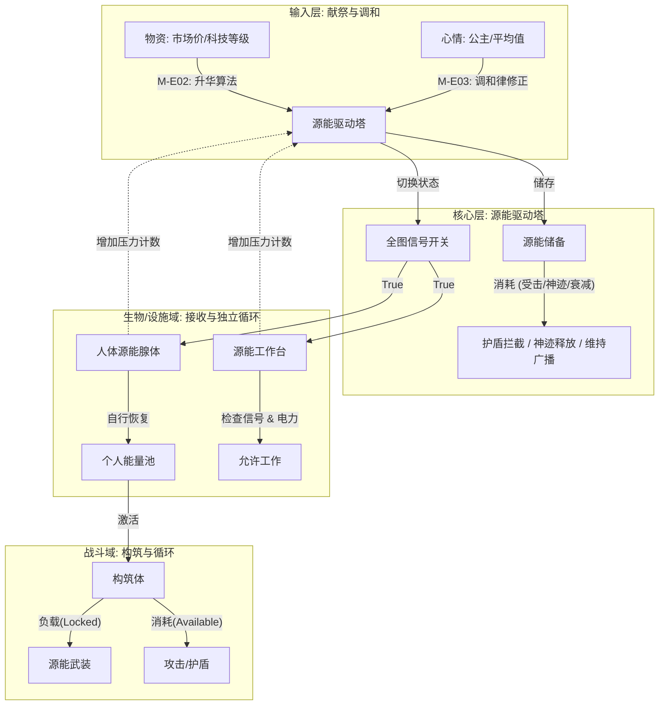
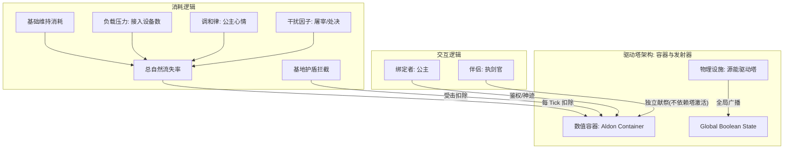
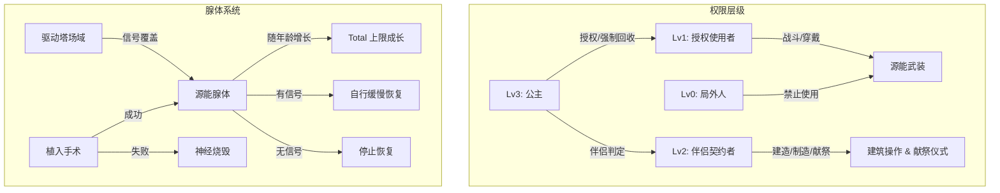
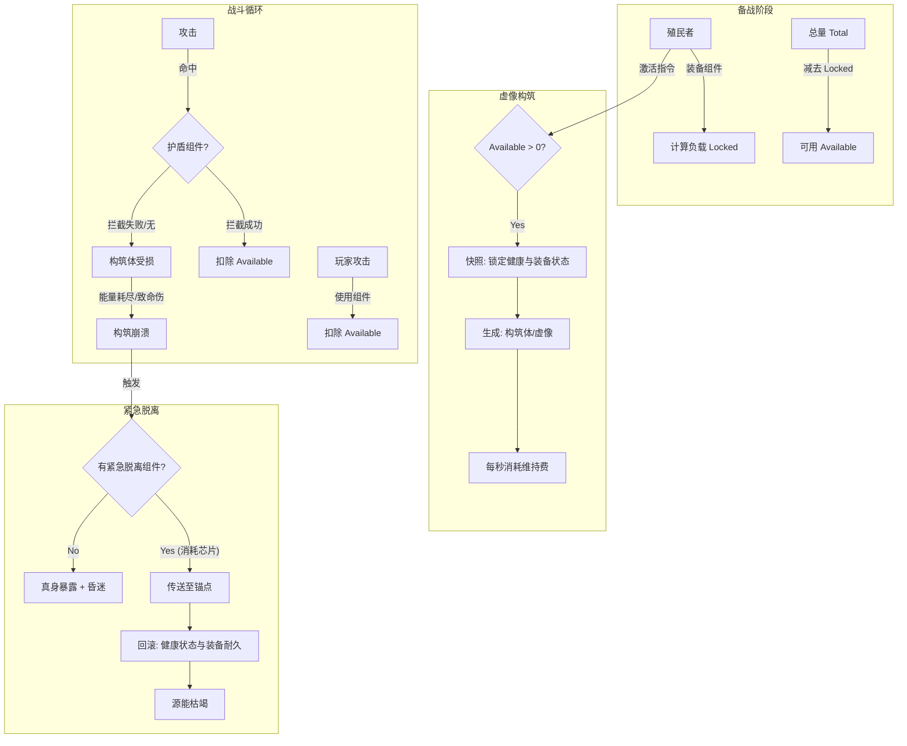

# Project Aldon 模组设定文档 v16.1
**[动态设计文档·实战驱动的迭代型设计稿]**

**版本：** Final Refined v16.1 (Revised Logic) → 标签版  
**密级：** 核心开发文档  
**状态：** 开发中 (Active Development with Ongoing Validation)  
**文档目的：** 本文档不是"最终规范"，而是边实践边演化的活文档。通过标签系统，清晰标注每个部分的确定性程度。任何代码实现中发现的问题都可能触发对相关章节的修订。

## 标签说明
-  **[锁定]**  - 已确认、不轻易改变的核心设定
-  **[核心创意]**  - 故事/美术/音乐的创意方向
-  **[试验]**  - 临时添加或思考尚未完全的机制，有可能撤销
-  **[参数待调]**  - 逻辑框架确定，具体数值公式需测试调整
-  **[待验证]**  - 需通过代码验证有效性可行性
-  **[实现待定]**  - 逻辑框架确定，具体实现方式未决定
-  **[方案待定]**  - 宏观方向确定，但具体方案设计未决定
-  **[实现需权衡]**  - 目标已明确，但实现方式可能因技术/性能问题而调整
-  **[未来计划]**  - 明确排除在当前版本外的功能
-  **[参考设计]**  - 用于演示的范例
-  **[表述可优化]**  - 思路方向已定，但具体表达可以考虑或者应当需要润色
-  **[概念待定]**  - 概念方向已定，但命名或描述需推敲
-  **[完全待定]**  - 确认将会设计，但完全未开始具体实行，全都是临时记录
-  **[无法判断]**  - 用户的知识不足以自行判断内容的状况
-  **[____]**  - 需要你根据实际情况补充标签的位置

**标题有标签，正文无标签：** 正文判定为标题相同标签  
**标题有标签，正文有标签：** 正文标签优先，下划线范围优先

---

# 第零章：项目摘要与致敬声明 (Executive Summary)

## 0.1 项目背景
**[锁定] [表述可优化]**  
本项目为游戏《RimWorld》(环世界)开发一个大型机制类模组(Mod)。该模组名为Project Aldon，试图引入一套独立于原版的<u>高维物理与能源[概念待定]</u>体系，将为游戏后期的生存与战斗提供全新的战术深度。

## 0.2 灵感来源与机制解耦 **[核心创意]**
本模组的设计理念是"机制的缝合与重构"，我们致敬并借鉴了以下三部ACG作品的核心设定，将其解耦并本地化为RimWorld的游戏逻辑：

-  **《ALDNOAH.ZERO》(AZ)**  **[核心创意]** - 借鉴要素: 皇权血统论与能源驱动。  
  模组体现: 只有特定血脉(皇室)才能共鸣并稳定核心能源塔(Aldon Drive)；皇室拥有对下级单位的绝对权限(强制停止权)；能源塔是基地运作的核心。

-  **《绝园的暴风雨》(Zetsuen no Tempest / ZnT)**  **[核心创意]** - 借鉴要素: "文明献祭"的等价交换法则。  
  模组体现: 能量并非凭空产生，必须通过分解(献祭)高科技物品来获取。献祭的物品科技含量越高(如AI核心 vs 木头)，获得的能量效果越强。

-  **《境界触发者》(World Trigger / WT)**  **[核心创意]** - 借鉴要素: 生体能量器官与战斗义体(Trion System)。  
  模组体现: 引入"源能腺体"作为一种可成长的生物器官；战斗时身体转化为由能量构成的"构筑体"；能量上限直接决定武器威力与护盾厚度；战斗体受损表现为粒子泄漏而非流血。

## 0.3 核心目标 **[锁定]**
通过融合上述设定，构建一个"源能(Aldon)"的世界观。玩家将体验一段关于"逃亡公主与叛变骑士"的悲壮故事，在边境世界利用古代神权科技，通过献祭旧时代的文明遗物，来抵御野蛮与疯狂。

---

# 第一章：世界观与叙事 (Worldview & Narrative)

## 1.1 物理法则：源能 (Aldon)
在标准物理模型之外，存在一种被称为Aldon的高维能量形式，中文定名为**源能**。

**能量实体化：** **[锁定] [表述可优化]**  
源能是一种高能粒子流，它倾向于凝聚成高密度场。在特定频率下，它可以被"硬化"为具有物理碰撞体积的实体，是构建"构筑体"和"源能护盾"的基础。

**物理特性 (Aldon Object)：** **[锁定]**  
任何接入源能系统的物体，其内部能量状态始终遵循框架层的核心公式：  
**Available (当前可用) = Capacity (总容量上限) - Locked (被占用上限) - Used (已消耗待回复)**

- **Capacity**：容器理论上的最大容积（例如电池的总大小）。
- **Locked**：被装备组件或常驻功能强制占用的份额，这部分不仅不可用，且不参与回复。
- **Used**：因消耗（射击、受击）而产生的空缺，这部分会随着充能逐渐减少（即能量回复）。
- **Available**：当前这一刻真正能打出去的能量弹药。

**能量的来源与场域：** **[锁定]**  
- **场域 (The Field)**：源能驱动塔不再直接传输能量，而是作为全图唯一的发射源 (Global Emitter)，决定整个地图是否拥有源能环境。
- **自然回充**：人体内若植入了"源能腺体"，其本身作为一个接收端 (Receiver)。当全图场域激活时，腺体获得从虚空中汲取能量的权限，进行自然回充。
- **特权例外**：皇室血脉拥有者自身即为微型源点，不依赖驱动塔信号即可回充，但不具备对外广播信号的能力。
- **驱动塔充能**：驱动塔自身作为超巨型容器，其巨大的消耗(维持场域广播、基地护盾再生)必须通过**"献祭仪式"**来补充。

## 1.2 角色身份重构 (Identity Reforging) **[锁定]**  
**注： [锁定] 角色和背景叙事设计仅为特定剧本增加故事性，不直接等同于模组系统模块设计。内容冲突则以系统模块设计为准。**

**女主角：负重的"门扉守护者" (The Gatekeeper) [锁定]**

- **身份：** **[锁定]** 帝国议会(The Council)的"帝国公主"(Imperial Princess)。
- **本质：** **[锁定]** 在皇室华丽的头衔之下，她是极其罕见的"共鸣体"(Resonator)。如果说普通皇族是借用力量的凡人，她便是连接高维宇宙与现实世界的活体 **"门扉"** 。
- **宿命：** **[锁定]** 为了防止她体内时刻满溢的能量引发时空坍塌，她自幼便被囚禁在"水晶花房"之中。这并非保护，而是囚禁。她不仅要忍受庞大能量流过身体的剧痛，更需时刻保持清醒与克制，以凡人的意志作为堤坝，死死抵住那意图冲垮现实的洪流。
- **权能：** **[锁定]** 她是唯一能与这股狂暴神力对话的人。当她放开意志的闸门，便能引发"源能神迹"——那是以意志为透镜，强行重写物理法则的奇迹。

**男主角：离经叛道的"执剑官" (The Sword Executor) [表述可优化]**

- **身份：** **[表述可优化]** 帝国少将，名门继承人，公主的专属护卫长。
- **觉醒：** **[锁定]** 他曾是体制最坚定的维护者，直到他看清了繁华背后的腐朽。荣耀不过是杀戮的遮羞布，而他宣誓效忠的对象，正被这个体制缓慢地吞噬。
- **连接：** **[锁定]** 他是她在无尽能量风暴中唯一的"锚点"。通过亲密结合，他分担了她灵魂深处的重压，这让他成为了除她之外，唯一能触碰并操作核心系统的<u>"建造者" **[概念待定]**</u> 。

## 1.3 相恋的理由：灵魂的共振 (Why They Fell in Love) **[锁定]**
他们的关系并非始于浪漫的邂逅，而是两颗孤独灵魂在绝境中的共鸣。

- **初识：** **[锁定]** 他是唯一获准进入"水晶花房"的异性。起初，他只是冷漠的看守。直到那天，他看见这位尊贵的囚徒躲在全息帷幕后，贪婪地阅读着一本关于星海探险的禁书。她抬头看他，眼中没有囚徒的卑怯，只有狡黠的光芒："少将，向往自由应该不算叛国罪吧？"那一刻，他没有按下警报，而是递给了她一张最新的星图。
- **相知：** **[表述可优化]** 在漫长的监禁岁月中，他们成为了彼此唯一的真实。每当源能过载、剧痛让她几近崩溃时，只有他会违抗严苛的礼制，紧握她冰冷颤抖的手。他用自己的血肉之躯作为导体，替她分流那些狂暴的源能。这种物理层面上的"神经共鸣"，让他们比世间任何恋人都更深刻地理解彼此的痛苦与渴望。
- **决裂：** **[表述可优化]** 议会启动了"最终升华计划"——他们不再满足于通过她抽取能量，而是要将她的意识彻底抹除，将其固化为一座永恒运作、不再有悲欢的"活体神像"。那是他第一次将剑锋指向了自己的家族。"如果文明的存续需要以吞噬她为代价，那么这个文明，不救也罢。"

## 1.4 逃亡的一幕 (The Escape) **[表述可优化]**
在"最终升华"的前夜，皇都的星港燃起了冲天的火光。他驾驶着一艘非法改装的穿梭机，如流星般撞碎了"水晶花房"的穹顶。她早已脱下了繁琐的礼服，换上了一身<u>利落的淡蓝色便服 **[概念待定]**</u> ，怀中紧紧抱着那颗散发着微光的源能核心——那是她亲手从控制台拆下的、束缚了她半生的枷锁。没有犹豫，没有回头。她跳上副驾驶座，对他露出了他在宫廷中从未见过的、最自由的笑容。"带我去那个没有墙壁的地方，执剑官阁下。"引擎轰鸣，她咬破手指，将一滴泛着幽光的血抹在他的眉心，随后吻上了他的唇。"以艾瑞雅之名，协议重写。赋予你，铸造神躯的权利。"穿梭机冲破大气层，将崩塌的旧秩序与追兵的火光远远甩在身后。他们失去了一切，却第一次拥有了未来。

---

# 第二章：核心架构与词汇 (Architecture & Terminology)

## 2.1 核心词汇定义表

| 关键术语 | 英文标识 | 标签 | 详细定义与逻辑含义 |
|----------|----------|------|-------------------|
| 源能 | Aldon | **[锁定]** | 模组唯一的能量单位，无形的高维粒子流。 |
| 源能驱动塔 | Aldon Drive | **[锁定]** | 基地核心设施，作为全图唯一的信号源。负责开启全图的能量获取权限。 |
| 源能储备 | Drive Reserve | **[锁定]** | 储存在驱动塔内的能量总量。遵循 Total = Available + Locked 规则。 |
| 源能因子 / 皇室因子 | （等待AI填充） | **[锁定]** | (等待AI填充) |
| 源能腺体 | Aldon Gland | **[锁定]** | 位于人体心脏旁的隐形器官，作为场域接收端(Receiver)。 |
| 腺体容量 | Gland Volume | **[概念待定]** | 决定单兵战斗体性能上限的核心参数(即 Total 值)。 |
| 构筑体 | Construct | **[概念待定]** | 战斗时覆盖全身的能量硬化形态，基于虚像协议(Phantom Protocol)运作。 |
| 锁定值 | Locked Value | **[锁定]** | 被装备组件或常驻功能占用的能量上限，无法用于消耗。 |
| 负载压力 | Load Pressure | **[锁定]** | 接入场域的接收端数量，直接影响驱动塔的能量自然衰减率。 |
| 临界静默 | Critical Silence | **[试验] 倾向于撤销** | 当能量耗尽时进入的低功耗模式，防止死亡螺旋。 |
| 授权密钥 | Royal Key | **[概念待定]** | 由皇室授予的普通使用权限(战斗/穿戴)。 |
| 伴侣契约 | Consort Pact | **[锁定]** | 由亲密行为解锁的高级权限(建造/制造/献祭)。 |
| 源能神迹 | Aldon Miracles | **[锁定]** | 绑定者通过消耗大量能量释放的改写物理法则的能力。 |
| 绑定者 | （等待AI填充） | **[概念待定]** | 必需：拥有皇室因子。驱动塔必须有且仅有一位绑定者才可激活。绑定者的心情和意识极大程度影响驱动塔的运行。 |

---

# 第三章：系统一：源能能源域 (Aldon Energy Domain)

负责基地的能源循环、权限广播与护盾防御。

## 3.0 系统全景循环图 (System Overview Cycle)

## 3.1 能源域逻辑图谱 (Energy Logic)

负责基地的能源循环、权限广播与护盾防御。

## 3.2 模块 M-E01：绑定者鉴权与状态机 (Binder Auth & State Machine) **[锁定]**

**状态监测 (Watchdog)：** **[锁定]**  
<u>每RareTick检查 **[实现需权衡]**</u> 绑定者状态。

**强制关机与权限失效 (Shutdown & Revocation)：** **[锁定]**
- **触发条件：** 绑定者死亡 (Dead) 或 失去意识 (Downed/Unconscious)。注：绑定者仅离开地图 (Despawned/Caravan) 不会触发关机，系统维持运作。
- **后果：** 驱动塔强制切换为 IsActive = False，且无法通过献祭重启。
- **连锁失效：** 所有由绑定者下发的权限（包括 Level 2 伴侣权限）依赖于绑定者的意识连接。一旦绑定者失去意识，所有人的权限立刻被冻结/移除。
- **死局确认：** 若绑定者死亡，这就是一个不可逆的坏档点（Game Over），除非玩家拥有复活手段。这是设计的核心体验——她是唯一的门扉。

## 3.3 模块 M-E02：物质升华转化 (Matter Sublimation) **[概念待定]**

**机制：** **[表述可优化]** 驱动塔不产生能量，只通过分解物质转化能量。

**独立性：** **[锁定]** 献祭功能是独立的交互仪式，不依赖驱动塔的激活状态。即使驱动塔因能量耗尽停机，玩家依然可以通过献祭物品为其充能以重启系统。

**转化算法：** **[锁定]**
- 低级/中级物品：转化为少量/中量Drive Reserve。
- 高级/超凡物品(AI核心/仿生体)：转化为大量Drive Reserve。

**未来计划 (Planned)：** **[未来计划]** 引入"献祭属性倾向(Affinity)"系统，根据献祭物的类型（有机/无机）提供临时Buff，暂不实装。

## 3.4 模块 M-E03：调和律与负载压力 (Harmony & Pressure) **[锁定]**

调和律决定了驱动塔能量的自然流失速度(维持运行的衰减)。这是一个多维度的动态平衡系统：

**基础衰减 (Base Decay)：** **[锁定]** 维持全图广播的固定消耗。

**负载压力 (Load Pressure)：** **[锁定]**
- **定义：** 驱动塔承受的额外计算负担。
- **判定标准：** 仅计算处于 Working/Active 状态的接收端。
  - 闲置/关闭电源的工作台：不产生压力。
  - 正在加工的工作台：产生压力。
  - 未激活构筑体的殖民者：不产生压力（除非腺体正在进行自然回充）。
  - 已激活的构筑体：产生高额压力。

**情绪干扰 (Mood Distortion)：** **[实现待定]** 绑定者(公主)心情越低，流失越快。

**罪业干扰 (Karma Distortion)：** **[实现待定]** 屠宰人类(+100%)或处决囚犯(+50%)会显著增加衰减倍率。

~~**防死局机制：临界静默**~~**[已移除]** 
**设计变更：**为了保持逻辑的二值性健壮性，取消"临界静默"中间态。能量耗尽后果：当 Available <= 0 时，驱动塔逻辑判定为 Off。全图场域信号消失 (IsActive = False)，所有依赖场域的设施（包括维生设备）立即停摆，所有构筑体强制解除。

## 3.5 模块 M-E06：基地护盾模块 (Base Shield) **[锁定]**

**机制：** **[锁定]** 驱动塔的护盾是其自身Container的一种表现。

**拦截：** **[锁定]** 拦截所有从外部射入场域内的投射物。

**消耗：** **[参数待调]** 每次拦截消耗Reserve -= Damage × 2 (固定消耗)。

**过载：** **[参数待调]** 若Reserve<10%，护盾破碎。

## 3.6 模块 M-E05：源能神迹 (Aldon Miracles) **[锁定]**

**机制：** **[锁定]** 绑定者(公主)可以直接调动驱动塔内的庞大能量，释放神迹。

**消耗：** **[实现待定]** 直接扣除驱动塔的Available能量 / 直接扣除绑定者的 / 二者均可。

**神迹列表：** **[参考设计]**
- **绝对屏障(Absolute Aegis)：** 消耗5000能。护盾在4小时内无敌且不耗能。
- **空间折跃(Recall)：** 消耗8000能。将地图上所有激活了构筑体的单位瞬间传送回驱动塔旁。
- **重力干涉(Gravity Well)：** 消耗3000能。大幅降低敌军移动速度。

---

# 第四章：系统二：源能生物域 (Aldon Biology Domain)

负责权限管理、人体改造与腺体成长。

## 4.1 生物域逻辑图谱

## 4.2 模块 M-A01：权限分级体系 (Hierarchy of Access) **[锁定]**

上位级别拥有下位级别所有权限

**Level 0：局外人 [锁定]**  
无法使用任何Aldon装备，无法建造，无法激活构筑体。

**Level 1：授权使用者 (Authorized User) [锁定]**
- **获取方式：** 公主使用主动神迹<u>Bestow Access(赐福) **[概念待定]**</u> 施放于殖民者。
- **逻辑：** **[概念待定]** 目标获得Hediff AldonLicense。
- **权限：** 可穿戴装备、激活构筑体战斗。

**Level 2：伴侣契约者 (Consort Builder) [锁定]**
- **对象：** 绑定者认可的伴侣（男主）。
- **获取方式：** 必须有过"Kiss"行为。
- **权限：** 建造权限 + 制造权限 + 献祭操作权。

**Level 3：皇室因子拥有者 (） [表述可优化]**
- **特权：** 授权/回收：赋予或剥夺他人的使用权。 **[锁定]**  
  强制关闭：强制关闭Aldon驱动塔（非绑定者亦可）。 **[概念待定]**  
  施展神迹：可消耗Aldon施展神迹。 **[概念待定]**
- **特殊规则：** 皇室因子拥有者自带Self-Authority，其腺体恢复不依赖驱动塔信号，但也不对外广播信号。 **[锁定]**

## 4.3 模块 M-B01：设施双重消耗 (Dual Consumption) **[锁定]**

**机制：** **[锁定]** 所有Aldon生产设施(如源能工作台、分析仪)需要考虑两个条件才能运作：
- **可选：电力(Electricity)：** 电力设施必须接入原版电网，消耗常规电力维持物理机械运作。
- **必需：场域(Field)：** 必须处于激活的Aldon场域内，以此作为"运行密钥"。

**例外：** **[锁定]** 驱动塔本身不消耗电力，仅消耗源能储备。

**[未来计划]** 驱动塔激活时对外提供恒定输出功率的电力（相当于发电机），功率与调和律相关。

## 4.4 模块 M-B02：源能腺体 (Aldon Gland) **[概念待定]**

**能量属性：** **[锁定]** 赋予宿主AldonContainer属性。

**自然回充逻辑：** **[实现待定]**  
判定：if(GlobalField.IsActive || Pawn.HasRoyalFactor)。  
行为：根据设定的规则(基于代谢率/基因)自行缓慢恢复自身Aldon。

**成长机制：** **[试验]** 20岁之前，腺体容量(Total)随生物年龄自然增长。

## 4.5 模块 M-B03：植入手术控制 (Implantation Surgery) **[概念待定]**

**功能：** **[锁定]** 执行手术配方Recipe_ImplantAldonGland。

**判定公式：** **[实现待定]** FinalChance = 基础(0.2) + 医术加成 + 基因加成。

**失败后果：** **[锁定]** 添加Hediff_AldonBurnout(神经烧毁)。该Hediff是一种永久性脑损伤，且互斥于腺体植入(永久锁死该角色的Aldon路线)。

---

# 第五章：系统三：战斗协议 (Combat Protocols)

负责构筑体战斗、组件化武装负载及基于虚像协议的生存机制。

## 5.1 战斗域逻辑图谱

## 5.2 模块 M-C01：能量负载与组件系统 (Load & Components) **[锁定]**

本模块定义了装备如何占用和消耗能量。遵循Total = Available + Locked基础公式。

**[逻辑规则 Logic] [锁定]**

**负载锁定 (Locking Rule)：** **[锁定]**  
所有Aldon武装(无论是可拆卸组件还是特化武器)在装备时，都会强制占用Total上限的一部分。  
Locked总值等于所有当前装备物品的负载之和。  
**战术意义：** 携带越强力的装备(高锁定)，战斗时可用于消耗的"弹药库"(Available)就越小，迫使玩家在"高爆发/短续航"与"低配置/长续航"间做取舍。

**组件分类 (Component Types)：** **[参考设计]**
- 核心触发器：殖民者的基础装备，提供插槽。
- 功能组件：可插拔的芯片(如攻击、护盾、辅助)，每个组件都有独立的Locked值。
- 特化武装：不支持组件系统的独立强力武器，通常具有极高的Locked值。

**[配置范例 Example] [参考设计]**  
以下数据仅用于演示计算逻辑，实际参数需依据平衡性测试调整。  
假设场景：一个Total为1000的殖民者，配置了以下组件：
- 辅助组件-紧急脱离系统：锁定400
- 近战组件-弧月：锁定10
- 远程组件-炸裂弹：锁定10
- 辅助组件-护盾：锁定10

**计算结果：**  
总锁定(Locked)：430  
实战可用(Available)：570

## 5.3 模块 M-C02：虚像协议与构筑体 (Phantom Protocol) **[锁定]**

本模块定义了战斗时的形态切换与能量消耗规则。

**[逻辑规则 Logic] [锁定]**

**激活流程 (Activate)：** **[锁定]**
- **身心分离机制 (Mind-Body Separation)：** 系统将殖民者的数据拆分为"生理数据"与"心理数据"分别处理。
  - **生理层（停滞）：** 对原身的健康（Health）、装备（Apparel/Equipment）、物品栏（Inventory）、生理需求（Hunger/Rest/Comfort）、生物年龄（Age）进行硬快照（Hard Snapshot）。原身进入虚空停滞状态，上述数值完全停止变化。
  - **心理层（延续）：** 构筑体继承原身的所有心理状态（Mood/Thoughts）、社交关系（Relations）、技能经验（Skills）。
  - **运行期间 (Construct Phase)：** 构筑体没有生理需求（不饿不困），但有心理需求（会崩溃）。构筑体经历的所有事件（如目睹死亡、辱骂、聊天、技能使用）产生的记忆、社交评价和经验值，均实时记录在案。

**回滚流程 (Rollback)：** **[锁定]**
- **数据合并 (Data Merge)：** 
  - **肉体回滚：** 原身从停滞中唤醒，强制覆盖为激活时的生理快照（血量、伤痕、装备耐久完全恢复到战前状态）。
  - **意识同步：** 将构筑体在战斗期间产生的所有新记忆 (Memories)、新技能经验 (Xp)、社交变动 (Social) 注入回原身。
- **叙事结果：** 战斗结束后，你的身体毫发无伤（就像从未战斗过），但你的精神可能因为经历了惨烈的厮杀而疲惫不堪，或者因为击杀了仇敌而感到快意。你的枪法也因为刚才的战斗而变得更准了。

**技术实现的备注： [实现待定] [待验证]**  
在写代码时（针对 Framework v2.4），这意味着不能简单地删掉构筑体再把原身 Spawn 出来。需要一个 SyncMind(Pawn source, Pawn target) 的方法：
- Snapshot阶段：原身 Despawn。
- Rollback阶段：在销毁构筑体之前，读取其 needs.mood.thoughts.memories 和 skills。
- 将这些数据 Transfer 给处于 Despawn 状态的原身。
- 原身 Respawn。销毁构筑体。

**消耗规则 (Consumption Rule)：** **[锁定]**
- **维持消耗(Maintenance)：** **[锁定]** 构筑体存在期间，每单位时间固定扣除少量Available。
- **主动消耗(Active Cost)：** **[锁定]** 使用主动类组件(如激活组件、射击、释放技能)时，单次扣除固定量Available，具体数值各异。 **[锁定]** （部分类别的组件同时激活的数量有上限，达到上限后想激活其它组件需要先解除组件腾出空位。每次进行激活组件的操作均需扣除固定量available，解除组件不扣除。激活/解除动作有引导时间，无冷却时间）
- **持续消耗(Action Cost)：** **[试验]** 某些持续性动作(如连射、引导法术)会持续快速扣除Available。
- **被动消耗(Passive Cost)：** **[锁定]** 防御类组件(如护盾)仅在成功触发效果(如拦截伤害)时扣除少量Available。

**[配置范例 Example] [参考设计]**  
以下战斗流程演示了不同类型消耗的叠加方式。
- **维持：** 构筑体每秒自然消耗1点。
- **远程攻击(远程武器-炸裂弹组件)：**
  - 激活组件：单次消耗5点。
  - 发射弹药：每发子弹消耗1点。
- **近战攻击(近战武器-弧月组件)：**
  - 激活组件：单次消耗5点。
  - 普通攻击：不额外消耗(仅维持费)。
  - 使用技能组件-旋空弧月：单次消耗50点。
- **防御：** 护盾组件成功拦截一次攻击：消耗1点。

## 5.4 模块 M-C03：伤害处理与构筑体损伤 **[锁定]**

**[逻辑规则 Logic] [锁定]**

**护盾拦截：** **[锁定]** 优先由护盾组件判定拦截，若成功则消耗少量能量，构筑体无损。

**本体承伤：** **[锁定]** 若护盾失效或未触发，构筑体直接承受伤害。伤害数值转化为比护盾拦截较多能量扣除。

**功能受损：** **[锁定]** 若构筑体的特定部位(如手臂)受到破坏性伤害：
- 该部位对应的组件功能失效。
- 产生持续的能量泄漏(Leak)，加速维持消耗的Available的流失。
- **重要：** 此时原身(肉体)的手臂尚未真正断裂，这只是虚像层面的损伤。

## 5.5 模块 M-C04：崩溃与紧急脱离 (Collapse & Emergency Exit) **[锁定]**

当Available归零，或构筑体受到即死伤害(头/躯干全毁)时，触发崩溃。

**[逻辑规则 Logic] [锁定]**

**触发判定：** **[锁定]** 监测Available <= 0或<u>CriticalPartDestroyed事件 **[概念待定]**</u> 。

**分支A：拥有"紧急脱离组件"(消耗型芯片) [锁定]**
- **消耗：** 移除该组件(芯片破碎)。
- **动作：** 爆开烟雾（相当于原地激活烟雾弹），同时殖民者折跃传送回<u>"传送锚"(Teleport Anchor) **[概念待定]**</u> 所在位置，构筑体解除。
- **回滚(Rollback) [锁定]** 
  - **执行对象：** 仅限装备耐久与健康状态(Hediffs)。
  - **执行逻辑：** 强制覆盖为激活构筑体时的快照数据。
  - **残酷法则：** 若激活前殖民者已处于"濒死/流血"状态，回滚后依然处于濒死/流血状态，系统不会给予任何额外治疗。
- **代价：** 施加<u>AldonExhaustion(源能枯竭) **[概念待定]**</u> 状态，阻断能量恢复。

**分支B：无脱离组件 [锁定]**
- **动作：** 爆开烟雾（相当于原地激活烟雾弹），构筑体原地解除。
- **后果：** 真身完全暴露，<u>意识-20% **[方案待定]**</u> 。

---

# 第六章：开局剧本详案 (Scenario Specification)

## 6.1 开场白 (Opening Monologue) **[核心创意]**
皇都的钟声不再为你们而鸣，取而代之的是边境荒原凛冽的风。艾瑞雅，你逃离了那座试图将你化为永恒神像的祭坛；凯路斯，你背弃了那个要求你献上盲目忠诚的誓约。在这片被文明遗忘的土地上，没有了"门扉守护者"的重负，也没有了"执剑官"的枷锁。你们一无所有。除了那艘迫降的穿梭机、怀中微热的核心，以及，第一次真正掌握在自己手中的——命运。

## 6.2 剧本配置表：水晶花房的共犯 **[参考设计]**
- **剧本名：** The Crystal Garden Escape
- **类型：** Crashlanded (2人特殊版)
- **关系：** 固定为 **[恋人]** 。

## 6.3 角色 A：艾瑞雅 (Aria) - 公主 **[参考设计] [方案待定]**

- **外观：** 穿着"淡蓝色宫廷便服"(属性同普通衣物，高美观度) **[方案待定]** 。
- **基因： [参考设计] [锁定]**
  - AldonFactor_Royal(皇室因子) **[参数待定]**
  - HighVolume_Master(始祖级容量：6000+) **[锁定]**
  - Delicate(纤弱) **[锁定]**
  - Psychic Sensitivity(超感)
  - Super Clotting(超强凝血)
- **技能： [参考设计]**
  - 社交+8、医术+6、智力+8、艺术+6。
  - 禁用暴力(真身)。 **[参考设计]**
- **能力：** **[锁定]** 拥有驱动塔全权及神迹能力。

## 6.4 角色 B：凯路斯 (Caelus) - 执剑官 **[参考设计] [方案待定]**

- **外观：** 穿着"帝国军官制服"。
- **基因： [参考设计]**
  - AldonOrgan_Grafted(植入型腺体：3000)
  - Robust(健壮)
  - Dark Vision(夜视)
  - High Metabolism(高代谢)
- **技能： [参考设计]**
  - 射击+8、格斗+8、建造+6、手工+6。
- **权限：** **[锁定]** 初始拥有Aria的伴侣契约权限。

## 6.5 初始物资清单 (Inventory) **[参考设计] [方案待定]**

-  **[核心] 源能核心 (Aldon Core)：**  **[锁定]** 一个发光的水晶球体物品。功能：它是建造第一座驱动塔的必需材料(不可替代)。
-  **[武器] 源能光束步枪：** 凯路斯专属。
-  **[组件] 紧急脱离芯片 × 2：** 关键保命物资。
-  **[献祭储备] 古代智能终端 × 3：** 应急充能物资。
-  **[生存物资]：**
  - 40 × 包装食品
  - 15 × 闪耀医药
  - 450 × 钢铁
  - 30 × 零部件
-  **[定情信物] 《星渊探险录》实体书：** 娱乐物品。

---

# 第七章：技术实现与UI指引 (Implementation & UI)

## 7.1 Framework Integration **[锁定]**
本模组基于Aldon Framework v2.4构建。
- AldonObject继承：AldonContainer。
- Signal System：驱动塔控制AldonFieldManager的全局开关(SetState)。
- 殖民者检查AldonFieldManager.IsActive。
-  **[试验]**  Phantom Protocol：增加数据清洗检查。

## 7.2 UI交互规范 (UI Specification) **[完全待定]**

**注：** 关于"锁链纹理覆盖"、"动态闪烁预览"等高级UI建议已记录，并归入未来开发计划，本版本暂不实装，保持基础进度条设计。

**源能条 (Aldon Bar)：** **[表述可优化]**
- **Available (可用)：** UI显示为 Current / Capacity 的形式，或者更准确地表述为 Stored Energy (当前储量)。
- **视觉逻辑：**
  - 灰色底槽：Capacity
  - 锁链/阴影段：Locked
  - 亮色填充段：Available (即实际可消耗的能量)
- **注：** UI需明确区分"上限被锁"和"能量用光"的区别。

**组件配置界面 (Loadout Gizmo)：**
- 点击装备栏的触发器，弹出一个Float Menu或Dialog。
- 显示当前允许插入的插槽(Slot)。
- 每个插槽旁显示该组件的Locked Cost。
- 底部显示总负载预览。

## 7.3 Harmony Patch Points **[待验证] [实现待定]**
- Pawn.GetGizmos：注入操作按钮(形态切换、驱动塔控制)。
- Pawn_HealthTracker.PreApplyDamage：拦截伤害，重定向至AldonContainer.TryConsume。
- GenRecipe.MakeRecipeProducts & JobDriver_Construct：权限检查。

## 7.4 性能预算 (Performance Budget) **[待验证] [实现待定]**
- **场域检测：** 简化为全局变量读取AldonFieldManager.IsActive，开销可忽略不计。
- **负载统计：** 驱动塔每250 Tick(RareTick)统计一次接入的接收端数量，更新负载压力系数。

---

# 附录：文档修改历史 (Revision History)

| 版本 | 变更说明 |
|------|----------|
| v16.1-标签版 | 添加标签系统，明确每个设定的确定性程度；统一称呼为"公主"；保留所有原始内容 |
| v16.1反馈修正版(Revised Logic) | 1. 防死局机制引入"临界静默"模式；2. 信号逻辑简化；3. 未来计划记录 |
| v16.0 (Rev 2) | 文档一致性与规范化修正：修正图表与文字同步性；细化能源域逻辑；结构化重写战斗协议 |
| v16.0 (Rev 1) | 逻辑修正与平衡性调整：修正设施能耗逻辑(双重消耗)；引入负载压力机制；明确构筑体回充规则；完善UI规范 |
| v16.0 | 核心架构重构(基于Framework v2.3)：引入Total = Available + Locked模型；确立驱动塔信号机制；引入虚像协议与组件化武装 |
| v15.5 | 模组概念草案初稿 |
