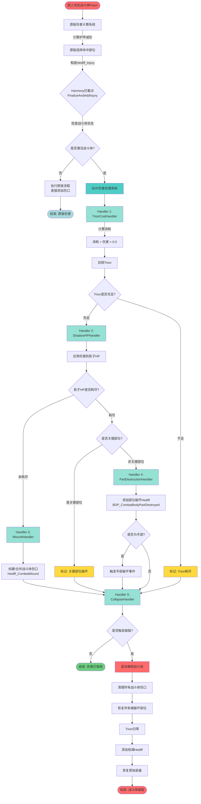

# 战斗体伤害处理完整流程图解

## 概述

本文档详细解释战斗体状态下,从受到攻击到该攻击的所有连锁影响结算完毕的完整过程。基于BorderDefenseProtocol模组的实际代码实现。

## 一、整体流程图



## 二、详细流程说明

### 阶段0: 原版伤害计算（拦截前）

**位置**: RimWorld原版 `DamageWorker_AddInjury.FinalizeAndAddInjury`

**执行内容**:
1. 原版已完成护甲减伤计算
2. 原版已选择命中部位
3. 原版已构造 `Hediff_Injury` 对象
   - `injury.Severity` = 护甲后伤害值
   - `injury.Part` = 命中的身体部位
   - `injury.def` = 伤口类型（切割/钝击/烧伤等）

**关键点**: BDP在这个时机拦截,可以直接使用原版计算结果,无需重复计算。

---

### 阶段1: 伤害拦截

**代码位置**: `Patch_DamageWorker_FinalizeAndAddInjury.Prefix`

```csharp
public static bool Prefix(Pawn pawn, Hediff_Injury injury, DamageInfo dinfo, DamageWorker.DamageResult result)
{
    // 检查是否有战斗体基因且已激活
    var gene = pawn.genes?.GetFirstGeneOfType<Gene_TrionGland>();
    if (gene == null || !gene.IsCombatBodyActive)
        return true;  // 执行原版流程

    // 调用BDP伤害处理系统
    CombatBodyDamageHandler.HandleDamage(pawn, injury, dinfo);

    return false;  // 跳过原版AddHediff（伤害被战斗体吸收）
}
```

**判断逻辑**:
- ✅ 有战斗体基因 + 已激活 → 进入BDP处理流程
- ❌ 无战斗体基因 或 未激活 → 执行原版流程（直接受伤）

---

### 阶段2: Handler链处理

**代码位置**: `CombatBodyDamageHandler.HandleDamage`

#### Handler 1: Trion消耗处理

**代码位置**: `TrionCostHandler.Handle`

```csharp
float cost = damage * 0.5f;  // 消耗系数: 0.5
bool success = compTrion.Consume(cost);
```

**处理逻辑**:
1. 计算Trion消耗 = 伤害值 × 0.5
2. 调用 `CompTrion.Consume(cost)` 扣除Trion
3. 如果Trion不足,返回 `false`

**示例**:
- 受到20点伤害 → 消耗10点Trion
- 当前Trion: 50 → 40

---

#### Handler 2: 影子HP处理

**代码位置**: `ShadowHPHandler.Handle`

```csharp
float hpBefore = gene.ShadowHP.GetHP(part);
gene.ShadowHP.TakeDamage(part, damage);
float hpAfter = gene.ShadowHP.GetHP(part);

if (hpAfter <= 0f) {
    partDestroyed = true;  // 部位被破坏
}
```

**处理逻辑**:
1. 获取部位当前影子HP
2. 应用伤害: `影子HP -= 伤害值`
3. 检查是否耗尽 (≤ 0)

**示例**:
- 左臂影子HP: 30 → 10 (受到20点伤害)
- 头部影子HP: 15 → 0 (受到20点伤害,破坏!)

---

#### Handler 3: 伤口处理 (部位未破坏时)

**代码位置**: `WoundHandler.Handle`

```csharp
float severity = damage / 10f;  // 伤口严重度映射
WoundAdapter.AddOrMergeWound(pawn, part, damageDef, severity, dinfo);
```

**处理逻辑**:
1. 计算伤口严重度 = 伤害值 / 10
2. 查找是否已有同部位同类型伤口
3. 如果有 → 合并伤口 (severity累加)
4. 如果无 → 创建新伤口 `Hediff_CombatWound`

**特点**:
- 战斗体伤口不会造成疼痛
- 战斗体伤口不会流血
- 战斗体解除时自动清理

**示例**:
- 20点切割伤害 → 创建severity=2.0的战斗体伤口
- 再受10点切割伤害 → 合并为severity=3.0

---

#### Handler 4: 部位破坏处理 (部位破坏时)

**代码位置**: `PartDestructionHandler.Handle`

```csharp
var hediffDef = BDP_DefOf.BDP_CombatBodyPartDestroyed;
var hediff = pawn.health.AddHediff(hediffDef, part);
```

**处理逻辑**:
1. 添加 `BDP_CombatBodyPartDestroyed` Hediff到部位
2. 记录已破坏部位 (避免重复处理)
3. 如果是手部 → 触发手部破坏事件

**效果**:
- 部位失效 (无法使用)
- 影响移动能力 (如腿部破坏)
- 影响操作能力 (如手部破坏)
- **不会造成疼痛和流血**

**关键部位判断**:
- 关键部位: Head, Brain, Heart, Neck, Torso
- 关键部位破坏 → 跳过部位标记,直接触发破裂

---

#### Handler 5: 破裂检测

**代码位置**: `CollapseHandler.Handle`

**破裂条件** (满足任一即触发):
1. Trion耗尽 (Handler 1返回false)
2. 关键部位破坏 (Head/Brain/Heart/Neck/Torso的影子HP耗尽)

**触发破裂时的处理**:
```csharp
gene.DeactivateCombatBody(isEmergency: true);
```

---

### 阶段3: 紧急解除流程 (破裂时)

**代码位置**: `CombatBodyOrchestrator.Deactivate` (isEmergency=true)

**执行步骤**:

1. **清理战斗体伤口**
   ```csharp
   WoundHandler.Clear(pawn);  // 移除所有Hediff_CombatWound
   ```

2. **恢复被破坏部位**
   ```csharp
   gene.PartDestruction.Clear(pawn);  // 移除所有BDP_CombatBodyPartDestroyed
   ```

3. **Trion归零**
   ```csharp
   compTrion.SetToZero();
   ```

4. **添加枯竭Hediff**
   ```csharp
   pawn.health.AddHediff(BDP_DefOf.BDP_TrionExhaustion);
   ```

5. **恢复原始装备**
   ```csharp
   snapshot.RestoreOriginalState();  // 卸下战斗体装备,穿回原装备
   ```

6. **清理影子HP**
   ```csharp
   gene.ShadowHP.Clear();
   ```

7. **进入冷却期**
   ```csharp
   state.StartCooldown();  // 1天冷却
   ```

---

## 三、关键数据流

### 数据读取

| 数据 | 来源 | 用途 |
|------|------|------|
| 护甲后伤害 | `injury.Severity` | Trion消耗计算、影子HP扣除 |
| 命中部位 | `injury.Part` | 影子HP定位、伤口定位 |
| 伤害类型 | `dinfo.Def` | 伤口类型判断 |
| 当前Trion | `CompTrion.Cur` | 消耗检查 |
| 部位影子HP | `ShadowHPTracker.GetHP(part)` | 破坏检查 |

### 数据修改

| 操作 | 位置 | 效果 |
|------|------|------|
| 扣除Trion | `CompTrion.Consume` | Cur -= cost |
| 扣除影子HP | `ShadowHPTracker.TakeDamage` | partHP -= damage |
| 添加伤口 | `pawn.health.AddHediff` | 添加Hediff_CombatWound |
| 标记部位破坏 | `pawn.health.AddHediff` | 添加BDP_CombatBodyPartDestroyed |
| 清理伤口 | `pawn.health.RemoveHediff` | 移除所有战斗体伤口 |
| 恢复部位 | `pawn.health.RemoveHediff` | 移除所有部位破坏标记 |

---

## 四、实战示例

### 示例1: 普通攻击 (未破裂)

**场景**: 战斗体Pawn被步枪击中左臂

**初始状态**:
- Trion: 100/150
- 左臂影子HP: 30/30

**攻击数据**:
- 原始伤害: 25
- 护甲减伤后: 20
- 命中部位: 左臂 (Shoulder)

**处理流程**:

1. **Handler 1: Trion消耗**
   - 消耗 = 20 × 0.5 = 10
   - Trion: 100 → 90 ✅

2. **Handler 2: 影子HP**
   - 左臂影子HP: 30 → 10 ✅

3. **Handler 3: 伤口**
   - 创建战斗体伤口 (severity=2.0)
   - 部位: 左臂
   - 类型: 枪伤

4. **Handler 5: 破裂检测**
   - Trion充足 ✅
   - 非关键部位 ✅
   - **不触发破裂**

**最终状态**:
- Trion: 90/150
- 左臂影子HP: 10/30
- 左臂有1个战斗体伤口 (severity=2.0)
- Pawn继续战斗

---

### 示例2: 部位破坏 (非关键部位)

**场景**: 战斗体Pawn被连续攻击左臂

**初始状态**:
- Trion: 90/150
- 左臂影子HP: 10/30
- 左臂已有伤口 (severity=2.0)

**攻击数据**:
- 护甲后伤害: 15
- 命中部位: 左臂

**处理流程**:

1. **Handler 1: Trion消耗**
   - 消耗 = 15 × 0.5 = 7.5
   - Trion: 90 → 82.5 ✅

2. **Handler 2: 影子HP**
   - 左臂影子HP: 10 → -5 ❌ **破坏!**

3. **Handler 4: 部位破坏**
   - 检查: 左臂不是关键部位
   - 添加 `BDP_CombatBodyPartDestroyed` 到左臂
   - 左臂失效 (无法使用)

4. **Handler 5: 破裂检测**
   - Trion充足 ✅
   - 非关键部位破坏 ✅
   - **不触发破裂**

**最终状态**:
- Trion: 82.5/150
- 左臂影子HP: 0/30 (已破坏)
- 左臂标记为破坏 (无法使用)
- 左臂伤口被清理 (破坏时不保留伤口)
- Pawn继续战斗 (单臂作战)

---

### 示例3: 关键部位破坏 (触发破裂)

**场景**: 战斗体Pawn被狙击枪爆头

**初始状态**:
- Trion: 82.5/150
- 头部影子HP: 20/20

**攻击数据**:
- 护甲后伤害: 30
- 命中部位: 头部 (Head)

**处理流程**:

1. **Handler 1: Trion消耗**
   - 消耗 = 30 × 0.5 = 15
   - Trion: 82.5 → 67.5 ✅

2. **Handler 2: 影子HP**
   - 头部影子HP: 20 → -10 ❌ **破坏!**
   - 检查: 头部是关键部位 ⚠️

3. **Handler 4: 跳过部位标记**
   - 关键部位破坏不标记部位
   - 直接进入破裂流程

4. **Handler 5: 破裂检测**
   - 关键部位破坏 ❌ **触发破裂!**

5. **紧急解除流程**:
   - 清理所有战斗体伤口
   - 恢复左臂 (移除破坏标记)
   - Trion归零: 67.5 → 0
   - 添加枯竭Hediff (1天debuff)
   - 恢复原始装备
   - 进入1天冷却期

**最终状态**:
- Trion: 0/150 (枯竭)
- 所有影子HP清零
- 所有部位恢复正常
- 有枯竭debuff (1天)
- 战斗体冷却中 (1天)
- Pawn脱离战斗体状态

---

### 示例4: Trion耗尽 (触发破裂)

**场景**: 战斗体Pawn被持续攻击,Trion即将耗尽

**初始状态**:
- Trion: 8/150
- 躯干影子HP: 50/50

**攻击数据**:
- 护甲后伤害: 20
- 命中部位: 躯干 (Torso)

**处理流程**:

1. **Handler 1: Trion消耗**
   - 消耗 = 20 × 0.5 = 10
   - 需要10,但只有8 ❌ **Trion不足!**
   - Trion: 8 → 0

2. **Handler 2: 影子HP**
   - 躯干影子HP: 50 → 30 ✅

3. **Handler 3: 伤口**
   - 创建战斗体伤口 (severity=2.0)

4. **Handler 5: 破裂检测**
   - Trion耗尽 ❌ **触发破裂!**

5. **紧急解除流程** (同示例3)

**最终状态**:
- Trion: 0/150 (枯竭)
- 战斗体破裂
- 进入冷却期

---

## 五、架构特点

### 1. 拦截点选择

**优势**:
- 在原版计算完成后拦截
- 直接使用原版结果 (护甲减伤、部位选择)
- 避免重复计算和猜测

**对比旧方案**:
- 旧: 在 `PreApplyDamage` 拦截 → 需要手动模拟护甲计算
- 新: 在 `FinalizeAndAddInjury` 拦截 → 直接读取原版结果

### 2. Handler链设计

**优势**:
- 职责单一,易于维护
- 顺序清晰,易于理解
- 易于扩展 (添加新Handler)

**Handler顺序**:
1. Trion消耗 (资源检查)
2. 影子HP (伤害应用)
3. 伤口/部位破坏 (效果应用)
4. 破裂检测 (状态检查)

### 3. 数据流向

```
原版伤害 → BDP拦截 → Handler链 → 状态更新 → 破裂检测 → 解除流程
```

**关键点**:
- 单向数据流
- 每个Handler只修改自己负责的数据
- 破裂检测统一在最后

### 4. 防御性设计

**重入保护**:
```csharp
private static HashSet<Pawn> processingPawns = new HashSet<Pawn>();
```

**空值检查**:
- 每个Handler都有完整的空值检查
- 避免因数据异常导致崩溃

**状态一致性**:
- 破裂时清理所有战斗体状态
- 避免残留数据

---

## 六、性能考虑

### 1. 拦截频率

- 每次受伤触发一次
- 高频战斗场景下可能频繁调用

### 2. 优化点

- Handler链顺序优化 (先检查Trion,避免无效计算)
- 已破坏部位跳过处理
- 重入保护避免递归

### 3. 日志输出

- 开发模式下详细日志
- 生产模式可关闭部分日志

---

## 七、总结

### 核心流程

1. **拦截**: 在原版伤害计算完成后拦截
2. **消耗**: 扣除Trion和影子HP
3. **效果**: 添加伤口或标记部位破坏
4. **检测**: 检查破裂条件
5. **解除**: 触发破裂时紧急解除战斗体

### 关键设计

- **Handler链**: 职责分离,易于维护
- **拦截点**: 利用原版计算结果
- **破裂机制**: 双重保护 (Trion + 关键部位)
- **清理机制**: 解除时完整恢复状态

### 玩家体验

- 战斗体吸收伤害 (无疼痛/流血)
- 部位破坏影响能力 (手臂/腿部)
- 破裂时紧急脱离 (保命机制)
- 冷却期限制频繁使用

---

## 历史记录

| 日期 | 版本 | 修改内容 | 修改人 |
|------|------|----------|--------|
| 2026-03-05 | v1.0 | 初始版本,完整流程图解 | Claude Sonnet 4.6 |
